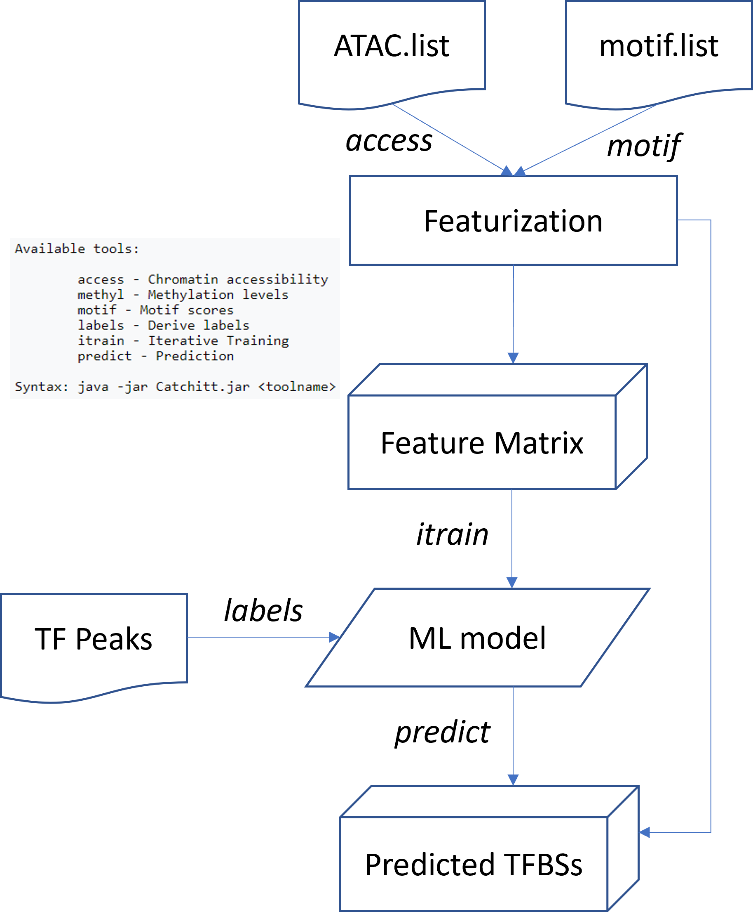

Predicting in vivo TFBS using Catchitt
=======================

::

	usage: TFBS_predict.py [-h] [-j JID] -f ATAC_LIST -c CONSERVED_PEAK -r
	                       RELAXED_PEAK -t TRAINING_CELL_TYPE [-m MOTIF_LIST]
	                       [-q QUEUE] [-g GENOME] [--faidx FAIDX] [--fasta FASTA]

	optional arguments:
	  -h, --help            show this help message and exit
	  -j JID, --jid JID     enter a job ID, which is used to make a new directory.
	                        Every output will be moved into this folder. (default:
	                        TFBS_predict_yli11_2021-10-01)
	  -f ATAC_LIST, --atac_list ATAC_LIST
	                        tsv 2 columns, cell type and path to bam file (abs or
	                        relative to current working dir) (default: None)
	  -c CONSERVED_PEAK, --conserved_peak CONSERVED_PEAK
	                        path to IDR peak (default: None)
	  -r RELAXED_PEAK, --relaxed_peak RELAXED_PEAK
	                        path to union MACS2 peak (default: None)
	  -t TRAINING_CELL_TYPE, --training_cell_type TRAINING_CELL_TYPE
	                        training cell type label, must match to names in
	                        atac.list (default: None)
	  -m MOTIF_LIST, --motif_list MOTIF_LIST
	                        tsv 2 columns, motif name and path to motif file (abs
	                        or relative to current working dir) (default: None)
	  -q QUEUE, --queue QUEUE
	                        submit queue (default: standard)

	Genome Info:
	  -g GENOME, --genome GENOME
	                        genome version: hg19, hg38, mm9, mm10. By default,
	                        specifying a genome version will automatically update
	                        index file, black list, chrom size and
	                        effectiveGenomeSize, unless a user explicitly sets
	                        those options. (default: mm9)
	  --faidx FAIDX         fasta index (default:
	                        /home/yli11/Data/Mouse/mm9/fasta/mm9.fa.fai)
	  --fasta FASTA         fasta index (default:
	                        /home/yli11/Data/Mouse/mm9/fasta/mm9.fa)

Summary
^^^^^^^^

Catchitt can predict TFBS given motif and DNase/ATAC signal (bam file), the model is first need to be generated given a ChIP-seq peak.

Catchitt is developed by a group from German, called J-Team, who won the shared first place in the ENCODE-DREAM competetion in the final phase. It was also the second place in the initial phase. They also provided the best documented and workable tutorial for their algorithm. I tried other teams methods, including the XGboost method (shared-first place) and the Deep Learning method (second place), they don't seem to work. 

The learning algorithm used by J-team is adoptied from the team leader's Ph.D thesis on discriminative Baysian learning. 

Flowchart
^^^^^^^^^^^^^^^^^^

Input
^^^^^^^^^^^^

Raw data can be put anywhere, users only need to provide the abs/rel PATH to raw bam, motif and peak files.

ATAC.list
---------

2-col tsv, cell type and path to bam.

::

	CFUe	/research/rgs01/project_space/chenggrp/blood_regulome/chenggrp/HemPortal/HemTools_uniform_processed_files/Mouse/ATAC/blood_lineage/atac_seq_yli11_2021-09-24/bam_files/mouse_CFUe_ATAC.markdup.bam
	Ery	/research/rgs01/project_space/chenggrp/blood_regulome/chenggrp/HemPortal/HemTools_uniform_processed_files/Mouse/ATAC/blood_lineage/atac_seq_yli11_2021-09-24/bam_files/mouse_Ery_ATAC.markdup.bam
	LTHSC	/research/rgs01/project_space/chenggrp/blood_regulome/chenggrp/HemPortal/HemTools_uniform_processed_files/Mouse/ATAC/blood_lineage/atac_seq_yli11_2021-09-24/bam_files/mouse_LTHSC_ATAC.markdup.bam
	MEP	/research/rgs01/project_space/chenggrp/blood_regulome/chenggrp/HemPortal/HemTools_uniform_processed_files/Mouse/ATAC/blood_lineage/atac_seq_yli11_2021-09-24/bam_files/mouse_MEP_ATAC.markdup.bam
	STHSC	/research/rgs01/project_space/chenggrp/blood_regulome/chenggrp/HemPortal/HemTools_uniform_processed_files/Mouse/ATAC/blood_lineage/atac_seq_yli11_2021-09-24/bam_files/mouse_STHSC_ATAC.markdup.bam
	CMP	/research/rgs01/project_space/chenggrp/blood_regulome/chenggrp/HemPortal/HemTools_uniform_processed_files/Mouse/ATAC/blood_lineage/atac_seq_yli11_2021-09-24/bam_files/mouse_CMP_ATAC.markdup.bam
	GMP	/research/rgs01/project_space/chenggrp/blood_regulome/chenggrp/HemPortal/HemTools_uniform_processed_files/Mouse/ATAC/blood_lineage/atac_seq_yli11_2021-09-24/bam_files/mouse_GMP_ATAC.markdup.bam
	MEG	/research/rgs01/project_space/chenggrp/blood_regulome/chenggrp/HemPortal/HemTools_uniform_processed_files/Mouse/ATAC/blood_lineage/atac_seq_yli11_2021-09-24/bam_files/mouse_MEG_ATAC.markdup.bam
	MPP	/research/rgs01/project_space/chenggrp/blood_regulome/chenggrp/HemPortal/HemTools_uniform_processed_files/Mouse/ATAC/blood_lineage/atac_seq_yli11_2021-09-24/bam_files/mouse_MPP_ATAC.markdup.bam
	HPC5	/research/rgs01/project_space/chenggrp/blood_regulome/chenggrp/Projects/NFIX_megan/ATAC/HPC5_WT/single-end-run/atac_seq_yli11_2021-09-25/bam_files/HPC5_ATAC.markdup.bam

motif.list
---------

2-col tsv, motif name and path to pfm or the SLIM model.

Because the motif can be a pfm or xml file. the second column here should be ``d=PATH_to_xml`` or ``m=Jaspar j=PATH_to_pfm`` file. The motif SLIM model can be directly found in Catchitt downloads and to convert meme format to pfm, you can use http://embnet.ccg.unam.mx/rsat/convert-matrix_form.cgi

::

	Ctcf_H1hesc_shift20_bdeu_order-20_comp1-model-1	d=Ctcf_H1hesc_shift20_bdeu_order-20_comp1-model-1.xml
	ENCSR000BHK_SP1-human_1_hg19-model-2	d=ENCSR000BHK_SP1-human_1_hg19-model-2.xml
	intersect_all_relaxed_filtered_lslim3-model-1	d=intersect_all_relaxed_filtered_lslim3-model-1.xml
	intersect_all_relaxed_filtered_lslim3-model-2	d=intersect_all_relaxed_filtered_lslim3-model-2.xml
	intersect_all_relaxed_filtered_lslim3-model-3	d=intersect_all_relaxed_filtered_lslim3-model-3.xml
	intersect_all_relaxed_filtered_lslim3-model-4	d=intersect_all_relaxed_filtered_lslim3-model-4.xml
	intersect_all_relaxed_filtered_lslim3-model-5	d=intersect_all_relaxed_filtered_lslim3-model-5.xml
	intersect_all_relaxed_filtered_lslim3-model-6	d=intersect_all_relaxed_filtered_lslim3-model-6.xml
	intersect_all_relaxed_filtered_lslim3-model-7	d=intersect_all_relaxed_filtered_lslim3-model-7.xml
	intersect_all_relaxed_filtered_pwm-model-1	d=intersect_all_relaxed_filtered_pwm-model-1.xml
	NFIX.homer	m=Jaspar j=NFIX.homer.pfm
	PU1.homer	m=Jaspar j=PU1.homer.pfm

Example of pfm file:

::

	[yli11@nodecn203 NFIX_motif_model]$ head NFIX.homer.pfm 
	>NFIX NFIX
	A  [113  67  56   1  19 164 506 179 262 180 264   8  16   5 784 442 ]
	C  [473 426   3   1   4 782 186 356 222 271  29  53 960 993 155  64 ]
	G  [201  38 158 995 964  43  33 257 211 352 194 784   5   1   3 421 ]
	T  [213 470 783   3  14  11 275 208 304 197 513 155  19   1  58  73 ]

Other required parameters
-----------------------

Users also need to provide a conserved peak set (``-c``) such as IDR peaks and a relaxed peak set (``-r``) such as the union of the MACS2 peaks. Users also need to give the training cell type ``-t``; this name needs to match the one specified in the atac.list file.

Output
^^^^^^^^^^^^

Users can find the predicted TFBS in the ``prediction`` subfolder.

JID folder structure
-------------

::
	
	ATAC

	Motif

	labels

	trained_model

	prediction

Usage
^^^^^^^^^^^^

You will receive an email notification when job is finished.

::

	hpcf_interactive

	module load python/2.7.13

	TFBS_predict.py -f ATAC.list -m motif.list -c NFIX.idr.narrowPeak -r NFIX.union.narrowPeak -t HPC5 -q priority -g mm9

Timming
-------

- Motif feature generation: 3h per motif, 64G memory and 3 threads.

- ATAC feature generation: 1h per cell type, 10G memory and 1 threads.

- generate labels given peaks: 10 minutes

- Training: 10h, 8 threads, 20G

- Prediction

Other notes
--------

My previous run failed at training step, so to user previously generated features, i use ``override_jid`` option

::

	TFBS_predict.py -f ATAC.list -c NFIX.idr.narrowPeak -r NFIX.union.narrowPeak -t HPC5 -q priority -g mm9 --override_jid -j TFBS_predict_yli11_2021-10-01_192f19c80968

My previous run failed at the prediction step, so I want to rerun prediction and make it fast. The following pipeline will run prediction for each chr, so the speed is very fast, also avoiding failing at some specific chr, for example chrY.

::

	TFBS_predict.py -f ATAC.list -c NFIX.idr.narrowPeak -r NFIX.union.narrowPeak -t HPC5 -g mm9 --override_jid -j TFBS_predict_yli11_2021-10-03 --predict_only --motif_features "m=TFBS_predict_yli11_2021-10-03/Motif/Ctcf_H1hesc_shift20_bdeu_order-20_comp1-model-1/Motif_scores.tsv.gz m=TFBS_predict_yli11_2021-10-03/Motif/ENCSR000BHK_SP1-human_1_hg19-model-2/Motif_scores.tsv.gz m=TFBS_predict_yli11_2021-10-03/Motif/intersect_all_relaxed_filtered_lslim3-model-1/Motif_scores.tsv.gz m=TFBS_predict_yli11_2021-10-03/Motif/intersect_all_relaxed_filtered_lslim3-model-2/Motif_scores.tsv.gz m=TFBS_predict_yli11_2021-10-03/Motif/intersect_all_relaxed_filtered_lslim3-model-3/Motif_scores.tsv.gz m=TFBS_predict_yli11_2021-10-03/Motif/intersect_all_relaxed_filtered_lslim3-model-4/Motif_scores.tsv.gz m=TFBS_predict_yli11_2021-10-03/Motif/intersect_all_relaxed_filtered_lslim3-model-5/Motif_scores.tsv.gz m=TFBS_predict_yli11_2021-10-03/Motif/intersect_all_relaxed_filtered_lslim3-model-6/Motif_scores.tsv.gz m=TFBS_predict_yli11_2021-10-03/Motif/intersect_all_relaxed_filtered_lslim3-model-7/Motif_scores.tsv.gz m=TFBS_predict_yli11_2021-10-03/Motif/intersect_all_relaxed_filtered_pwm-model-1/Motif_scores.tsv.gz m=TFBS_predict_yli11_2021-10-03/Motif/NFIX.homer/Motif_scores.tsv.gz m=TFBS_predict_yli11_2021-10-03/Motif/PU1.homer/Motif_scores.tsv.gz"

ATAC-seq notes
--------------

Using bam file, the algorithm will perform a local Fold-enrichment normalization similar to MACS2. I found the final prediction, since ATAC-seq is the only cell-type specific marker, the value will affect the final prediction. The ENCODE-DREAM competition mainly focusing on auPRC and auROC, which between-cell type normalization doesn't really needed. Based on the two TFs we are interested, it seems that another metric that the ENCODE-DREAM compeition failed to consider is this TF-TF interactions.

Here, I first used S3norm to normalize ATAC-seq signal across cell-types then performed the whole pipeline. I had a bug at training, so the following commands split into two parts:

::

	TFBS_predict.py -f ATAC.list2 -m motif.list2 -c NFIX.idr.narrowPeak -r NFIX.union.narrowPeak -t HPC5 -q priority -g mm9 -j single_motif_ATAC_S3norm3 --bw

	TFBS_predict.py -f ATAC.list2 -m motif.list2 -c NFIX.idr.narrowPeak -r NFIX.union.narrowPeak -t HPC5 -q priority -g mm9 -j single_motif_ATAC_S3norm3 --train_predict --override_jid

.. tip:: ``--train_predict`` is also good for tuning training parameters!

