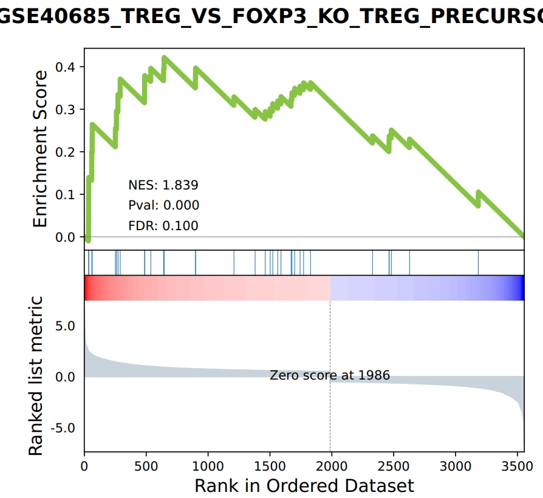
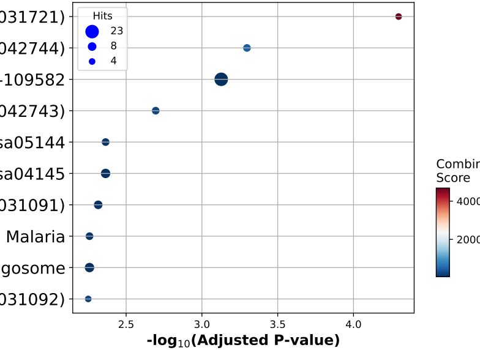

GSEA and pathway/GO enrichment analyses
===================================

::

	run_GSEA.py [input_file] [logFC_cutoff] [pvalue_cutoff] [logFC_col_name] [pvalue_col_name] [out_file_label]

Summary
^^^^^^^

Given a differential gene expression table (a full table containing both significant and insignificant genes), this script performans Pathway and GO enrichment analysis (``enrichR``) for the follow databases:

- GO_Biological_Process_2021
- GO_Cellular_Component_2021
- GO_Molecular_Function_2021
- KEGG_2019_Mouse
- KEGG_2021_Human
- KEGG_2016
- Reactome_2016

And the GSEA analysis (``GSEApy``) based on the MSIG database ``/home/yli11/Data/Human/MSigDB/msigdb.v7.5.1.symbols.gmt`` and the following databases:

- KEGG_2019_Mouse
- KEGG_2021_Human
- KEGG_2016
- Reactome_2016

Takes about 10-30 min to finish the whole analysis.

Input
^^^^^

The input can be a csv or a tsv file with the first column of gene names. The first row should be column names.

Usage
^^^^^

.. code:: bash

	hpcf_interactive.sh

	module load conda3/202011

	source activate /home/yli11/.conda/envs/captureC

	# suppose our input is from the diffgene pipeline, then we need to reformat the data

	# example

	cd /research_jude/rgs01_jude/groups/chenggrp/projects/blood_regulome/common/RNA/sorted/fetal_adult_expression/example/hg19_gene/d11_sleuth

	awk -F "," '{print $4"\t"$13"\t"$3}' d11.gene.final.combined.tpm.csv > tmp.tsv

	run_GSEA.py tmp.tsv 1 0.05 logFC qval example

Output
^^^^^^

EnrichR results are in the ``Enrichr`` folder.

GSEA results are in the ``GSEA_Prerank`` and ``GSEA_plots_FDR_0.1`` folder.

Example stats files are:

``GSEA.MSigDB.stats.csv`` for GSEA results.

``enrichR.stats.csv`` for enrichR results.

Comments
^^^^^^^^

.. disqus::
    :disqus_identifier: NGS_pipelines

