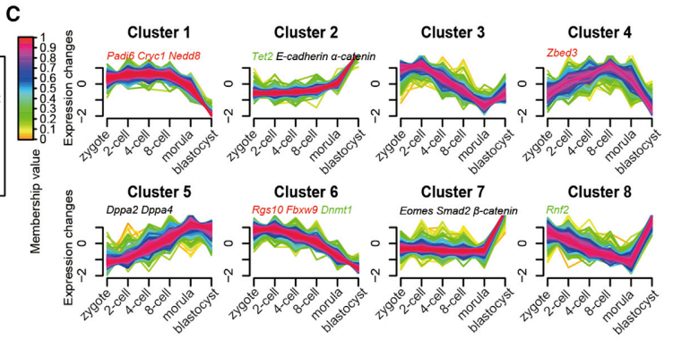
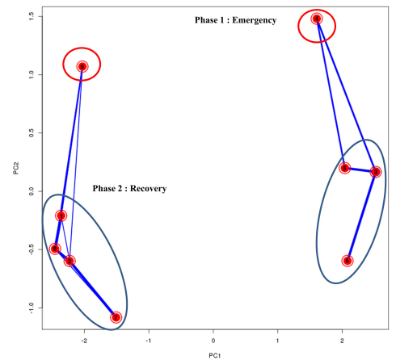

Gene expression clustering
==========================

Summary
^^^^^^^

MFuzz is a tools for fuzz-clustering. It is a type of soft clustering where a sample can be assigned to multiple clusters with a probability cutoff. 

I found two interesting figures for visualizing MFuzz and wanted to note it here.

vis1: https://www.cell.com/cell-reports/pdf/S2211-1247(17)31795-3.pdf

vis2: https://journals.plos.org/plosone/article/file?id=10.1371/journal.pone.0135565&type=printable

Clustering line plot
^^^^^^^^^^^^^^^^^^^^

Description:

We applied the fuzzy c-means algorithm (Futschik and Carlisle, 2005) to cluster protein expression profiles in all developmental stages. In total, we observed 10 distinct clusters of temporal patterns representing proteins that are regulated differently (Figure 1C; Table S1), indicating different expression kinetics. Among these, clusters 1, 6, and 10 represent proteins that are downregulated, clusters 2, 5, and 9 represent proteins that are upregulated, whereas clusters 3, 4, 7, and 8 represent proteins displaying a bi-modal expression pattern. Overlaying our previously published oocyte proteomic data containing primarily maternal proteins (Wang et al., 2010), we found, intriguingly, that maternal proteins are mainly classified within clusters that show a low expression level in the blastocyst stage with distinct kinetics (clusters 1, 4, 6, and 10, Figures 1D and 1F). These proteins include many defined maternal factors that play critical roles regulating ZGA, such as MATER, PADI6, NPM2, ZFP36L2, ATG5, ZAR1, etc. (Xue et al., 2013). Our experiments captured three (MATER, FLOPED, and TLE6) of four known components of the subcortical maternal complex (SCMC), a protein structure that is essential for pre-implantation development(Li et al., 2008), all of which fall into cluster 1 (Figure 1E). This is consistent with the idea that these maternal proteins are 

Clustering PCA plot
^^^^^^^^^^^^^^^^^^^^

Description:

This PCA biplot—plotting the first two principal components—gives a general idea on how the average expression patterns of the clusters are similar to each other. The closer the different cluster centres to each other, the more similar their average expression profiles are. Additionally, on top of the PCA plot, the overlap in genes between different clusters is visualized by lines with variable width between different clusters: the wider the line between two clusters, the higher the overlap. The graph generally shows a clustering in two groups, representing two distinct phases. Phase one—“Emergency response”: Clusters 3, 5 and 6 (blue ellipse) display the highest up-regulation at time point 0h and this effect fades out at later time points. To a lesser extent, also cluster 4 (red ellipse) can be categorized in the Phase1 response clusters, as genes belonging to this cluster display a significant high expression at 0H, and a strong repression after 2 hours and again a normal expression level after 5 hours. Phase 2 -“Recovery response”: Clusters 1, 2, 7, and 8 (blue ellipse) grouping genes with lowered expression at T0H that increased again during recovery; and in minor degree cluster 9 (red ellipse) showing significant increase in expression for all doses during recovery. 
