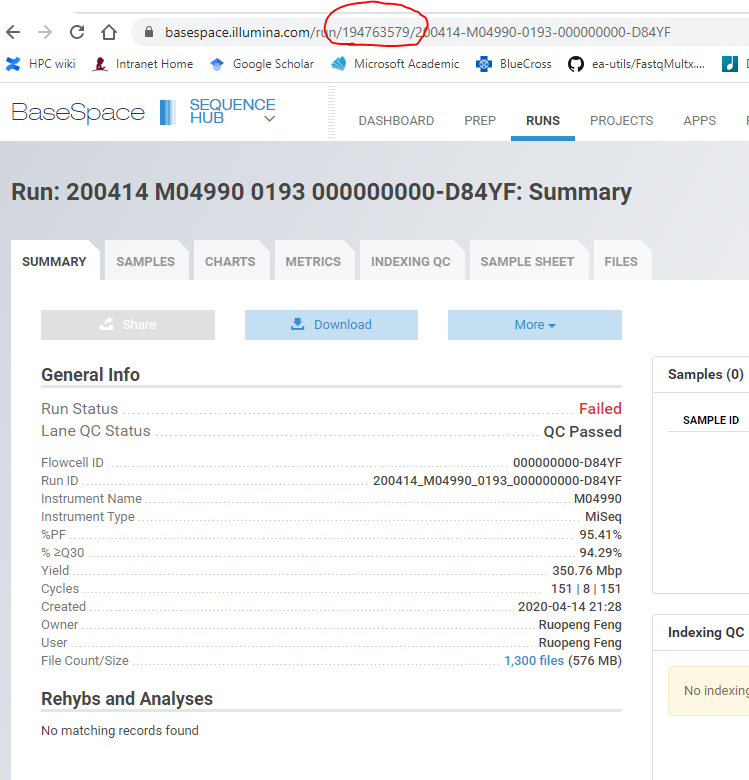

Download raw data from Illumina Base Space
======================

Input
^^^^^

You need runID to locate the files.

Usage
^^^^^

``bs authenticate`` will ask for username and password. Once this is done, next time you want to download data, you don't need to do this anymore.

I found that, if data is shared with me, but not owned by me, then I can't download the data.

In the following commands, ``194763579`` is the runID. ``failed_download`` is the output folder name, where you can then use bcl2fastq for demultiplexing.

.. code:: bash

	hpcf_interactive.sh

	bs authenticate

	bs download run -i 194763579 -o failed_download

