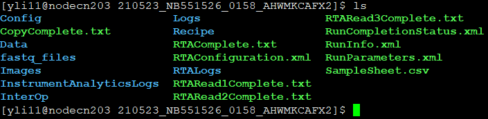

Convert BCL basecall files to FASTQ files
=========================================


.. tip:: For demultiplexing, you must provide ``SampleSheet.csv``; otherwise, all fastq.gz files will be named as ``Undetermined``. You have to upload ``SampleSheet.csv`` to the dir that conatins BCL files on HPC. Below is what this dir should look like (and the files and subfolders it should contain, not including fastq_files folder):



.. note:: ``SampleSheet.csv`` is a keyword, user much provide a file with exactly this name. Otherwise, the output will just be ``Undetermined``. A different name is OK for more advanced users.

See this for SampleSheet format details: https://www.illumina.com/content/dam/illumina-marketing/documents/products/technotes/sequencing-sheet-format-specifications-technical-note-970-2017-004.pdf

You can download an example SampleSheet.csv here: https://github.com/YichaoOU/HemTools/tree/master/docs/gallery/SampleSheet.csv

.. note:: Please note that there should be no spaces (i.e., only _ is allowed, for special char) in sample_ID (e.g., see some incorrect examples below). A unique sample_ID is also preferred. 


.. note:: We found that for Miniseq and Nextseq, your R2 index in samplesheet.csv have to be reverse complemented. For Miseq, everything is normal.


.. note:: Basic sequence information is in ``RunInfo.xml`` if you are not sure about SE or PE or read/index length.

.. image:: ../../images/no_space_bcl2fastq.PNG
	:align: center

**Step 1**

.. highlight:: none

:: 

	hpcf_interactive -q standard -R "rusage[mem=32000]"

**Step 2**

.. code:: bash

	module load bcl2fastq

**Step 3**

.. code:: bash

	bcl2fastq --no-lane-splitting -o fastq_files

Once finished, you should be able to see the fastq files in folder `fastq_files`.

.. note:: ``fastq_files`` is the output folder. Feel free to change it.

.. tip:: By default, one mismatch is allowed for demultiplexing. If you want to allow for two mismatches, type the command below:

.. code:: bash

	bcl2fastq --no-lane-splitting -o fastq_files --barcode-mismatches 2


Manually reverse complement R2 index
^^^^^^^^^^^^^^^^^^^^^^^^

In some sequencer, e.g., miniseq or Nextseq, users have to manually get revcomp seq of R2 index. So in this case, you can use http://arep.med.harvard.edu/labgc/adnan/projects/Utilities/revcomp.html to get a list of revcomp sequences and copy and replace old index. Upload new sample sheet csv to HPC and run:

.. code:: bash

	bcl2fastq --sample-sheet SampleSheet2.csv --no-lane-splitting -o fastq_files2


Wierd special char in your samplesheet.csv
^^^^^^^^^^^^^^^^^

<U+FEFF> character showing up in files. How to remove them?

https://gist.github.com/szydan/b225749445b3602083ed

::


	1) In your terminal, open the file using vim:

	vim file_name
	2) Remove all BOM characters:

	:set nobomb
	3) Save the file:

	:wq


Mising bcl
^^^^^^^^^


Question: "I have a pair-end 150bp sequencing run that stopped in the middle at about 150cycles. I think that it should contain the data that I need for the analysis. But when I do bcl files to fastq files, it showed error "Unable to find BCL file for 's_1_1102' in"

Solution: Add ``--ignore-missing-bcls`` option. 

For example: ``bcl2fastq --no-lane-splitting -o fastq_files --ignore-missing-bcls``


Which delmultiplexing pipeline I should use
^^^^^^^^^^^^^^^^^^^^^^^^^^^^^^^^^^^


https://support.illumina.com/bulletins/2016/04/adapter-trimming-why-are-adapter-sequences-trimmed-from-only-the--ends-of-reads.html


Generating I1 I2 reads
^^^^^^^^^^

::

	bcl2fastq --no-lane-splitting -o fastq_files2 --create-fastq-for-index-reads --ignore-missing-bcls --minimum-trimmed-read-length 0 --mask-short-adapter-reads 0

ref: https://manuals.cellecta.com/drivermap-targeted-expression-profiling-kits/v1/en/topic/run-data-extraction


Generate Undetermined fastq
^^^^^^^^^^^^^^^^^^^


::

	# if you haven't done hpcf_interactive, run the next command
	hpcf_interactive -q standard -R "rusage[mem=32000]"

	module load bcl2fastq

	wget https://raw.githubusercontent.com/YichaoOU/HemTools/master/docs/gallery/minimal_SampleSheet.csv

	bcl2fastq --no-lane-splitting -o raw_fastq --sample-sheet minimal_SampleSheet.csv

Generate R1 and R2 reads with I1 and I2 in the read name
^^^^^^^^^^^^^^

Header example: 

::

	@M04990:107:000000000-JYJGM:1:1101:20373:1000 1:N:0:NCTCCGAC+NTANNNCNNNNNNNNTTC

By default, ```bcl2fastq`` indeed does put index reads in the read name. However, it is only when you have some samples specified in the ``SampleSheet.csv``. To get Undertermined R1, R2, I1, I2 with read name containing index, you need to have some dummy SampleSheet.csv.

::

	# if read length is 301bp, uditas, I8, I18
	bcl2fastq --no-lane-splitting -o fastq_files --sample-sheet /research/dept/hem/common/sequencing/210109_M04990_0003_000000000-J87CP/Data/Intensities/BaseCalls/SampleSheet.csv --create-fastq-for-index-reads

	# uditas, 151 read, I8, I18
	bcl2fastq --no-lane-splitting -o fastq_files --sample-sheet /home/yli11/HemTools/share/misc/SampleSheet_I8_I18.csv --create-fastq-for-index-reads

	# if read length is 151bp
	bcl2fastq --no-lane-splitting -o fastq_files --sample-sheet /home/yli11/HemTools/share/misc/SampleSheet.csv --create-fastq-for-index-reads

	# for starr-seq
	bcl2fastq --no-lane-splitting -o starr_seq_fastq --sample-sheet /home/yli11/HemTools/share/misc/starr_seq_SampleSheet.csv --create-fastq-for-index-reads

	# for starr-seq demultiplexing
	starr_seq_demultiplex.py ATTACTCG TATAGCCT ATAGAGGC 1
	# DNA barcode R1, R2, RNA barcode, mismatch cutoff

	# for g34 iSeq
	cp /home/yli11/dirs/hem_seq/20220505_FS10001356_32_BPN80008-1429/SampleSheet.csv .
	bcl2fastq --no-lane-splitting -o fastq_files


Sequence data is paired-end with 8bp i7 and i5, but my actual data is just single-end read with just index 1 6bp.
^^^^^^^^^^^^^^^^^^^^^^^^^^^^^^^^

In this case, you don't need to do anything different for bcl2fastq command. You just need to only put i7 6bp index in the ``SampleSheet.csv`` file. After bcl2fastq, you will have R1 and R2 reads, but you only need R1 reads.


.. raw:: html

  <video controls width="690" src="../../_static/bcl2fastq_single_index.mp4#t=0.3"></video>


Comments
^^^^^^^^

.. disqus::
    :disqus_identifier: NGS_pipelines

