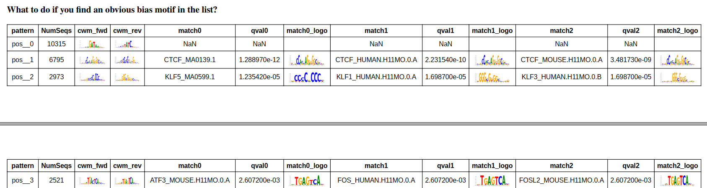
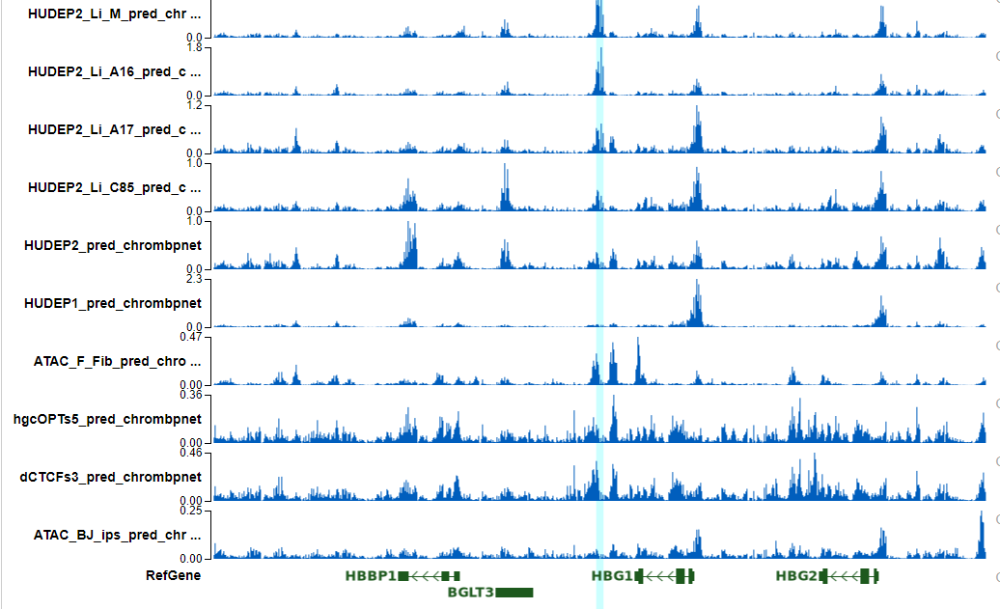

ATAC-seq model and footprint prediction using Chrombpnet
^^^^^^^^^^^^^^^^^^^^^^^^^^^^^^^^^^^^^^^^

Summary
^^^^^^^

Compared to HINT-ATAC and TOBIAS, they claimed this method is the best so far.

Training takes about 12 hours.

Increase number of filtered (model complexity) doesn't increase model performance. So we will keep default parameters.

Input
^^^^^

``input.list`` containing 3 columns: bam, peak, label

BAM file
--------

You need to have paired-end properly mapped reads, PCR duplicated removed, and replicats merged data. ``samtools view -b -@50 -F780 -q30``

::

	samtools merge -f ~/chrombpnet_tutorial/data/downloads/merged_unsorted.bam ~/chrombpnet_tutorial/data/downloads/rep1.bam  ~/chrombpnet_tutorial/data/downloads/rep2.bam  ~/chrombpnet_tutorial/data/downloads/rep3.bam
	samtools sort -@4 ~/chrombpnet_tutorial/data/downloads/merged_unsorted.bam -o ~/chrombpnet_tutorial/data/downloads/merged.bam
	samtools index ~/chrombpnet_tutorial/data/downloads/merged.bam

Peak file
--------

You need relaxed peak-calls (MACS2 with p-value parameter threshold set to 0.01) with blacklist region removed. ``pipeline: atac_merge_replicates_relax_peakcall``

Important note
^^^^^^^^^^^^^^

``make sure you have removed chrM in both BAM file and peak file, if not, use genome fasta without chrM``

The input chromosome size file only have chr1-chr22 + X/Y. The input fasta file can have chrM. Bam/Peak will be filtered using chromosomes in the fasta file. Therefore, if bam/peak have chrM reads, then when the file generate bw (as an intermediate input to the DL model), chrombpnet will fail. So make sure you have removed chrM in both Bam file and peak file.

Usage
^^^^^^

::

	run_lsf.py -f input.list -p chrombpnet --genome_fasta hg19_main.fa --main_nochrM_chrom_size hg19.main.size --blacklist hg19-blacklist.v2.bed.gz

	run_lsf.py -f input.list -p chrombpnet --genome_fasta /research_jude/rgs01_jude/groups/chenggrp/projects/blood_regulome/chenggrp/Data_resource/Genome/Human/hg38/fasta/each_chr/no_chrM/hg38.no_chrM.fa --main_nochrM_chrom_size /home/yli11/Data/Human/hg38/annotations/hg38_main.nochrM.chrom.sizes --blacklist /home/yli11/Data/Blacklist/lists/hg38-blacklist.v2.bed.gz --bed10 /home/yli11/Data/Human/hg38/annotations/hg38_main.chrombpnet.bed10

Output
^^^^^^

hg38 blood models: ``/research_jude/rgs01_jude/groups/chenggrp/projects/blood_regulome/chenggrp/HemPortal/HemTools_uniform_processed_files/ATAC/atac_seq_yli11_2023-12-08/bam_files/atac_merge_replicates_relax_peakcall_yli11_2023-12-11/chrombpnet_yli11_2023-12-18``

``Hudep2 hg19 models``: /home/yli11/Programs/chrombpnet/chrombpnet_yli11_2023-12-08

QC
^^^^

Open the evaluation report pdf file, the QC metrics are self-explainary. 

The top enriched motifs are data specific, you should be able to see the enriched motifs are different in HUDEP2 and Jurkat.

