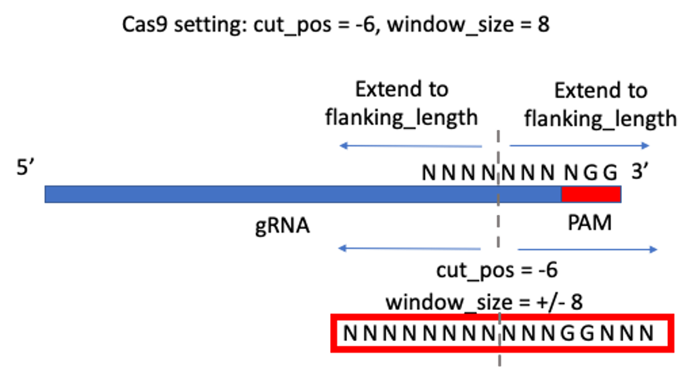
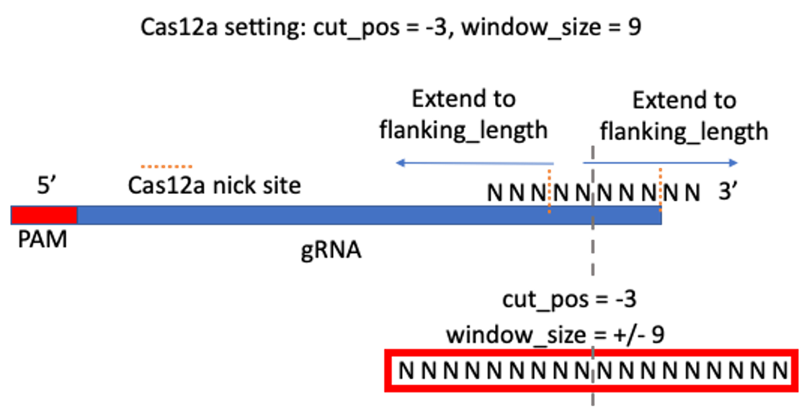

Count indel integration pipeline
=====================

Summary
^^^^^^^

This pipeline performs the following analysis in order:

1. trimmomatic PE 

2. flash

3. bwa mem

4. count_indels_integrations2.py

Once the pipeline is finished, you will be notified by email.

Input
^^^^^

Input file is a 4-col tsv file: R1 read, R2 read, output_name, gRNA_bed_file

::

	CRL1403_S1_R1_001.fastq.gz	CRL1403_S1_R2_001.fastq.gz	CRL1403_S1	CTLA4_site_9.bed

The first 3 columns can be automatically generated using ``--guess_input`` option. Users have to fill in the last column.

The coordinates for gRNA need to include the PAM sequence.

gRNA_bed_file should be 6 columns: chr, start, end, name, value (can be anything), strand

4/14/2025 updates
-----------------

User can input a custom dsODN sequence via:  ``--addon_parameters " --dsODN AAAAAAAAAAAAA"``. Please notice there is a space before "--dsODN". ``" --dsODN``. 

Note: if custom dsODN sequence length is around 34bp, then default sequence alignment parameter should be OK. If length is too different, we may need to adjust the parameters.

Example:

::

	run_lsf.py -p count_integration -f fastq.tsv --addon_parameters " --dsODN AAAAAAAAAAAAA"

12/6/2023 updates
-----------------

To generate a summary table for Prism to create Manhattan plot, you first need a user label tsv file, ``user_label.tsv``

The second column is the sample ID used in your fastq file. The first column is a user label, such as donor informatin.

::

	xxx_Control	VK2379
	xxx_Edit	VK2380
	yyy_Control	VK2381
	yyy_Edit	VK2382
	yyy_Control	VK2383
	yyy_Edit	VK2384

Then run:

::

	# first, login to a compute node

	module load python/2.7.13

	export PATH=$PATH:"/home/yli11/HemTools/bin"

	## Inside the count_integration jobID folder

	countIntegration_summary_table.py

8/5/2021 updates
-----------------

FLASH can fail due to some reasons, including amplcion sequence length or noisy reads. In this case, you might want to just use R1 and R2, because the program use BWA to map to the genome, trimming reads may not be needed. 

Same input, but to just use R1, run:

::

	run_lsf.py -p count_integration_R1 -f fastq.tsv

Same input, but to just use R2, run:

::

	run_lsf.py -p count_integration_R2 -f fastq.tsv

Also, if you would like to get allele frequency plot, generated by crispresso, you can follow the :doc:`base_editor_amplicon_seq pipeline <../CRISPR/base_editor_amplicon_seq>` for more details.

1/26/2021 updates
-----------------

Added a 5-th column (optional). When user has a large bed file, where each row is for a different fastq file, this option should save some time.

Input file is a 5-col tsv file: R1 read, R2 read, output_name, gRNA_bed_file, site_name

site name should match the 4th column in the bed file

::

	CRL1403_S1_R1_001.fastq.gz	CRL1403_S1_R2_001.fastq.gz	CRL1403_S1	target.bed	EMX1_site1
	banana.R1.fastq.gz	banana.R2.fastq.gz	banana	target.bed	banana_site3
	orange.R1.fastq.gz	orange.R2.fastq.gz	orange	target.bed	EMX1_site1

The first 3 columns can be automatically generated using ``--guess_input`` option. Users have to fill in the rest columns.

The coordinates for gRNA need to include the PAM sequence.

gRNA_bed_file should be 6 columns: chr, start, end, name, value (can be anything), strand

Output
^^^^^^

Inside the Job ID folder, you can find individual result folder for each line specified in the input.

When the job is finished, you will be notified by an email with QC report.

Method
^^^^^

How indel is determined
----------------------

.. image:: ../../images/count_indel_pipeline.png
	:align: center

Optimal window size setting is from: https://www.biorxiv.org/content/10.1101/2020.11.13.382283v1.full

"We determined the optimal window size to be the size at which the median difference of calculated indel editing between treatment and control samples was less than 0.1%. Using this rationale, we find that an optimal window can be defined as ``+/- 8bp`` for Cas9 (Figure 3A) and +/- 12bp for Cas12a (Figure S5). However, we found that if the center of the Cas12a window is shifted -3bp from the PAM distal cut site, the optimal variant window can be decreased to ``+/- 9bp`` (Figure 3B)."

Usage
^^^^^

Create a new working dir, put the fastq files in (e.g., ``ln -s``) and run the following.

Step 0: Login to a compute node.

::

	hpcf_interactive

Step 1: generate input file ``fastq.tsv`` using ``--guess_input``

::

	module load python/2.7.13

	export PATH=$PATH:"/home/yli11/HemTools/bin"

	run_lsf.py --guess_input

Step 2: manually add the bed file as the 4th column

Step 3: submit job

::

	run_lsf.py -p count_integration -f fastq.tsv

default is cas9 setting, to choose other options, use:

::

	run_lsf.py -p count_integration -f fastq.tsv --setting cas12a

g34 indel quantification
^^^^^^^^^^^^^^^

::

	run_lsf.py --guess_input

	run_lsf.py -f fastq.tsv -p count_integration_g34