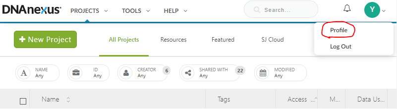
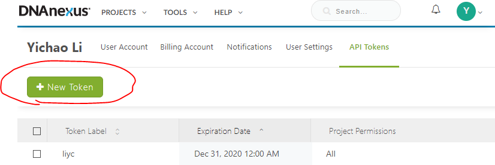
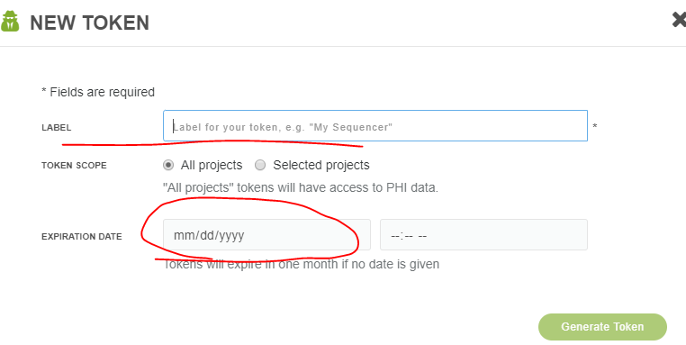

DNAnexus download
=================

Summary
^^^^^^^

This post provides a method to download files from Stjude Could that is much faster than ``wget``.

Login account setup
^^^^^^^^^^^^^^^^^^^

.. note:: You just need to do this once.

**CREATE YOUR API TOKEN**

Following these 3 steps to get an API TOKEN. Maybe email this token to yourself, because you will once see it once. If you lost it, you will need to create it again (though it is quite easy to generate a new one).

.. code:: bash

	module load dx-toolkit

	dx login --token [YOUR TOKEN]

Download a folder
^^^^^^^^^^^^^^^^^^^

You can find ``projectID`` by going to the folder and click ``Settings``. See the example below:

.. image:: ../../images/dx_download.png
	:align: center

The general usage is shown below.

.. code:: bash

	module load dx-toolkit

	dx cd projectID

	dx ls

	# replace projectID 

	dx download -r -f folder_name

	## or 

	dx download -f *.gz

	# -f option used to overwrite files with the same file name.

	# I sometimes see files with the same file name in Stjude cloud

	# and it can raise error when download the files.

For example, all your data is store in some folder inside ``chengLab`` dir, say ``RNA_seq_example00``. Then, by ``dx cd chengLab-projectID``, you are virtually inside ``chengLab`` dir, just like Linux command ``cd``. Next, do ``dx download -r RNA_seq_example00``, it will download the whole folder to your current dir in HPC. Now, suppose I want to download ``RNA_seq_example00`` inside my ``sequencing`` folder, you should first go to that dir and then do dx download.

.. note:: ProjectID is for each project, it is the root of your directory tree. If your target folder is in the third-level or more, you need to do more than one ``cd`` command.

The following example will assume that the directory structure is::

::
	├── project
	│   ├── seq_data1
	│   └── Banana
	│      └── seq_data2

Example 1 - download seq_data1
^^^^^^^^^^^^^^^^^^^^^^^^^^^^^^

Option 1: This option will create ``seq_data1`` folder inside your current dir.

.. code:: bash

	module load dx-toolkit

	dx cd projectID

	dx download -r -f seq_data1

Option 2: This option will download every file inside your current dir.

.. code:: bash

	module load dx-toolkit

	dx cd projectID

	dx download -f *.gz

Example 2 - download seq_data2
^^^^^^^^^^^^^^^^^^^^^^^^^^^^^^

Option 1: This option will create ``seq_data2`` folder inside your current dir.

.. code:: bash

	module load dx-toolkit

	dx cd projectID

	dx cd Banana

	dx download -r -f seq_data1

Option 2: This option will download every file inside your current dir.

.. code:: bash

	module load dx-toolkit

	dx cd projectID

	dx cd Banana

	dx download -f *.gz

