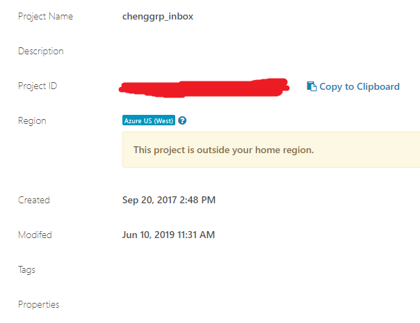

DNAnexus download
=================

.. tip:: Much faster than ``wget``.

You can find ``projectID`` by going to the folder and click ``Settings``. See the example below:

.. code:: bash

	module load dx-toolkit

	dx cd projectID

	# replace projectID 

	dx download -r -f folder_name

	# -f option used to overwrite files with the same file name.

	# I sometimes see files with the same file name in Stjude cloud

	# and it can raise error when download the files.

For example, all your data is store in some folder inside ``chengLab`` dir, say ``RNA_seq_example00``. Then, by ``dx cd chengLab-projectID``, you are virtually inside ``chengLab`` dir, just like Linux command ``cd``. Next, do ``dx download -r RNA_seq_example00``, it will download the whole folder to your current dir in HPC. Now, suppose I want to download ``RNA_seq_example00`` inside my ``sequencing`` folder, you should first go to that dir and then do dx download.

