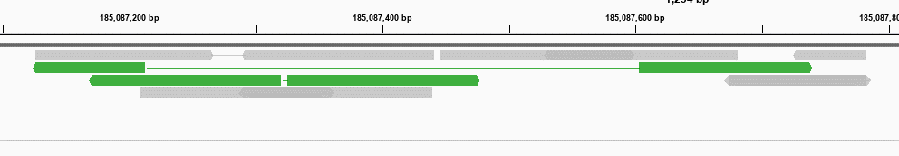

Extract inward/outward oriented pairs from BAM file
===================================

::

	usage: extract_reads.py [-h] [-o OUTPUT] [-f BAM_FILE] (--outward | --inward)

	optional arguments:
	  -h, --help            show this help message and exit
	  -o OUTPUT, --output OUTPUT
	                        output table name (default:
	                        extract_reads_2020-03-11.csv)
	  -f BAM_FILE, --bam_file BAM_FILE
	                        input bam file (default: None)
	  --outward             get outward reads (default: False)
	  --inward              get inward reads (default: False)

Summary
^^^^^^^

This program can extract inward or outward reads from a given BAM file. This problem will only consider properly paired reads and not supplementary alignments. Results are matched to the numbers from ``samtools stats``.

Examples of outward oriented pairs are highlighted in green. 

Input
^^^^^

A bam file with index in the same dir.

Usage
^^^^^

.. code:: bash

	hpcf_interactive

	module load python/2.7.13

	extract_reads.py -f input.bam --outward -o output.csv

Output
^^^^^^

Output file contains 3 columns: read name, read 1 sequences, read 2 sequences.

FAQ
^^^

Numbers do not match?
---------------------

Remember that in this program, reads are filtered. To get the number match, you can filter your bam file like below: 

.. code:: bash

	samtools view -b -F 2048 -f 2 input.bam > test.bam
	samtools index test.bam
	samtools stats test.bam | head -37
	extract_reads.py -f test.bam --outward

Comments
^^^^^^^^

.. disqus::
    :disqus_identifier: NGS_pipelines

