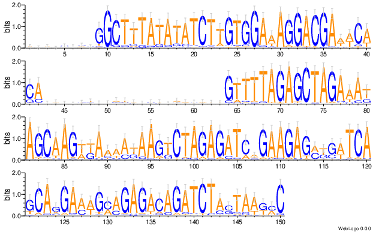

subsample fastq and visualize in sequence logo
================

Summary
^^^^^

Mostly used for exploration and debug of raw fastq files, to identify common sequence patterns.

Steps: fastq was subsamples to 2M reads, clustered and reordered based on k-mer and sequence logo was generated for each of the 10-splits reads. For example, a sequence logo for 0% to 10% of the reads.

Usage
^^^^^

Copy your fastq to a working dir.

::

	hpcf_interactive

	module load python/2.7.13

	run_lsf.py --guess_input --single

	run_lsf.py -f fastq.tsv -p fastq_vis

	

