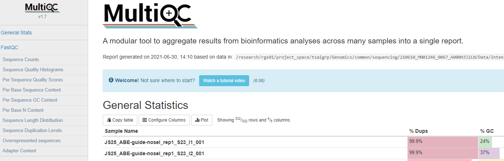

Run fastQC for a list of fastq files
========================

Input
^^^^^

A list of fastq files. If these files are in the current dir, you can create this input list by:

::

	ls *fastq.gz > input.list
	ls *fastq >>input.list
	ls *fq.gz >>input.list
	ls *fq >> input.list

Usage
^^^^

.. code:: bash

	hpcf_interactive

	module load python/2.7.13

	run_lsf -f input.list -p fastqc

Output
^^^^^

You will receive a QC report by email.

Please check the fastqc documentation for each invidual metric explanation. https://www.bioinformatics.babraham.ac.uk/projects/fastqc/