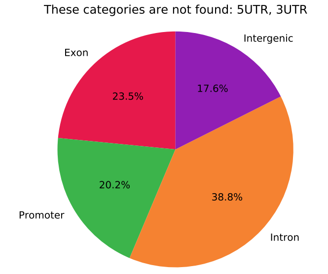

Genomic features annotatoin given bed file
===================================

::

	usage: annot_gene_features.py [-h] -f INPUT_BED [-g GENOME] [--tss TSS]
	                              [--exon EXON] [--promoter PROMOTER]
	                              [--UTR5 UTR5] [--UTR3 UTR3] [--intron INTRON]
	                              [--gene_name_list GENE_NAME_LIST] [--coding]
	                              [-d1 D1] [-d2 D2] [-o OUTPUT] [--gene_names]

	optional arguments:
	  -h, --help            show this help message and exit
	  -f INPUT_BED, --input_bed INPUT_BED
	                        3 column bed file, additional columns are OK, but will
	                        be ignored (default: None)
	  --coding              focus on coding genes only (default: False)
	  -d1 D1                extend query bed for intersection (default: 0)
	  -d2 D2                extending genomic features for intersection (default:
	                        0)
	  -o OUTPUT, --output OUTPUT
	                        output intermediate file (default: output)
	  --gene_names          use gene names instead of gene id, only works for hg19
	                        now (default: False)

	Genome Info:
	  -g GENOME, --genome GENOME
	                        genome version: hg19, hg38, mm9, mm10. By default,
	                        specifying a genome version will automatically update
	                        the annotation file (default: hg19)
	  --tss TSS             tss feature file, 4 columns, chr, start, end , gene
	                        name (default: None)
	  --exon EXON           exon feature file, 4 columns, chr, start, end , gene
	                        name (default: None)
	  --promoter PROMOTER   promoter feature file, 4 columns, chr, start, end ,
	                        gene name (default: None)
	  --UTR5 UTR5           5UTR feature file, 4 columns, chr, start, end , gene
	                        name (default: None)
	  --UTR3 UTR3           3UTR feature file, 4 columns, chr, start, end , gene
	                        name (default: None)
	  --intron INTRON       intron feature file, 4 columns, chr, start, end , gene
	                        name (default: None)
	  --gene_name_list GENE_NAME_LIST
	                        a file containing id to name conversion (default:
	                        None)

Summary
^^^^^^^

Genomic features are based on Gencode annotation, which is then parsed to exon, promoter, 5UTR, 3UTR, intron, intergenic regions using : https://github.com/saketkc/gencode_regions

Feature assignment program is based on :doc:`EPI assignment program <assign_targets>`

Input
^^^^^

Bed file with at least 3 columns: chr, start, end

Output
^^^^^^

8 columns will be added to the input bed file:

The first 2 columns are nearest_TSS_gene, nearest_TSS_distance.

The next 5 columns are overlaps with exon_gene, promoter_gene, 5UTR_gene, 3UTR_gene, intron_gene.

The last columns is Genomic_features, the priority is Exon, Promoter, 5UTR, 3UTR, Intron, Intergenic. 

By default, output uses gene Ensemble ID. You can use ``--gene_names`` option to output just gene names.

Usage
^^^^^

.. code:: bash

	export PATH=$PATH:"/home/yli11/HemTools/bin"
	hpcf_interactive.sh
	module load conda3
	source activate /home/yli11/.conda/envs/py2
	annot_gene_features.py -f input.bed -o output.bed

	# OR
	annot_gene_features.py -f input.bed -o output.bed --gene_names

	## generate a pie chart

	pie_plot.py -f output.bed --order Exon,Promoter,5UTR,3UTR,Intron,Intergenic --use_col -1 --header

Pie chart example
^^^

::

	n=3995
	f=CFUe.06.peaks.bed
	annotatePeaks.pl $f mm9 -gtf $ann > $f.annot.txt
	pie_plot.py -f $f.annot.txt --use_col Annotation --header --homer -t "$f(n=$n)" -o $f.annot.pdf
