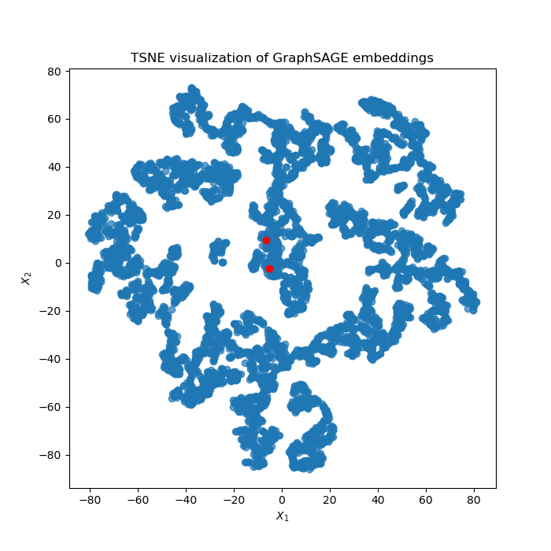
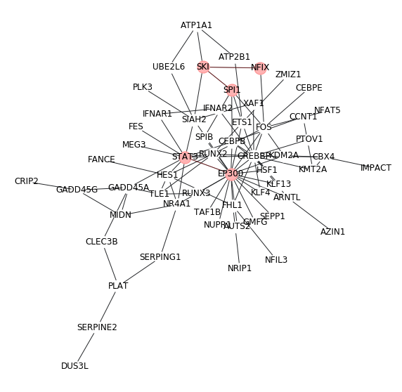
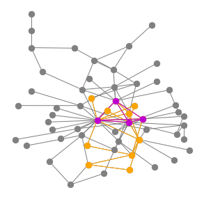

Integrating gene expression data and PPI network
^^^^^^^^^^^^^^^^^^^^^^^^^^^^^^^^^^^^^

Objective
^^^^^^^^

Our goal is to learn some network modules specific to the given gene expression data. No new PPIs are made by this algorithm. 

Input
^^^^^

Gene expression read count table, CSV
----------------------

Each row is a gene, each column is a sample.

The first row is column names and the first column is row names.

BIO-GRID txt file
-----------------

For example, ``BIOGRID-ALL-4.2.192.tab3.txt``

Usage
^^^^^

Step 1: prepare input.list
------

This is a 3 column tsv with file names of gene.count.csv, biogrid.txt. The last column is output label.

Step 2: submit job
-----------

::

	hpcf_interactive

	module load python/2.7.13

	run_lsf.py -f input.list -p graphSAGE

Output
^^^^^^^

1. TSNE plot of all the nodes
--------------------------------

I sometimes run the algorithm multiple times to see if my interested genes can be clustered together.

2. network modules with name
--------------------------

This is a raw network plot without cosmetic enhancements.

2. network modules with some highlights
--------------------------

We can highlight our genes of interest manually. (need customized code)

