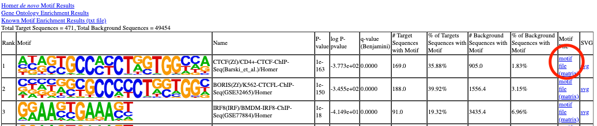

Homer ChIP-seq analysis
=======================

Reference: `Homer NGS annotation <http://homer.ucsd.edu/homer/ngs/annotation.html>`_

.. code:: bash

	hpcf_interactive -q standard -R "rusage[mem=20000]"

	module load homer/4.10

Peak annotation with genomic features: TSS, intron, exon, etc.
^^^^^^^^^^^^^^^^^^^^^^^^^^^^^^^^^^^^^^^^^^^^^^^^^^^^^^^^^^^^^^

**Using default genomes**

.. code:: bash

	annotatePeaks.pl [peak file] [genome version] -annStats annotate.log  > output.tsv

[peak file] : narrowPeak file from HemTools

[genome version] : hg18, hg19, mm9, mm10.

**output.tsv** is the peak annotation file, such as TSS-promoter, exon, etc.

Find motifs 
^^^^^^^^^^^

.. code:: bash

	findMotifsGenome.pl [peak_file] [genome_version] myOutput -size 200 -mask -preparsedDir parsing_genome_dir

Ref: http://homer.ucsd.edu/homer/ngs/peakMotifs.html

.. tip:: Need to add "-preparsedDir parsing_genome_dir"  homer will need to write a temp background files, you need some where that is writable.

Motif scanning: Find which peaks contain the motif
^^^^^^^^^^^^^^^^^^^^^^^^

Different motif scanning tools will give similar but still different results. For consistency, if you used homer for motif discovery, you should use homer for motif scanning.

Input motif is homer motif format
-----

::

>CCACHAGGKGGC	1-CCACHAGGKGGC,BestGuess:BORIS(Zf)/K562-CTCFL-ChIP-Seq(GSE32465)/Homer(0.929)	6.908069	-165.654312	0	T:203
.0(53.70%),B:7014.9(14.16%),P:1e-71
0.091	0.762	0.045	0.102
0.037	0.936	0.026	0.001
0.806	0.026	0.149	0.019
0.026	0.600	0.357	0.017
0.274	0.332	0.033	0.360
0.814	0.026	0.031	0.129
0.022	0.001	0.959	0.018
0.342	0.043	0.573	0.042
0.049	0.026	0.486	0.439
0.023	0.001	0.959	0.017
0.068	0.028	0.889	0.015
0.037	0.793	0.051	0.119

Note that ``1-CCACHAGGKGGC,BestGuess:BORIS(Zf)/K562-CTCFL-ChIP-Seq(GSE32465)/Homer(0.929)``, this long name will be the motif name that homer uses.

You can find the motif PWM from the motif report.

Usage
----

.. code:: bash

	annotatePeaks.pl peak_file hg19 -m homer.motif > output.tsv

If you have N motifs in ``homer.motif``, then the last N columns provide which peak contain the motif.

For example:

::

	CTCF_B_cell_GCCCCCTRGTGG,BestGuess:BORIS(Zf)/K562-CTCFL-ChIP-Seq(GSE32465)/Homer(0.878) Distance From Peak(sequence,strand,conservation) 
	179(ACCCCCTGGCGG,+,0.00)
	NA

``NA`` means that the peak doesn't contain the motif.

Motif co-occurrence in peaks 
^^^^^^^^^^^^^^^^^^^^^^^^^^^^

.. code:: bash

	annotatePeaks.pl [peak file] [genome version] -annStats annotate.log -m [knownResults/*.motif] -matrix co_occur_motifs > output.tsv

[peak file] : narrowPeak file from HemTools

[genome version] : hg18, hg19, mm9, mm10.

[knownResults/*.motif] : findMotifsGenome.pl output dir.

.. tip:: You can also use ``-m /hpcf/apps/homer/install/4.9.1/motifs/*.motif``. This is local homer motif database.

**co_occur_motifs.stats.txt** contains the co-occuring statistics.

**output.tsv** is the peak annotation file, with additional motif occurrence information.

.. tip:: You can control the peak size from the peak mid-point and use it to look for co-occuring motifs. For example, ``-size -300,300`` will extend the peak to -300bp upstream from center and 300bp downstream.

.. code:: bash

	annotatePeaks.pl [peak file] [genome version] -annStats annotate.log -m [knownResults/*.motif] -matrix co_occur_motifs -size -300,300 > output.tsv

[peak file]: for this ``size`` option, you might want to use the ``summits.bed`` file from HemTools.

