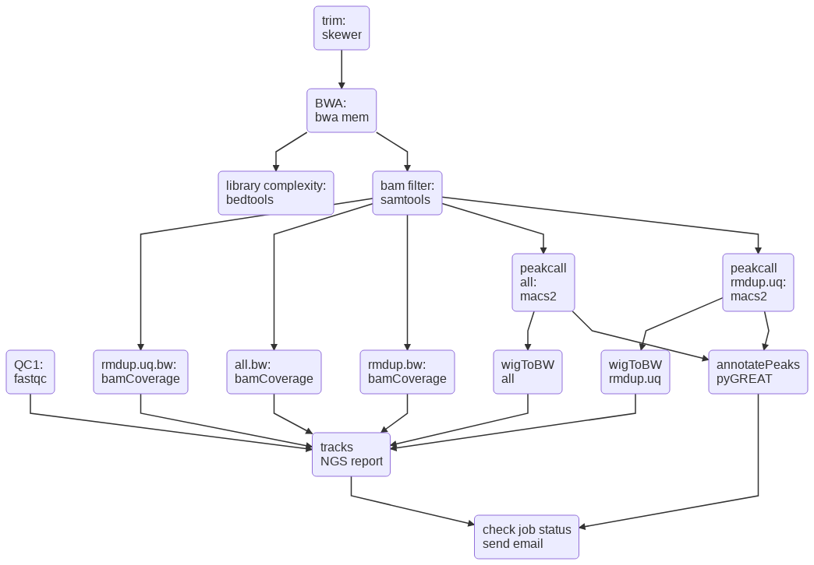

Write flowchart using text
==========================

**Step 1**

.. highlight:: none

:: 

	hpcf_interactive -q standard -R "rusage[mem=4000]"

**Step 2**

.. code:: bash

	module load conda3
	source activate /home/yli11/.conda/envs/npm/
	mmdc -h

**Step 3**

The text file example shown below. See https://mermaidjs.github.io/flowchart.html for syntax.

.. highlight:: none

:: 

	graph TD
    id1(QC1: fastqc)
    id2(trim: skewer) --> id3(BWA: bwa mem)
    id3 --> id4(library complexity: bedtools)
    id3 --> id5(bam filter: samtools)
    id5 --> id6(rmdup.uq.bw: bamCoverage)
    id5 --> id7(all.bw: bamCoverage)
    id5 --> id8(rmdup.bw: bamCoverage)
    id5 --> id9(peakcall all: macs2)
    id5 --> id10(peakcall rmdup.uq: macs2)
    id9 --> id11(wigToBW all)
    id10 --> id12(wigToBW rmdup.uq)
    id1 --> id13(tracks NGS report)
    id6 --> id13
    id7 --> id13
    id8 --> id13
    id11 --> id13
    id12 --> id13
    id9 --> id14(annotatePeaks pyGREAT)
    id10 --> id14
    id14 --> id15(check job status send email)
    id13 --> id15

.. code:: bash

	mmdc -i test.md -o test.png -w 1200 -H 1000

Default size is 800 * 600. Output to svg is OK. But text wrapping has some issues. ``test.png`` is shown below.

