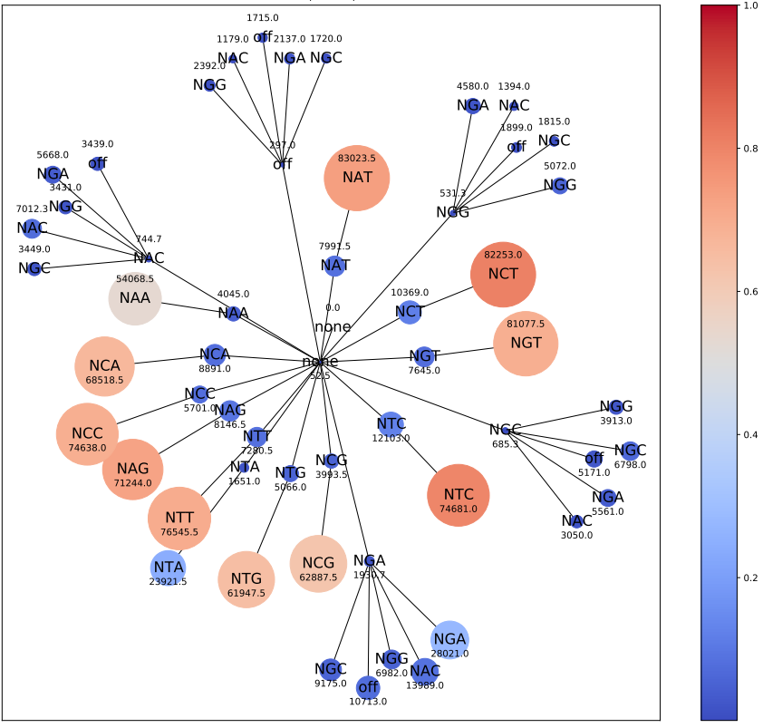

Optimal subset finding problem in mutagenesis studies
===================

::

	usage: optimal_subset.py [-h] -f MUTATION_LIST [-dir OUTPUT_DIR] -a
	                         AMPLICON_NUMBER [-t FLEXIBILITY] [-n TOP_N]
	                         [-m MIN_SAMPLE]
	                         [--binary_matrix_dir BINARY_MATRIX_DIR]

	optional arguments:
	  -h, --help            show this help message and exit
	  -f MUTATION_LIST, --mutation_list MUTATION_LIST
	                        mutation list, can be a file with one mutation per
	                        line or a list of mutations separated by comma
	                        (default: None)
	  -dir OUTPUT_DIR, --output_dir OUTPUT_DIR
	                        output_label (default:
	                        optimal_subset_yli11_2020-05-06)
	  -a AMPLICON_NUMBER, --amplicon_number AMPLICON_NUMBER
	                        amplicon number (default: None)
	  -t FLEXIBILITY, --flexibility FLEXIBILITY
	                        +- t search space (default: 3)
	  -n TOP_N, --top_n TOP_N
	                        save results for top n combinations for each t
	                        (default: 5)
	  -m MIN_SAMPLE, --min_sample MIN_SAMPLE
	                        if less than min_sample samples contain the given
	                        combination, skip plot (default: 5)
	  --binary_matrix_dir BINARY_MATRIX_DIR
	                        data matrix in feather format (default: /research/rgs0
	                        1/project_space/tsaigrp/Genomics/common/projects/Cas9m
	                        utagenesis/step1_mutation_count_yli11_2020-04-09/read_
	                        count_matrix)

Summary
^^^^^^

Finding a preferred subset from a given set of features is a common problem in biology. With different constraints, the problem can be mapped to set cover problem if user requires a minimal cardinality subset or mapped to feature selection problem if user wants to find the most distriminative subset between positive class and negative class. While the significance of individual feature can be quantified easily using statistical tests (e.g., DESEQ), the combination of features can't be evaluated over the entire space because of the curse of dimensionality. One common approach to reduce the computational cost is to solve the problem through some kind of heuristic algorithm. 

Here, we consider an optimal subset finding problem where the user has :math:`K` preferred features. The user would like to extend the :math:`K` features and find a superset that is of interest in terms of some metric. On the other direction, the user is also flexible on the "preferred" features; namely, the user would like to remove some feature(s) and find a subset that is of interest. In this study, we formally define the optimal subset finding problem and solve the problem via a greedy algorithm that finds sub-optimal solutions and a branch-and-bound algorithm that finds the exact optimal solution. We demonstrate the effectiveness of the solutions in mutagenesis studies.

.. todo::

	branch-and-bound algorithm

Problem definition
^^^^^

We consider a mutagenesis study where :math:`N` number of experiments have been sequenced and the total number of observed mutations is denoted by set :math:`M = \{M_1,M_2,...,M_m\}, m=|M|`. The number of reads in each experiments is denoted by :math:`R = \{R_1,R_2,...,R_N\}`.

Given $k$ number of candidate mutations (e.g., selected for DESEQ2 results), the biological question is to examine if the co-occurring of the $k$ mutations, and the subset of the $k$ mutations or the superset of the $k$ mutations are also significantly enriched in each sample. In other words, we ask if adding $t$ new mutations to the set or removing $t$ mutations ($t<k$) from the set can produce more biological meaningful mutation sets. 

A formal statement of this optimization problem is as follows. Let :math:`A^i` be a read count table for mutagenesis experiment $i$, $m$ be the number of observed mutations, and $r$ be the number of reads in sample $i$, where

Input
^^^^

1. mutation list
-----------

::

	mutation_name1
	mutation_name2
	mutation_name3

Output
^^^^^

All output files are stored in the {{jid}} folder.

1. Summary.tsv
------

This file contains the number of reads, percentage of reads, D_score, and OE_score  information for each mutation combination and each sample. I found OE_score is not informative.

When D_score>0, it represents the percentage of dropped reads when t mutations are added.

When D_score<0, its absolute value represents the presentage of increased reads when t mutations are removed.

+---------------------------------+---------------+------------+------------+------------------------+--------------------+-------------+
| mutation                        | sample        | read_count | D_score    | percent                | OE_score           | cardinality |
+=================================+===============+============+============+========================+====================+=============+
| ['x', 'mutation2', 'mutation3'] | 0-none.rep1.2 | 64         | 0.0        | 0.000382866714525006   | 3339.025469100123  | 3           |
+---------------------------------+---------------+------------+------------+------------------------+--------------------+-------------+
| ['x', 'mutation2']              | 0-none.rep1.2 | 126        | -0.96875   | 0.0007537688442211055  | 19.898871946034802 | 2           |
+---------------------------------+---------------+------------+------------+------------------------+--------------------+-------------+
| ['mutation2', 'mutation3']      | 0-none.rep1.2 | 89         | -0.390625  | 0.0005324240248863366  | 33.22221477858913  | 2           |
+---------------------------------+---------------+------------+------------+------------------------+--------------------+-------------+
| ['x', 'mutation3']              | 0-none.rep1.2 | 65         | -0.015625  | 0.0003888490069394592  | 17.954115827461766 | 2           |
+---------------------------------+---------------+------------+------------+------------------------+--------------------+-------------+
| ['x']                           | 0-none.rep1.2 | 1196       | -17.6875   | 0.007154821727686048   | 1.0                | 1           |
+---------------------------------+---------------+------------+------------+------------------------+--------------------+-------------+
| ['mutation2']                   | 0-none.rep1.2 | 885        | -12.828125 | 0.005294328786791098   | 1.0                | 1           |
+---------------------------------+---------------+------------+------------+------------------------+--------------------+-------------+
| ['mutation3']                   | 0-none.rep1.2 | 506        | -6.90625   | 0.0030270399617133284  | 1.0                | 1           |
+---------------------------------+---------------+------------+------------+------------------------+--------------------+-------------+
| ['x', 'mutation2', 'mutation3'] | 0-none.rep2.2 | 41         | 0.0        | 0.00046273305945555507 | 2489.549954985795  | 3           |
+---------------------------------+---------------+------------+------------+------------------------+--------------------+-------------+

2. enrichment visualization
-----

Node color represents percent of reads. Node size represent number of reads.

Figure title contains the mutation names (hidden for this example).

Usage
^^^^

.. code:: bash

	hpcf_interactive_large.sh

	module load conda3

	source activate /home/yli11/.conda/envs/py2

	export PATH=$PATH:"/home/yli11/Tools/optimal_subset" 

	optimal_subset.py -f test_mutations.list -a 2

Notes on association rule mining
^^^^^^^^^^^^^^^^^

https://en.wikipedia.org/wiki/Association_rule_learning

https://github.com/chuanconggao/PrefixSpan-py

https://github.com/ChongYou/subspace-clustering

http://rasbt.github.io/mlxtend/user_guide/frequent_patterns/association_rules/

https://www.google.com/search?q=association+rule+mining&sxsrf=ALeKk03HR2KVkvDnq45jediw3V5YOuPcQw:1590011454496&source=lnms&tbm=isch&sa=X&ved=2ahUKEwi59buftsPpAhWFGs0KHW6GA_cQ_AUoAnoECBcQBA&biw=1920&bih=878#imgrc=Nww2F_-dQTy-uM&imgdii=qSwr_hn6JDG-GM

