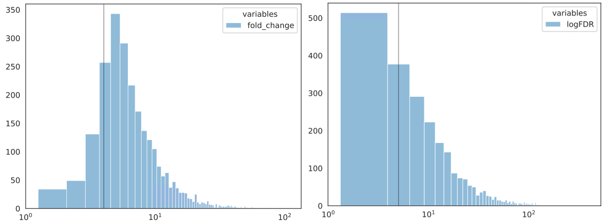

Filtering out peaks in narrowPeak files
==============================

NarrowPeak format
^^^^^^^^^^^

::

	NAME_peaks.narrowPeak is BED6+4 format file which contains the peak locations together with peak summit, p-value, and q-value. You can load it to the UCSC genome browser. Definition of some specific columns are:

	5th: integer score for display. It's calculated as int(-10*log10pvalue) or int(-10*log10qvalue) depending on whether -p (pvalue) or -q (qvalue) is used as score cutoff. Please note that currently this value might be out of the [0-1000] range defined in UCSC ENCODE narrowPeak format. You can let the value saturated at 1000 (i.e. p/q-value = 10^-100) by using the following 1-liner awk: awk -v OFS="\t" '{$5=$5>1000?1000:$5} {print}' NAME_peaks.narrowPeak

	7th: fold-change at peak summit

	8th: -log10pvalue at peak summit

	9th: -log10qvalue at peak summit

	10th: relative summit position to peak start

Usage
^^^^^

General approach: filtering out peaks using ``Fold-change or FC`` or ``FDR`` (``-log10qvalue ``).

First, let's take a look on the distribution of FC and FDR.

::

	hpcf_interactive

	module load conda3

	source activate /home/yli11/.conda/envs/py2

	cut -f 7 Donor12_FG4592_ABE801_100uM_S4.vs.CD34_day10_NT_IgG_S11.rmdup.uq.rmchrM_peaks.narrowPeak > tmp.list; histogram_seaborn.py --fold_change tmp.list --axv 4 --xscale_log -o FC.dist

	cut -f 9 Donor12_FG4592_ABE801_100uM_S4.vs.CD34_day10_NT_IgG_S11.rmdup.uq.rmchrM_peaks.narrowPeak > tmp.list; histogram_seaborn.py --logFDR tmp.list --axv 5 --xscale_log -o FDR.dist

The grey line (``--axv 4``) in ``FC.dist.pdf`` is fold change = 4.

The grey line (``--axv 5``) in ``FDR.dist.pdf`` is FDR = 1e-5. 

	

Next, based on the distributions, you can then filter narrowPeak files using just Fold Change = 4:

::

	narrowPeak_FC_filter.py xxx.narrowPeak 4

Or, using Fold Change = 6 and -logFDR = 5

::

	narrowPeak_FC_filter.py xxx.narrowPeak 6 5

