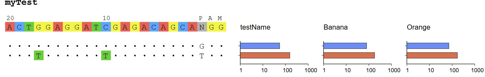

sequence alignment seq + bar plot
======================

::

	usage: seq_bar_svg.py [-h] -i INPUT -o OUTPUT [-t TITLE] [--pam PAM] [--on-target ON_TARGET]

	Sequence + sample barplot SVG generator.

	Input CSV columns (header required):
	  seq          first row is on-target (typically 23bp ending in NGG PAM);
	               other rows are off-targets (any length; will be NW-aligned to
	               the on-target if length differs from on-target length).
	  <sample 1>   numeric value, OR comma/semicolon-separated replicates
	               (e.g. "12.3,15.1,11.8") -> mean +/- sd error bar.
	  <sample 2>   ...
	  ...

	Each column after `seq` becomes one bar-plot panel on the right of the
	sequence block, in column order. Bars are horizontal, drawn on a log10
	x-axis, one bar per off-target row, color-coded per row.

	Usage:
	  python seq_bar_svg.py -i input.csv -o out.svg -t "BCL2L11_A11_rep1"

	optional arguments:
	  -h, --help            show this help message and exit
	  -i INPUT, --input INPUT
	                        Input CSV
	  -o OUTPUT, --output OUTPUT
	                        Output SVG path
	  -t TITLE, --title TITLE
	                        Plot title

Summary
^^^^^^^

Input a csv and generate this image:

Input
^^^^^

Prepare a csv file with first column is the sequences and the rest columns are values for the bar plot.

::

	anyName(first column always seq| first seq always on-target),testName,Banana,Orange
	ACTGGAGGATCGAGACAGCAGGG,55,80,72
	ACTTGAGGATTGAGACAGCATGG,155,180,172

Usage
^^^^^

::

	module load conda3/202402

	source activate /home/yli11/.conda/envs/jupyterlab_2024

	seq_bar_svg.py -i test.csv -o test.svg -t "myTest"

