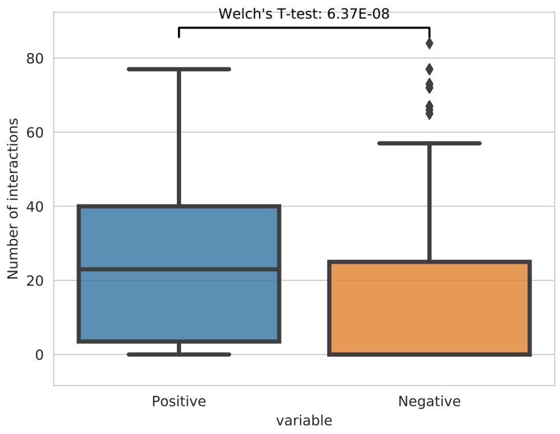

Test differences in number of interactions
================

::

	usage: overlap_bedpe.py [-h] -p POS_BED -n NEG_BED -f BEDPE [-o OUTPUT]

	optional arguments:
	  -h, --help            show this help message and exit
	  -p POS_BED, --pos_bed POS_BED
	                        positive bed file, chr, start, end, etc. (default:
	                        None)
	  -n NEG_BED, --neg_bed NEG_BED
	                        negative bed file, chr, start, end, etc. (default:
	                        None)
	  -f BEDPE, --bedpe BEDPE
	                        bedpe, chr, start, end, chr, start, end, etc.
	                        (default: None)
	  -o OUTPUT, --output OUTPUT

Summary
^^^^^^^

Given a positive and a negative bed file, get number of interactions for each region in the two bed files and apply welch's t-test to get the significance.

Example
^^^^^^^

Input
^^^^^

two bed file and a bedpe file.

Example of bedpe file: only the first 6 columns are used. You might want to first extract significant interactions then perform our analysis.

::

	chr1	62099	63943	chr1	105955	107671	1	0.90552424887951
	chr1	105955	107671	chr1	235358	237015	1	0.051453442758473
	chr1	712256	716178	chr1	753657	755899	1	0.90552424887951
	chr1	712256	716178	chr1	761417	764406	3	0.34819012369507
	chr1	712256	716178	chr1	766795	769182	2	0.660667234099137

Output
^^^^^^

output.pdf

You can also specify the output file name.

Usage
^^^^^

.. code:: bash

	hpcf_interactive

	source activate /home/yli11/.conda/envs/py2/

	cd /home/yli11/test/xxx/

	overlap_bedpe.py -p pos.bed -n neg.bed -f Hudep2_D0_H3K27AC_HiChIP_FS.interactions.all.mango
	

