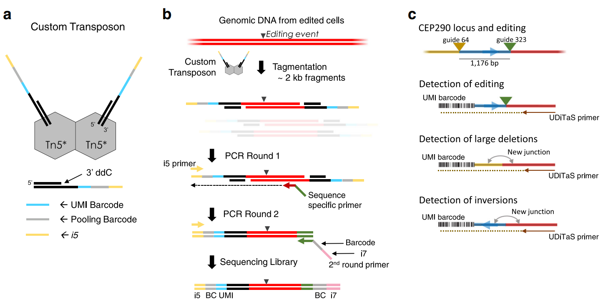
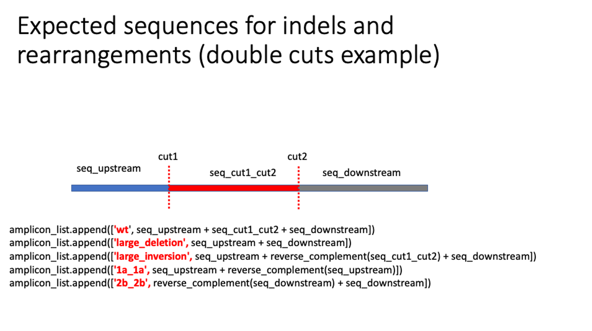

Uditas
===================================

::

	uditas -h
	usage: uditas [-h] [-folder_genome_2bit FOLDER_GENOME_2BIT]
	              [-skip_demultiplexing SKIP_DEMULTIPLEXING]
	              [-skip_trimming SKIP_TRIMMING]
	              [-skip_genome_local_alignment SKIP_GENOME_LOCAL_ALIGNMENT]
	              [-skip_genome_global_alignment SKIP_GENOME_GLOBAL_ALIGNMENT]
	              [-process_amplicon PROCESS_AMPLICON]
	              [-skip_amplicon_global_alignment SKIP_AMPLICON_GLOBAL_ALIGNMENT]
	              [-check_plasmid_insertions CHECK_PLASMID_INSERTIONS]
	              [-skip_plasmid_alignment SKIP_PLASMID_ALIGNMENT] [-ncpu NCPU]
	              [-window_size WINDOW_SIZE]
	              [-default_amplicon_window_around_cut DEFAULT_AMPLICON_WINDOW_AROUND_CUT]
	              [-min_MAPQ MIN_MAPQ] [-min_AS MIN_AS]
	              [-process_AMP_seq_run PROCESS_AMP_SEQ_RUN]
	              dir_sample

	Process UDiTaS data

	positional arguments:
	  dir_sample            Directory with the sample to be processed

	optional arguments:
	  -h, --help            show this help message and exit
	  -folder_genome_2bit FOLDER_GENOME_2BIT
	                        Folder containing the 2bit file(s) with the reference
	                        genome being used (default:
	                        /home/yli11/Data/Human/hg38/)
	  -skip_demultiplexing SKIP_DEMULTIPLEXING
	                        Skip demultiplexing? Options: 0, 1 (skip) (default: 0)
	  -skip_trimming SKIP_TRIMMING
	                        Skip adapter trimming? Options: 0, 1 (skip) (default:
	                        0)
	  -skip_genome_local_alignment SKIP_GENOME_LOCAL_ALIGNMENT
	                        Skip genome-wide local alignment? Options: 0 , 1
	                        (skip) (default: 1)
	  -skip_genome_global_alignment SKIP_GENOME_GLOBAL_ALIGNMENT
	                        Skip genome-wide global alignment? Options: 0 , 1
	                        (skip) (default: 0)
	  -process_amplicon PROCESS_AMPLICON
	                        Select row number (0-based) of amplicon to process,
	                        set to all to process all amplicons (default: all)
	  -skip_amplicon_global_alignment SKIP_AMPLICON_GLOBAL_ALIGNMENT
	                        Skip amplicon global alignment? Options: 0, 1 (skip)
	                        (default: 0)
	  -check_plasmid_insertions CHECK_PLASMID_INSERTIONS
	                        Check for plasmid insertions. Options: 0 (skip), 1
	                        plamid_name and plasmid_sequence required in
	                        sample_info.csv (default: 1)
	  -skip_plasmid_alignment SKIP_PLASMID_ALIGNMENT
	                        Skip plasmid alignment? Note, just alignment. Counts
	                        still evaluated. Options: 0, 1 (skip) (default: 0)
	  -ncpu NCPU            Number of CPUs to use (default: 4)
	  -window_size WINDOW_SIZE
	                        Window size around cut sites used to grab UDiTaS reads
	                        (default: 15)
	  -default_amplicon_window_around_cut DEFAULT_AMPLICON_WINDOW_AROUND_CUT
	                        Window size around cut sites used to create amplicons
	                        (default: 1000)
	  -min_MAPQ MIN_MAPQ    Minimum mapping quality to include a read (default: 5)
	  -min_AS MIN_AS        Minimum alignment score to include a read (default:
	                        -180)
	  -process_AMP_seq_run PROCESS_AMP_SEQ_RUN
	                        Set to 1 to process an AMP-seq run using GUIDE-seq
	                        adapters (default: 0)

Summary
^^^^^^^

UDiTaS (UniDirectional Targeted Sequencing) is a method to capture indels and structural rearrangements. 

Original code is modified (customized for st. jude), see: https://github.com/YichaoOU/uditas

Input
^^^^^

A folder that contains:

- R1.fastq.gz
- R2.fastq.gz
- I1.fastq.gz
- I2.fastq.gz
- sample_info.csv

``sample_info.csv`` this file name is fixed, has to be exactly the same. Format can be found here: https://github.com/editasmedicine/uditas/blob/master/data/fig2c/sample_info.csv

fastq file names have to be exactly the same except for R1, R2, I1, I2.

In the same working folder, there should be only 4 fastq files: R1, R2, I1, I2. More than 4 fastq files will confuse the program. 

Double cut senarios, cut is -3 (hardcoded, for NGG cas9):

.. code-block:: python

	# amplicon_window_around_cut default 1kb
	start_coordinate = int(cut1 - amplicon_window_around_cut)
	end_coordinate = int(cut2 + amplicon_window_around_cut)
	# We switch the coordinates of cut1 and cut2 if the guides are provided so that cut2 < cut1
	seq_upstream = genome[amplicon_info['chr_guide_1']][start_coordinate:int(cut1)]
	seq_cut1_cut2 = genome[amplicon_info['chr_guide_1']][int(cut1):int(cut2)]
	seq_downstream = genome[amplicon_info['chr_guide_1']][int(cut2):end_coordinate]

	amplicon_list.append(['wt', seq_upstream + seq_cut1_cut2 + seq_downstream])
	amplicon_list.append(['large_deletion', seq_upstream + seq_downstream])
	amplicon_list.append(['large_inversion', seq_upstream + reverse_complement(seq_cut1_cut2) + seq_downstream])
	amplicon_list.append(['1a_1a', seq_upstream + reverse_complement(seq_upstream)])
	amplicon_list.append(['2b_2b', reverse_complement(seq_downstream) + seq_downstream])

A note on preparing sample_info.csv
^^^^^^^^^^^^^^^^^^^^^^^

1. Many columns are not used, such as: NGS_req-ID, name, Sample, description, Control sample (Y/N), Cell name_type, etc.

2. If control = Yes, please make sure guide columns are empty: guide_1, sequence_guide_1, genome_guide_1, chr_guide_1, start_guide_1, end_guide_1

When the sample is control, amplicon sequence is generated using genome, chr, start, end and strand columns.

.. code-block:: python

	if reaction_type == 'control':
		# Case no guides
		if amplicon_info['strand'] == '+':  # This is the UDiTaS oligo strand
			end_coordinate = int(amplicon_info['start']) + amplicon_window_around_cut
			if end_coordinate > len(genome[amplicon_info['chr']]):
				end_coordinate = len(genome[amplicon_info['chr']])
			amplicon_list.append(['wt', genome[amplicon_info['chr']][int(amplicon_info['start']):end_coordinate]])
		elif amplicon_info['strand'] == '-':
			start_coordinate = int(amplicon_info['end']) - amplicon_window_around_cut
			if start_coordinate < 0:
				start_coordinate = 0
			amplicon_list.append(['wt', genome[amplicon_info['chr']][start_coordinate:int(amplicon_info['end'])]])
		else:
			raise StrandError('strand can only have as values + or -')

3. Sample info.csv supports upto 3 cuts, which are guide_1, guide_2, and guide_3 columns. Fill in as needed.

4. plasmid_sequence for plasmid-based experiments

Usage
^^^^^

Run interactive job
-------------------

.. code:: bash

	hpcf_interactive -q standard -R "rusage[mem=20000]"

	module load conda3

	source activate /home/yli11/.conda/envs/uditas_env

	export BOWTIE2_INDEXES=/home/yli11/Data/Human/hg38/bowtie2/

	export GENOMES_2BIT=/home/yli11/Data/Human/hg38/

	module load bowtie2/2.2.9

	uditas /path/to/your/input_folder

Submit to HPC
-------------------

go to the working dir and run the following

.. code:: bash

	hpcf_interactive

	module load conda3

	source activate /home/yli11/.conda/envs/uditas_env

	export BOWTIE2_INDEXES=/home/yli11/Data/Human/hg38/bowtie2/

	export GENOMES_2BIT=/home/yli11/Data/Human/hg38/

	module load bowtie2/2.2.9

	bsub -q standard -P genomics -R rusage[mem=40000] uditas $PWD

UDITAS HBG version
---------------

go to the working dir and run the following

.. code:: bash

	hpcf_interactive

	module load conda3

	source activate /home/yli11/.conda/envs/uditas_env

	export BOWTIE2_INDEXES=/home/yli11/Data/Human/hg38/bowtie2/

	export GENOMES_2BIT=/home/yli11/Data/Human/hg38/

	module load bowtie2/2.2.9

	module load java/1.8.0_181

	bsub -q standard -P genomics -R rusage[mem=50000] uditasHBG $PWD

UDITAS Parallel version
-------------------

1. prepare input.list, 0-based row index. For example, if we have 6 samples in ``sample_info.csv``, then the input.list will look like below.

::

	head input.list 
	--------------
	0
	1
	2
	3
	4
	5

2. go to the working dir and run the following [submit job].

.. code:: bash

	hpcf_interactive

	module load python/2.7.13

	run_lsf.py -f input.list -p uditas_parallel

Output
^^^^^^

Output files are located inside the input_folder

How to read the output
------------------------

I would look at ``big_results_pivot.xlsx``, it contains everything, for example, for the 5 types I mentioned earlier:

* WT

* large deletion

* large inversion

* 1a_1a

* 2b_2b

The total number of unique reads (collapsed using UMI barcode) are in columns:

* WT reads_collapsed + Small Indels reads_collapsed

* Large Deletion reads_collapsed

* Inversion reads_collapsed

* 1a_1a_cut1_total_reads_collapsed

* 2b_2b_cut1_total_reads_collapsed

total_aligned_junctions_collapsed is the sum of the above numbers, used as denominators for percentage (last column), for example "large deletion percentage = Large Deletion reads_collapsed / total_aligned_junctions_collapsed"

You can also get mapping rate from this table, for example: total_aligned/read_count

UDITAS pipeline notes
^^^^^^^^^^^^^^^^^^^^

These notes are mainly for me to better understand the code.

1. The pipeline creates results for each sample, stored in the sample name folder. They have a ``only_summarize`` option so that I can run UDITAS pipeline for each sample (so as to parallize the pipeline) and then once everything is finished, run the summarize function.

Steps 
------

1. Demultiplexing: based on hamming distance, allowing for 1 mismatch. Stats stored in ``reports`` folder

Replicate figure 2C
^^^^^^^^^^^^^^^^^^^

It took me a while to find the actual primer name for each SRA ID because it was not provided in the SRA metadata file.

::

	Run,Library Name,LibraryLayout,replicate,Antibody
	SRR6704713,library_13_umi,SINGLE,biological replicate 2,OLI6256
	SRR6704714,library_13,PAIRED,biological replicate 2,OLI6256
	SRR6704715,library_14_umi,SINGLE,biological replicate 1,OLI6259
	SRR6704716,library_14,PAIRED,biological replicate 1,OLI6259
	SRR6704719,library_12_umi,SINGLE,biological replicate 1,OLI6256
	SRR6704720,library_12,PAIRED,biological replicate 1,OLI6256
	SRR6704721,library_15_umi,SINGLE,biological replicate 2,OLI6259
	SRR6704722,library_15,PAIRED,biological replicate 2,OLI6259

Download data from SRA. /home/yli11/dirs/shengdar_group/users/Yichao/Uditas/PRJNA433666/sra_download_yli11_2022-06-06/names

UMI and R1/R2 have different read names, I have to preprocess them so that:

 - 1. read name is the same

 - 2. index1 and index2 contains sample barcode because the Uditas code must start from demultiplexing, otherwise you have to make sure the folder structure is the same to skip demultiplexing.

.. code-block:: python

	seq_1a = genome[amplicon_info['chr_guide_1']][start_coordinate1:int(cut1)]
	seq_1b = genome[amplicon_info['chr_guide_1']][int(cut1):end_coordinate1]
	seq_2a = genome[amplicon_info['chr_guide_2']][start_coordinate2:int(cut2)]
	seq_2b = genome[amplicon_info['chr_guide_2']][int(cut2):end_coordinate2]

	amplicon_list.append(['1a_1a', seq_1a + reverse_complement(seq_1a)])
	amplicon_list.append(['1a_1b', seq_1a + seq_1b])
	amplicon_list.append(['1a_2a', seq_1a + reverse_complement(seq_2a)])
	amplicon_list.append(['1a_2b', seq_1a + seq_2b])

	amplicon_list.append(['1b_1b', reverse_complement(seq_1b) + seq_1b])
	amplicon_list.append(['2a_1b', seq_2a + seq_1b])
	amplicon_list.append(['2b_1b', reverse_complement(seq_2b) + seq_1b])

	amplicon_list.append(['2a_2a', seq_2a + reverse_complement(seq_2a)])
	amplicon_list.append(['2a_2b', seq_2a + seq_2b])

	amplicon_list.append(['2b_2b', reverse_complement(seq_2b) + seq_2b])

Because the 2 cuts are from 2 different chromosomes, so the output is directly the chromosome rearrangements results for these two chromosomes (exactly in figure 2c).

Comments
^^^^^^^^

.. disqus::
    :disqus_identifier: NGS_pipelines

