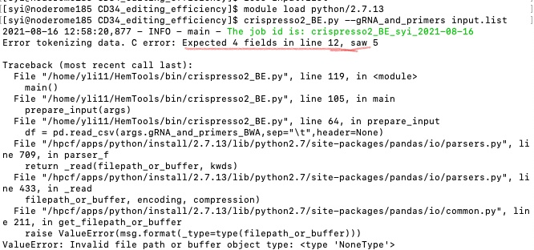
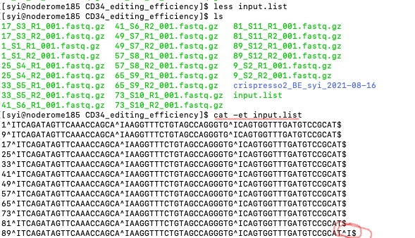

Crispresso2 for Base editor
==========================

::

	usage: crispresso2_BE.py [-h] [-j JID] [-r1 | -r2] [-f INPUT_LIST] [-q Q]
	                         [--tsv TSV] [-s S] [-m MIN_OVERLAP] [--ref REF]
	                         [--alt ALT]
	                         [--base_editor_commands BASE_EDITOR_COMMANDS]
	                         [--default] [--queue QUEUE]
	                         [--gRNA_and_primers GRNA_AND_PRIMERS]
	                         [--gRNA_and_primers_BWA GRNA_AND_PRIMERS_BWA]
	                         [-g GENOME] [--genome_fasta GENOME_FASTA]
	                         [--index_file INDEX_FILE]

	optional arguments:
	  -h, --help            show this help message and exit
	  -j JID, --jid JID     enter a job ID, which is used to make a new directory.
	                        Every output will be moved into this folder. (default:
	                        crispresso2_BE_yli11_2021-08-16)
	  -r1                   only use R1 read for analysis (default: False)
	  -r2                   only use R2 read for analysis (default: False)
	  -f INPUT_LIST, --input_list INPUT_LIST
	                        tsv 5 columns, R1.fastq, R2.fastq, amplicon_seq,
	                        gRNA_seq, output_name (default: None)
	  -q Q                  read quality (default: 0)
	  --tsv TSV             not for end user (default: )
	  -s S                  base quality (default: 0)
	  -m MIN_OVERLAP, --min_overlap MIN_OVERLAP
	                        min_overlap for read merging (default: 10)
	  --ref REF             reference base (default: A)
	  --alt ALT             alternative base (default: G)
	  --base_editor_commands BASE_EDITOR_COMMANDS
	                        alternative base (default:
	                        --quantification_window_size 10
	                        --quantification_window_center -10
	                        --base_editor_output --keep_intermediate --dump)
	  --default             not running in base editor mode (default: False)
	  --queue QUEUE         which queue to use (default: standard)
	  --gRNA_and_primers GRNA_AND_PRIMERS
	                        tsv 4 columns, unique ID that matches to fastq file
	                        name, gRNA seq, Forward Primer, Reverse Primer
	                        (default: None)
	  --gRNA_and_primers_BWA GRNA_AND_PRIMERS_BWA
	                        tsv 4 columns, unique ID that matches to fastq file
	                        name, gRNA seq, Forward Primer, Reverse Primer
	                        (default: None)

	Genome Info:
	  -g GENOME, --genome GENOME
	                        genome version: hg19, hg38, mm9, mm10. By default,
	                        specifying a genome version will automatically update
	                        index file, black list, chrom size and
	                        effectiveGenomeSize, unless a user explicitly sets
	                        those options. (default: hg19)
	  --genome_fasta GENOME_FASTA
	                        genome fasta file (default:
	                        /home/yli11/Data/Human/hg19/fasta/hg19.fa)
	  --index_file INDEX_FILE
	                        BWA index file (default: /home/yli11/Data/Human/hg19/i
	                        ndex/bwa_16a_index/hg19.fa)

Summary
^^^^^^^

only work for hg19. But should be able to work on other genomes.

Running crispresso2 for base editor mode: https://github.com/pinellolab/CRISPResso2

The command is:

.. code:: bash

	CRISPResso -r1 ${COL1} 
	-r2 ${COL2} 
	--amplicon_seq ${COL3} 
	--guide_seq ${COL4} 
	--quantification_window_size 10 
	--quantification_window_center -10
	--base_editor_output -o {{jid}}/${COL5}

..note:: Note that the sgRNA sequence needs to be input as the guide RNA sequence (usually 20 nt) immediately adjacent to but not including the PAM sequence (5' of NGG for SpCas9). 

Updates
^^^^^^

Users can now use ``-m`` to control minimal overlap for the FLASH command.

Added two more parameters for users to use only R1 or R2 for cirspresso analysis. For example:

To use only R1 read

::

	crispresso2_BE.py -r1 --gRNA_and_primers input.list 

To use only R2 read

::

	crispresso2_BE.py -r2 --gRNA_and_primers input.list 

Input
^^^^^

Option 1: User input amplicon sequence and gRNA sequence (``-f``)
--------

A 5-column tsv file: R1.fastq, R2.fastq, amplicon_seq,  gRNA_seq, output_name

::

	12_S12_L001_R1_001.fastq.gz	12_S12_L001_R2_001.fastq.gz	Amplicon_seq	cttgaccaatagccttgaca	test1
	XXXX_L001_R1_001.fastq.gz	XXXX_L001_R2_001.fastq.gz	Amplicon_seq	cttgaccaatagccttgaca	Bababa

Option 2: User input Primer sequence and gRNA sequence (``--gRNA_and_primers``)
-------------------

This option requires a unique ID in the fastq file name.

A 4-column tsv file: unique ID that matches to fastq file name, gRNA seq, Forward Primer, Reverse Primer

My fastq file is like:

::

	gRNA1-ch19_S4_L001_R1_001.fastq.gz
	gRNA2-ch19_S5_L001_R1_001.fastq.gz
	gRNA5-ch2_S19_L001_R1_001.fastq.gz
	gRNA8-ch8_S11_L001_R1_001.fastq.gz
	gRNA1-ch19_S4_L001_R2_001.fastq.gz
	gRNA2-ch19_S5_L001_R2_001.fastq.gz
	gRNA5-ch2_S19_L001_R2_001.fastq.gz
	gRNA10-ch8_S11_L001_R2_001.fastq.gz

Here, I can use gRNA1, gRNA2, etc. as my unique IDs. However, note that ``gRNA1`` is a substring of ``gRNA10``, so it is better to specify ``gRNA1-`` in your input file. So you will have something like:

::

	gRNA1-	gRNA_seq	Forward_Primer	Reverse_Primer
	gRNA2	gRNA_seq	Banana	Orange
	gRNA10	XXXXX	BBBBBB	AAAAAA

To get eff, use:

::

	cd $jid
	
	crispresso2_BE_get_eff.py ../input.list A G

Option 3: User input Primer sequence, gRNA sequence, and remove non-target matched reads (``--gRNA_and_primers_BWA``)
-------------------

Everything is the same as ``option2``, except that reads that mapped to other genomic regions will be removed from CrisprEsso2 analysis.

Only properly paired reads will be used. Duplicated reads are OK, non-uniquely mapped reads are OK if both R1 and R2 mapped to the target region (determined by in silico PCR).

Low-quality reads are filtered by CrisprEsso2: ``-q 10 -s 10``, default is all 0.

Reads mapping quality is 40 and single base quality is Q40. See the table below. 

+---------------+----------------------+
| Quality Score | Error Probability    |
+---------------+----------------------+
| Q40           | 0.0001 (1 in 10,000) |
+---------------+----------------------+
| Q30           | 0.001 (1 in 1,000)   |
+---------------+----------------------+
| Q20           | 0.01 (1 in 100)      |
+---------------+----------------------+
| Q10           | 0.1 (1 in 10)        |
+---------------+----------------------+

Usage
^^^^^

.. code:: bash

	hpcf_interactive

	module load python/2.7.13

	crispresso2_BE.py -f input.list

OR

.. code:: bash

	crispresso2_BE.py --gRNA_and_primers input.list 

Output
^^^^^^

Once the job is finished, you will receive a notification email.

Inside the jobID folder, you can look at the crispresso2 result. The html file is inside in each sub-folder.

``crispresso2_BE.edit_eff.tsv`` This file contains the ``ref`` to ``alt`` base editing eff for position -15 to 20 (e.g., 0-20 is the gRNA sequence). The last column is the indel rate. 

FAQ
^^^^

Input format error
-------------------

The input file requires specific number of columns. See some errors below:

The solution to find these errors is using ``cat -et [your_file_name]``.

Video tutorial 1: a custom 2 gRNA base editing quantification
^^^^^^^^^^^^^

The command I actually used is: ``crispresso2_BE.py -f fastq.tsv --base_editor_commands " --quantification_window_size 30 --quantification_window_center 0 --base_editor_output --keep_intermediate --dump --plot_window_size 30" --interactive``

Current HPC has a long waiting time, so I just run the pipeline interactively by adding ``--interactive``. Also, I set the center to be somewhere in the middle of the two gRNA, ``--quantification_window_center 0`` and increased the quantification window and visualization window size to 30bp.

.. raw:: html

  <video controls width="690" src="../../_static/crispresso2_BE_custom.mp4#t=0.3"></video>

Comments
^^^^^^^^

.. disqus::
    :disqus_identifier: NGS_pipelines

