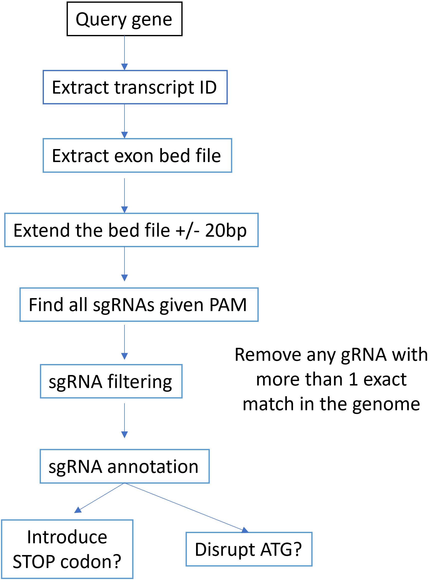

Base editor screening for gene functions
======================================

Summary
^^^^^^^

Base editor-based gene disruption tend to have less noise than cas9-based methods. Below is the design flowchart.

Input
^^^^^^^

The program needs the following inputs:

- Gene Name. Type: str.

- PAM. Type: str.

- ATG positions. This can be a dictionary for position annotation. For example, GATA1 has two start codons, one for GATA1 full length, the other for GATA1 short. Type: dict.

- iSTOP prediction results. Type: file

Output
^^^^^^^

Output file name is ``{{gene_name}}.gRNA.annot.tsv``

Candidate gRNA bed6 file, with additional columns of ``is_iSTOP`` and ``is_ATG``. ``iSTOP`` is a tool for STOP codon mutation gRNA design. ``is_ATG`` indicates if this gRNA disrupts the start codon.

Usage
^^^^^

::

	BE_gRNA_design.py GATA1 NG "{'GATA1Full': [48791110, 48791111], 'GATA1s': [48791873, 48791874]}" ../GATA1-istop.csv

	BE_gRNA_design.py RPS19 NG "{'RPS19_main': [41860775, 41860776], 'RPS19_ENST00000221975': [41869081, 41869082]}" /home/yli11/Share/John/RPS19-istop.csv

R code to run iSTOP
^^^^^^^^^^^^^^^^^

CHANGE gene name as needed.

.. image:: ../../images/iSTOP_design.png
	:align: center

::

	library(tidyverse)
	library(iSTOP)
	CDS_Human <- iSTOP::CDS_Hsapiens_UCSC_hg38() 
	Genome    <- BSgenome.Hsapiens.UCSC.hg38::Hsapiens
	BE_spacing=PAM_spacing(optimal = c(14, 14), good = c(13, 15), ok = c(12, 17))
	PAM_list=PAM_patterns_default(
	  sgNGG = PAM_pattern(".GG", 3),
	  sgNG = PAM_pattern(".G", 2),
	  sgNGA = PAM_pattern(".GA", 3),
	  sgNGCG = PAM_pattern(".GCG", 4),
	  sgNGAG = PAM_pattern(".GAG", 4),
	  sgNNGRRT = PAM_pattern("..G[AG][AG]T", 6),
	  sgNNNRRT = PAM_pattern("...[AG][AG]T", 6),
	)
	GATA1 <- 
	  CDS_Human %>%
	  filter(gene == 'GATA1') %>%
	  locate_codons(Genome) %>%
	  locate_PAM(Genome,PAM=PAM_list,spacing=BE_spacing)
	readr::write_csv(GATA1,"GATA1-istop.csv")

