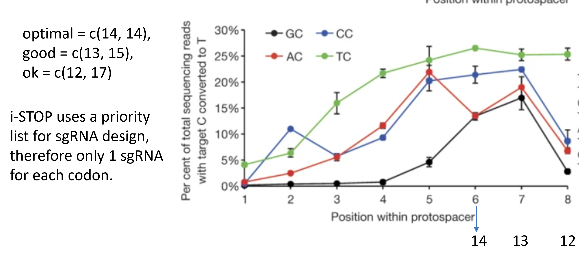

Base editor screening for gene functions
======================================

Summary
^^^^^^^

Base editor-based gene disruption tend to have less noise than cas9-based methods. Below is the design flowchart.

Input
^^^^^^^

The program needs the following inputs:

- Gene Name. Type: str.

- PAM. Type: str.

- ATG positions. This can be a dictionary for position annotation. For example, GATA1 has two start codons, one for GATA1 full length, the other for GATA1 short. Type: dict.

Output
^^^^^^^

Candidate gRNA bed6 file, with additional columns of ``is_iSTOP`` and ``is_ATG``. ``iSTOP`` is a tool for STOP codon mutation gRNA design. ``is_ATG`` indicates if this gRNA disrupts the start codon.

