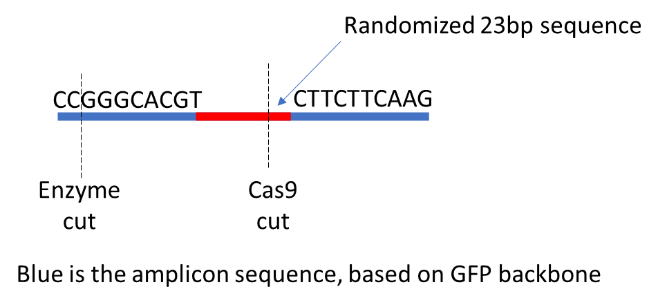

Analysis pipeline for change-seq randomized assay
======================================

Library Structure
^^^^^^

Input
^^^^^^

7-columns tsv file. The first 3 columns are R1, R2 and sample name.

The rest columns are meta information, including 5` adapter sequence, 3` adapter sequence, gRNA name, whether it is a treatment ``nuclease`` or control ``control``.

::

	ABC_R1_001.fastq.gz	ABC_R2_001.fastq.gz	ABC	CCGGGCACGT	CTTCTTCAAG	gRNA_name	nuclease
	Orange_S2_R1_001.fastq.gz	Orange_S2_R2_001.fastq.gz	Orange	CCGGGCACGT	CTTCTTCAAG	gRNA_name	control

Usage
^^^^^

::

	run_lsf.py -f fastq.tsv -u /home/yli11/Tools/changeseq_randomized/version3.lsf

