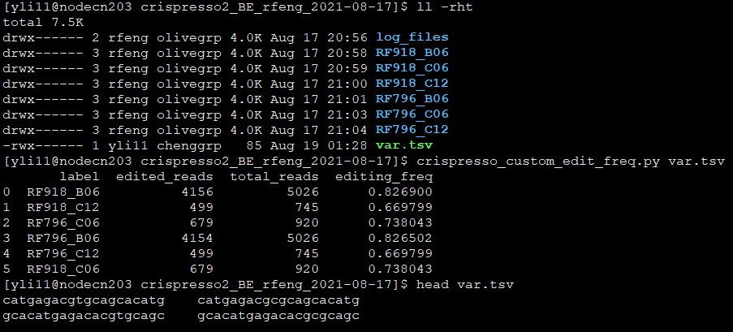

Calculate custom defined editing frequency from Crispresso2 output
==========================

Summary
^^^^^^^

Specifically designed for calculating co-occurring mutations caused by 2 gRNAs (base editing).

But the function is generic. 

Input
^^^^^

Allele frequency txt
---------

Not really need to **prepare** this input after you finished running ``crispresso2_BE.py``. I put it here for completeness because the program actually uses this file.

The output from crispresso, the visualization window (i.e., the actual sequence) must contain the two gRNA sequences, which means the default visualization parameters might not work.

mutation tsv
----------

A 2-column tsv, the first column is the reference sequence (e.g., gRNA sequence), the second column is the mutated sequence (e.g., A-G conversion, the edited sequence). The reference sequence is not nessesarily the gRNA sequence, as long as we can uniquely locate the mutation (without doing reverse complement). For example, in the example below, we specified the reverse completement of the gRNA sequnece, so the mutation is actually T->C.

Usage
^^^^^

Go to the result folder containing all your crispresso2 outputs. For example, the jobID folder directly from running ``crispresso2_BE.py``

.. code:: bash

	hpcf_interactive

	module load python/3.7.0

	crispresso_custom_edit_freq.py var.tsv

Output
^^^^^^

Output is saved as ``custom_edit_freq.csv``.

Comments
^^^^^^^^

.. disqus::
    :disqus_identifier: NGS_pipelines

