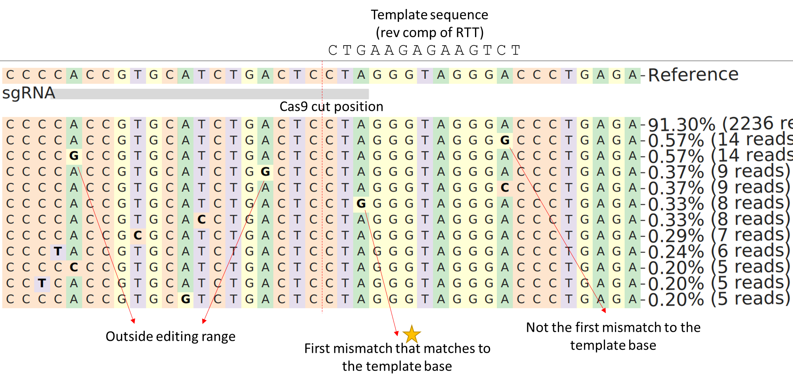

Quantify prime editor off-target activity for crispressoPooled experiments
====================================

::

	usage: crispressoPooled_PE.py [-h] [-j JID] -a AMPLICON_BED -gRNA GRNA_BED -f
	                              FASTQ_TSV --RTT RTT [--remove_PAM]
	                              [--queue QUEUE] [-g GENOME]
	                              [--genome_fasta GENOME_FASTA]

	optional arguments:
	  -h, --help            show this help message and exit
	  -j JID, --jid JID     enter a job ID, which is used to make a new directory.
	                        Every output will be moved into this folder. (default:
	                        crispressoPooled_PE_yli11_2022-09-07)
	  -a AMPLICON_BED, --amplicon_bed AMPLICON_BED
	                        amplicon_bed required, name column need to match gRNA
	                        bed (default: None)
	  -gRNA GRNA_BED, --gRNA_bed GRNA_BED
	                        gRNA_bed required, name column need to match amp bed
	                        (default: None)
	  -f FASTQ_TSV, --fastq_tsv FASTQ_TSV
	                        gRNA_bed required (default: None)
	  --RTT RTT             reverse transcription template. Note, this sequence is
	                        used to check substitution rate caused by prime
	                        editing, so for this parameter, you should use the
	                        reverse complement sequence of the actual RTT sequence
	                        in pegRNA (default: None)
	  --remove_PAM          gRNA bed coord include PAM, but crispresso need to
	                        remove PAM (default: False)
	  --queue QUEUE         which queue to use (default: standard)

	Genome Info:
	  -g GENOME, --genome GENOME
	                        genome version: hg19, hg38, mm9, mm10. By default,
	                        specifying a genome version will automatically update
	                        index file, black list, chrom size and
	                        effectiveGenomeSize, unless a user explicitly sets
	                        those options. (default: hg19)
	  --genome_fasta GENOME_FASTA
	                        genome fasta file (default:
	                        /home/yli11/Data/Human/hg19/fasta/hg19.fa)

Summary
^^^^^^

Given off-target region, we quantify:

1. indel frequency. Any insertion or deletion that overlap with cas9 cutting position, exactly the same as in crisprEsso ``--quantification_window_size 1 --quantification_window_center -3`` 

2. substitution rate. We quantify the first mismatch to the template sequence (i.e., expected mutated sequence). See the example below.

Input
^^^^^

The 4th column (name column) in the following two files should match (case sensitive!)

All these bed files should be bed6 format.

1. Amplicon sequence bed file
-----------------------------

The amplicon sequence can be downloaded from IDT. ``Assay.bed``

::

	chr2	57769587	57769832	HBGg22_Target09	0	+
	chrX	120721125	120721318	HBGg22_Target122	0	+
	chr7	14859651	14859845	HBGg22_Target105	0	+

2. gRNA bed file
----------------

Header starting with "#" is acceptable.

::

	#chr	start	end	name	CHANGEseq_reads	strand
	chr1	171455834	171455854	HBGg22_Target01	1	-
	chr1	235564562	235564582	HBGg22_Target02	1	-
	chr10	21466883	21466903	HBGg22_Target03	1	+

if the bed file coordinates include PAM, please use ``--remove_PAM`` option when submitting the job.

Output
^^^^^^

In the jobID folder, you should be a summary stats csv file with columns showing the total reads and percentages of indel and subtitution. The percentage values are already multipled by 100.

::

	sample	site	reads_total	is_indel_total	is_indel_percent	is_sub_total	is_sub_percent
	xx	A	39445	14	0.035492457852706	15	0.038027633413613406
	xx	B	61590	12	0.019483682415976103	10	0.0162364020133135
	xx	C	10409	2	0.0192141416082236	12	0.1152848496493417

Usage
^^^^^

Copy fastq files, amplicon bed file, and gRNA bed file  in the working dir and run the following:

::

	hpcf_interactive

	export PATH=$PATH:"/home/yli11/HemTools/bin"

	module load python/2.7.13

	run_lsf.py --guess_input --single

	crispressoPooled_PE.py -a 3AssayHBBALLOTs.bed -gRNA 3TargetHBBALLOTs.bed -f fastq.tsv --remove_PAM --RTT CTGAAGAGAAGTCT

