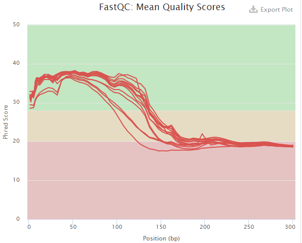
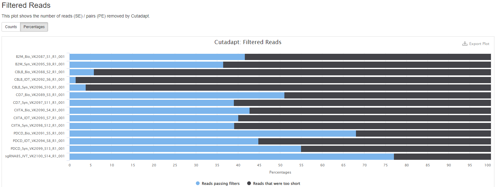
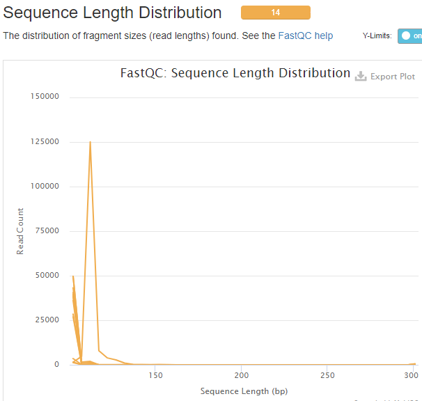
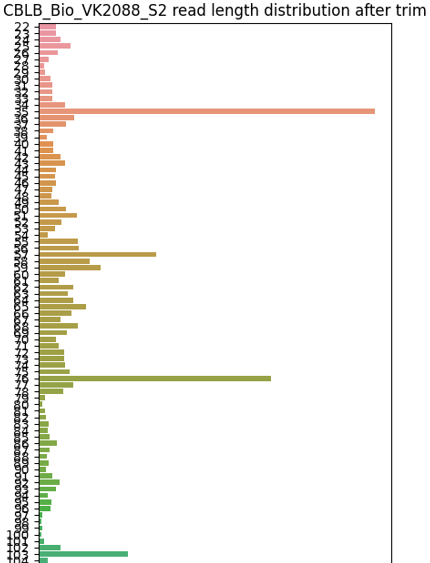
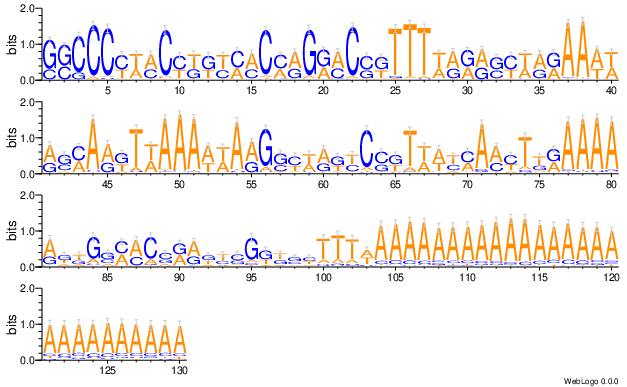
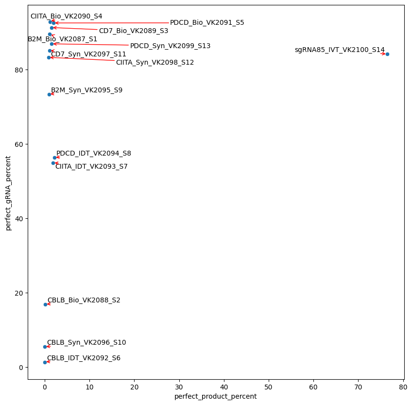
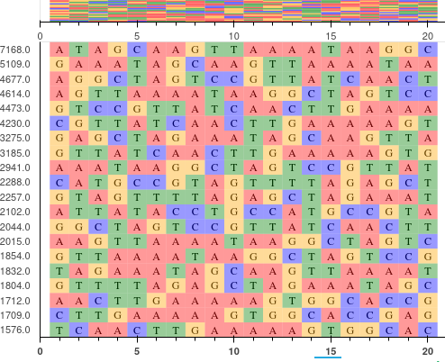
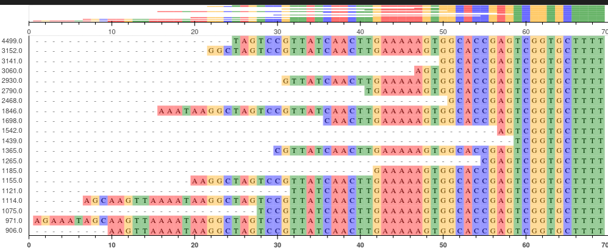
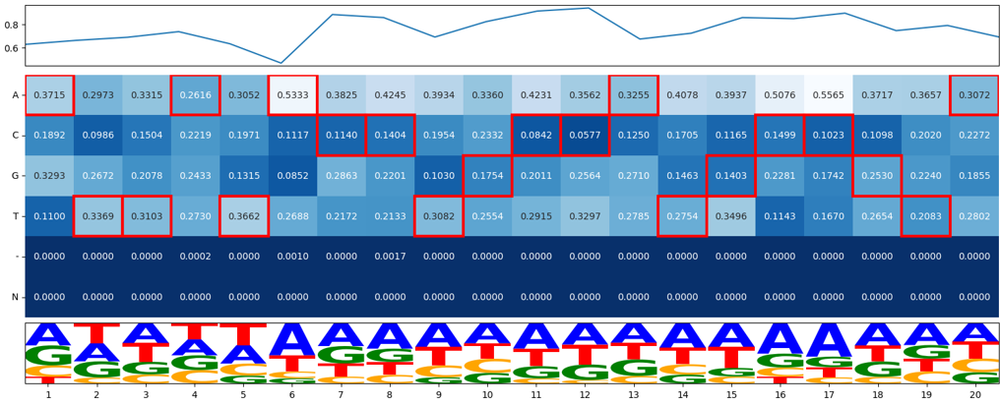
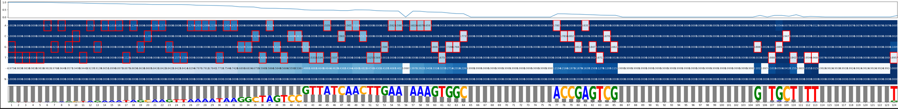

QC for gRNA quality, gRNA sequencing data
==========================

Summary
^^^^^^^

Input
^^^^^

A 3-col tsv file containing R1 fastq, sample name, and gRNA sequence (no PAM sequence)

::

	XXX_R1_001.fastq.gz	XXX	gRNA_sequence1
	YYY_R1_001.fastq.gz	YYY	gRNA_sequence2

Usage
^^^^^

.. code:: bash

	hpcf_interactive

	module load python/2.7.13

	run_lsf.py -f input.list -p gRNA_sequencing_QC

Output
^^^^^^

Once finished, you will be notified by email. 

1. read quality
-------------

The multiQC html report will be emailed to you. This file provides the overall sequencing quality and filtered reads stats. Important metric is the ``FASTQC mean quality scores``, ``Number/percent reads passing filter``, and ``Sequence Length Distribution``. The ``--min_length`` parameter will perform read filter based on trimmed read length.

``Number/percent reads passing filter`` with ``--min_length 100``

``Sequence Length Distribution`` with ``--min_length 100``

2. read length distribution
------------------

Barplot of read length distribution after poly-A trimming for one sample. Please look for files with ``*.trimmed_read_length_dist.png``

3. read visualization
----------------

If our reads contain 100% perfect product (20bp gRNA + 80bp scaffold sequence), then all reads will look exact the same. Otherwise, this read visualization provides a view of the most abundanct sequence. See png files in ``fastq_vis``.

4. Mapping_summary.csv and perfect_gRNA_vs_product_scatter.png
--------------------

This file provides the perfect gRNA% and count, the aligned gRNA% and count, and the same thing for scaffold and full product (gRNA+scaffold).

The ``perfect_gRNA_vs_product_scatter.png`` file provides "Overall frequency of perfect target sequence: Dot plots showing the frequency of targeted & full length sequences"

5. top20 most frequency gRNA, scaffold, full product sequences
-------------------------------------------------------------

See ``*.top20.[gRNA|scaffold|full_product].png``

The Y-axis shows the number of reads. The same read count occuring more than once will be shown as ``[read_count].xx``

6. Top200 Mismatch visualization, a complex plot
------------

This visualize aims to provide "Expected gRNA base versus unintended bases". Top 200 most frequency sequences (one complex plot for each of gRNA, scaffold, and full product).

The complex plot contains 3 parts:

1. line plot showing percent of error

2. heatmap showing ACGT-N occurring frequency per aligned position

3. a gRNA logo for visualizing the heatmap.

7. Check contaminants
-------------------

For reads do not align to our gRNA, there are several possible reasons.

1. no gRNAs at all, just scaffold sequence. Then our observed gRNA sequence (position 3 to position 23 in read) should partially match to the scaffold sequence.

2. gRNA contaminants.

2a. gRNA matched to our library

2b. gRNA matched to the genome. User need to run cas-offinder to confirm.

``unaligned.stat.csv`` to check the stats for 1,2,3 mentioned above.

``unaligned.casOffinder_to_check.list`` to run cas-offinder to identify ``Percentage of perfectly matched contaminants``, specifically the command is like: ``cas_offinder.py -g hg38 --add_PAM --PAM_seq NGG -j find_contaminants -n 1 -f unaligned.casOffinder_to_check.list``

Comments
^^^^^^^^

.. disqus::
    :disqus_identifier: NGS_pipelines

