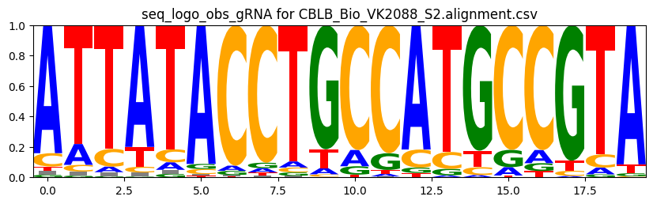
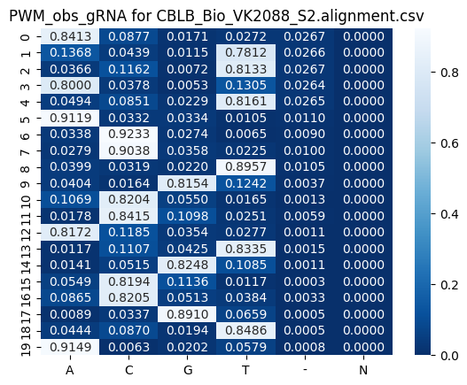

QC for gRNA quality, gRNA sequencing data
==========================

Summary
^^^^^^^

Input
^^^^^

A 3-col tsv file containing R1 fastq, sample name, and gRNA sequence (no PAM sequence)

::

	XXX_R1_001.fastq.gz	XXX	gRNA_sequence1
	YYY_R1_001.fastq.gz	YYY	gRNA_sequence2

Usage
^^^^^

.. code:: bash

	hpcf_interactive

	module load python/2.7.13

	run_lsf.py -f input.list -p gRNA_sequencing_QC

Output
^^^^^^

Once finished, you will be notified by email. 

1. read quality
-------------

The multiQC html report will be emailed to you. This file provides the overall sequencing quality. Important metric is the "FASTQC mean quality scores".

.. image:: ../../images/fastqc_mean_quality.PNG
	:align: center

2. read visualization
----------------

If our reads contain 100% perfect product (20bp gRNA + 80bp scaffold sequence), then all reads will look exact the same. Otherwise, this read visualization provides a view of the most abundanct sequence. See png files in ``fastq_vis``.

.. image:: ../../images/fastq_vis_gRNA_example.png
	:align: center

3. Mapping_summary.csv and perfect_gRNA_vs_product_scatter.png
--------------------

This file provides the perfect gRNA% and count, the aligned gRNA% and count, and the same thing for scaffold and full product (gRNA+scaffold).

The ``perfect_gRNA_vs_product_scatter.png`` file provides "Overall frequency of perfect target sequence: Dot plots showing the frequency of targeted & full length sequences"

.. image:: ../../images/perfect_gRNA_vs_product_scatter.png
	:align: center

4. gRNA logo
------------

This visualize aims to provide "Expected gRNA base versus unintended bases". Only aligned gRNA reads will be used. For those unaligned, we will look for contaminants.

The sequence logo is not good for bases below 1%. To see them we can look at heatmaps.

5. Check contaminants
-------------------

For reads do not align to our gRNA, there are several possible reasons.

1. no gRNAs at all, just scaffold sequence. Then our observed gRNA sequence (position 3 to position 23 in read) should partially match to the scaffold sequence.

2. gRNA contaminants.

2a. gRNA matched to our library

2b. gRNA matched to the genome. User need to run cas-offinder to confirm.

``unaligned.stat.csv`` to check the stats for 1,2,3 mentioned above.

``unaligned.casOffinder_to_check.list`` to run cas-offinder to identify ``Percentage of perfectly matched contaminants``, specifically the command is like: ``cas_offinder.py -g hg38 --add_PAM --PAM_seq NGG -j find_contaminants -n 1 -f unaligned.casOffinder_to_check.list``

Comments
^^^^^^^^

.. disqus::
    :disqus_identifier: NGS_pipelines

