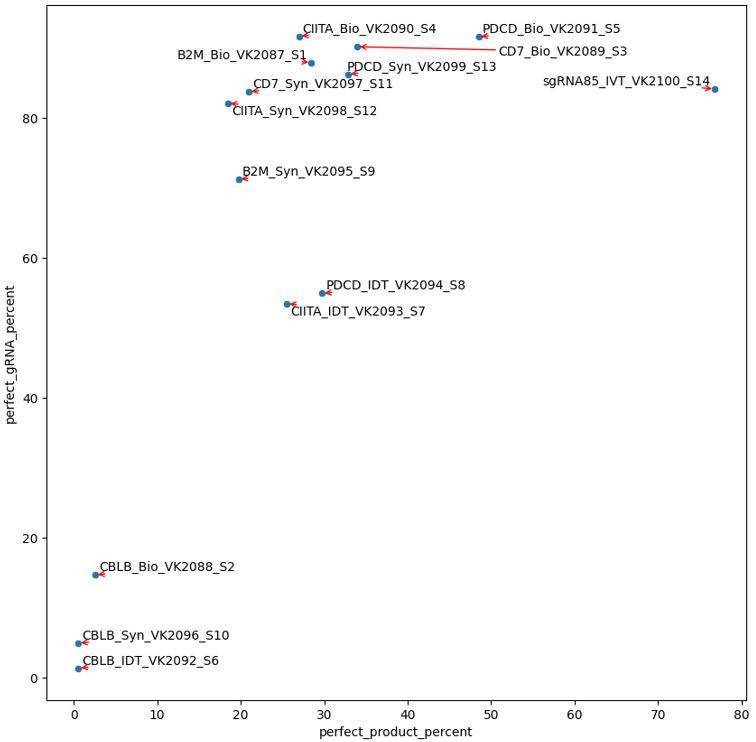

QC for gRNA quality, gRNA sequencing data
==========================

Summary
^^^^^^^

Input
^^^^^

``For SE data``, A 3-col tsv file containing R1 fastq, sample name, and gRNA sequence (no PAM sequence), the pipeline name is ``gRNA_sequencing_QC``

::

	XXX_R1_001.fastq.gz	XXX	gRNA_sequence1
	YYY_R1_001.fastq.gz	YYY	gRNA_sequence2

``For PE data``, A 4-col tsv file containing R1 fastq, R2 fastq, sample name, and gRNA sequence (no PAM sequence), the pipeline name is ``gRNA_sequencing_QC_PE``

::

	XXX_R1_001.fastq.gz	XXX_R2_001.fastq.gz	XXX	gRNA_sequence1
	YYY_R1_001.fastq.gz	YYY_R2_001.fastq.gz	YYY	gRNA_sequence2

``For PE data``, A 6-col tsv file containing R1 fastq, R2 fastq, sample name, and gRNA sequence (no PAM sequence), and the truncated scaffold sequence, and the primer, the pipeline name is ``gRNA_sequencing_QC_PE_trim``

The reason to have ``truncated scaffold sequence`` is because a primer targeting one part of the scaffold is used, because polyA primer tends to have non-specific binding in the scaffold.

::

	XXX_R1_001.fastq.gz	XXX_R2_001.fastq.gz	XXX	gRNA_sequence1	scaffold_seq_1	primer1
	YYY_R1_001.fastq.gz	YYY_R2_001.fastq.gz	YYY	gRNA_sequence2	scaffold_seq_2	primer2

9/2/2022 update for PE data
^^^^^^^

::

	run_lsf.py -f input.tsv -p gRNA_sequencing_QC_PE --min_length 30 -j read_length_30_filter_results

4/12/2023 update for PE data, custom scaffold sequence
^^^^^^^

::

	run_lsf.py -f fastq.tsv -p gRNA_sequencing_QC_PE_trim --min_length 30 -j read_length_30_filter_results_custom_scaffold_trim

Usage
^^^^^

.. code:: bash

	hpcf_interactive

	module load python/2.7.13

	run_lsf.py -f input.list -p gRNA_sequencing_QC --min_length 22 -j read_length_22_filter_results
	
	run_lsf.py -f input.list -p gRNA_sequencing_QC --min_length 50 -j read_length_50_filter_results
	
	run_lsf.py -f input.list -p gRNA_sequencing_QC --min_length 100 -j read_length_100_filter_results

The ``--min_length`` parameter will perform read filter based on poly-A trimmed read length. Higher value, e.g., 100, will give more high quality reads, thus, increasing the percentage of reads matching perfect product, however, the number/percentage of reads passing filter might decreased. The expected read length after trim is 103bp, which contains a 3bp GGG (from SMARTer smRNA-seq kit) + 20bp gRNA sequence + 80bp scaffold sequence.

Output
^^^^^^

Once finished, you will be notified by email. 

1. read quality
-------------

The multiQC html report will be emailed to you. This file provides the overall sequencing quality and filtered reads stats. Important metric is the ``FASTQC mean quality scores``, ``Number/percent reads passing filter``, and ``Sequence Length Distribution``. 

``Number/percent reads passing filter`` with ``--min_length 100``

``Sequence Length Distribution`` with ``--min_length 100``

2. read length distribution
------------------

Barplot of read length distribution after poly-A trimming for one sample. Please look for files with ``*.trimmed_read_length_dist.png``

3. read visualization
----------------

If our reads contain 100% perfect product (20bp gRNA + 80bp scaffold sequence), then all reads will look exact the same. Otherwise, this read visualization provides a view of the most abundanct sequence. See png files in ``fastq_vis``.

4. Mapping_summary.csv and perfect_gRNA_vs_product_scatter.png
--------------------

This file provides the perfect gRNA% and count, the aligned gRNA% and count, and the same thing for scaffold and full product (gRNA+scaffold).

The ``perfect_gRNA_vs_product_scatter.png`` file provides "Overall frequency of perfect target sequence: Dot plots showing the frequency of targeted & full length sequences"

5. top20 most frequency gRNA, scaffold, full product sequences
-------------------------------------------------------------

See ``*.top20.[gRNA|scaffold|full_product].png``

The Y-axis shows the number of reads. The same read count occuring more than once will be shown as ``[read_count].xx``

.. image:: ../../images/top20.gRNA.PNG
	:align: center

6. Top200 Mismatch visualization, a complex plot
------------

This visualize aims to provide "Expected gRNA base versus unintended bases". Top 200 most frequency sequences (one complex plot for each of gRNA, scaffold, and full product).

The complex plot contains 3 parts:

1. line plot showing percent of error

2. heatmap showing ACGT-N occurring frequency per aligned position

3. a gRNA logo for visualizing the heatmap.

7. user provided gRNA sequence to check contaminants
-------------------

To use this function, user need to provide a file, which named as ``gRNA_to_check.tsv`` (add ``--gRNA_to_check gRNA_to_check.tsv`` to your job submission command). Then the program will look for gRNA sequence exact match for the given sequences. The output is ``percent_reads_gRNA.csv``.

::

	abc	ACGTACGTACGT
	asdasda	ACGTACGTACGT
	babnanana	ACGTACGTACGT

8. find all potential contaminants 
-------------------

The program will first match scaffold sequence to extract candidate gRNA sequence, then if the gRNA sequence is not the target sequence, it will be searched in the hg38 genome. If match found, then it is a contaminant. The result is provided in ``gRNA_contaminant_analysis.csv``

Comments
^^^^^^^^

.. disqus::
    :disqus_identifier: NGS_pipelines

