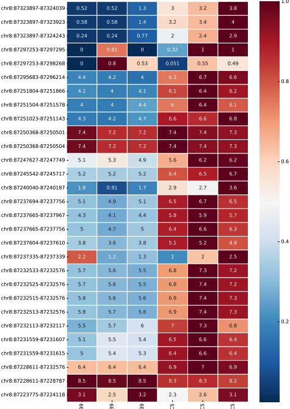

Heatmap for exon level expression
===========================

::

	usage: bw_exon_plot.py [-h] [-j JID] -f BW_LIST -q QUERY [-o OUTPUT]
	                       [-g GENOME] [-e EXON_BED] [--gene_name_db GENE_NAME_DB]

	Heatmap for exon level expression

	optional arguments:
	  -h, --help            show this help message and exit
	  -j JID, --jid JID     enter a job ID, which is used to make a new directory.
	                        Every output will be moved into this folder. (default:
	                        bw_exon_plot_yli11_2021-01-26)
	  -q QUERY, --query QUERY
	                        query gene name (default: None)
	  -o OUTPUT, --output OUTPUT
	                        output prefix (default: Heatmap_exon_yli11_2021-01-26)

	Genome Info:
	  -g GENOME, --genome GENOME
	                        genome version: hg19, hg38, mm9, mm10. By default,
	                        specifying a genome version will automatically update
	                        index file, black list, chrom size and
	                        effectiveGenomeSize, unless a user explicitly sets
	                        those options. (default: hg19)
	  -e EXON_BED, --exon_bed EXON_BED
	                        chrome size (default:
	                        /home/yli11/Data/Human/hg19/annotations/hg19.exon.bed)
	  --gene_name_db GENE_NAME_DB
	                        gene_name_db (default: /home/yli11/Data/Human/hg19/ann
	                        otations/hg19.ensembl_v75.gene_name.db)

Motivation
^^^^^^^^^^

In a KO experiment, the whole transcript expression level may remain the same, however, the KO exon should be dramastically disrupted.

Input
^^^^^

To get normalized bw files, we first sampled the fastq files to the same depth. 

Copy all bw files (samples to be shown in the heatmap) in a working dir. Then you will only need to provide the gene name (used to extract the exons from gene annotation file), e.g., ``-q NFIX``

Output
^^^^^^

An heatmap showing exon level expression (row) changes across different samples (column). The heatmap color is row normalized, in order to show difference within one exon. Annotation using log2(count+1)

Usage
^^^^^

only working for hg19 and mm9 by now.

::

	module load python/2.7.13
	bw_exon_plot.py -q NFIX -g mm9 -o NFIX.heatmap.pdf

