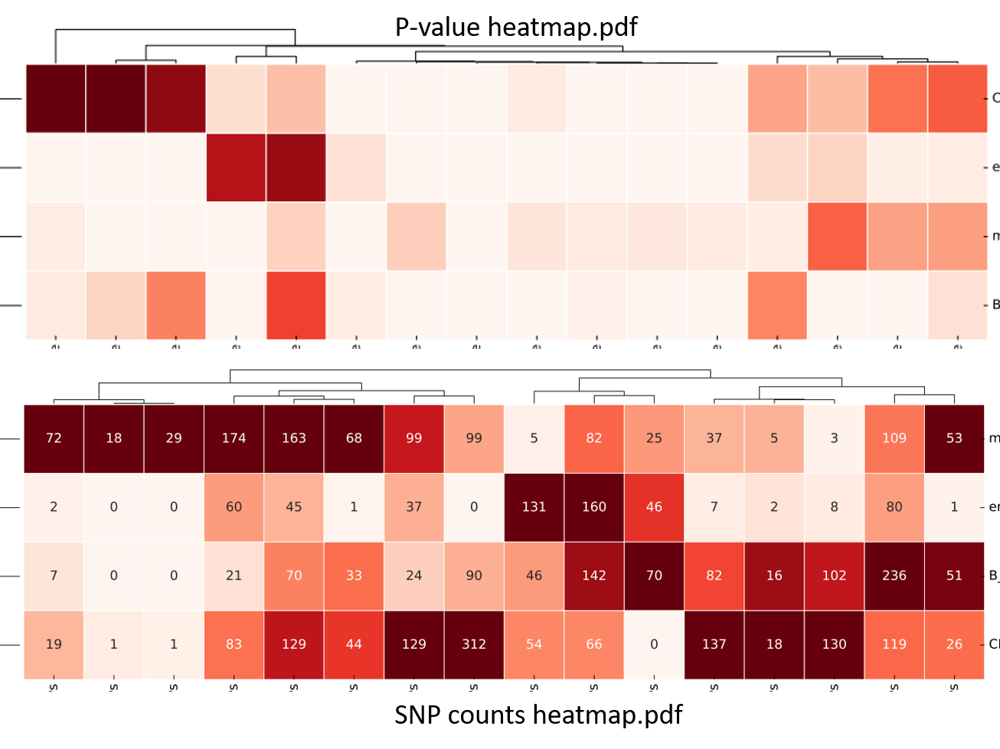

Blood data enrichment test
==================

Summary
^^^^^^^

This is a suite of tools for users to do an enrichment test given a list of bed files.

Input
^^^^^

A list of bed files. The first 3 columns of bed file should be chr, start, end.

Bed format 
-------------------

Additional columns are OK. The first 3 columns have to be chr, start, end.

::

	chr11	4167364	4167385	chr11:4167374-4167375
	chr11	4167366	4167387	chr11:4167376-4167377
	chr11	4167367	4167388	chr11:4167377-4167378
	chr11	4167370	4167391	chr11:4167380-4167381

Output
^^^^^^^

Blood traits variants/SNPs enrichment heatmap
----------------------------

Blood traits variants/SNPs enrichment ranked list
----------------------------

::

	[yli11@nodecn262 summary_files]$ ls *.list
	P_value_ranked.list  SNP_count_ranked.list

Usage
^^^^^

Blood traits variants/SNPs enrichment
----------------------------

::

	usage: GREGOR.py [-h] [-j JID] [-s SNP_LIST] [-n SNP_DATABASE_NAME] -f
	                 BED_LIST [--template_config TEMPLATE_CONFIG]

	optional arguments:
	  -h, --help            show this help message and exit
	  -j JID, --jid JID     enter a job ID, which is used to make a new directory.
	                        Every output will be moved into this folder. (default:
	                        GREGOR_yli11_2019-11-06)
	  -s SNP_LIST, --SNP_list SNP_LIST
	                        Please provide absolute path if you use custom SNP
	                        list (default: /research/rgs01/project_space/chenggrp/
	                        blood_regulome/chenggrp/Data_resource/blood_traits/VJ_
	                        2019/VJ01.list)
	  -n SNP_DATABASE_NAME, --SNP_database_name SNP_DATABASE_NAME
	                        options are custom, hg19_gwas, VJ01_combined, VJ01,
	                        VJ025, VJ05, VJ075 (default: VJ01)
	  -f BED_LIST, --bed_list BED_LIST
	                        absolute or relative path (default: None)
	  --template_config TEMPLATE_CONFIG

.. code:: bash

	hpcf_interactive

	module load python/2.7.13

	GREGOR.py -f bed.list -n VJ01

.. note:: You can provide your own SNP list using ``-n custom -s YOUR_list`` option. The SNP list file specifies the absolute paths to several trait-SNP lists. See below for an example of custom SNP list.

**-s YOUR_list**

You can have any number of list here.

::

	-----YOUR_list------
	/path/to/banana.list

**actual SNP locations (e.g., banana.list)**

::

	-banana.list--
	chr2:423434234
	chr4:463421444

