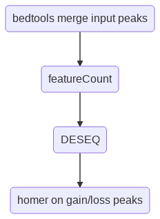

DESEQ2 for differential peak analysis
=====================================

::

	usage: diffPeak.py [-h] [-b BAMS] [-d DESIGN_MATRIX] [-p PEAKS] [-x DRY_RUN]
	                [-z SUBMIT_JOB] [-r FLAG] [--include_unmapped_reads] [-s]
	                [-j JID]

	optional arguments:
	  -h, --help            show this help message and exit
	  -b BAMS, --bams BAMS  list of bam files (include path to file)
	  -d DESIGN_MATRIX, --design_matrix DESIGN_MATRIX
	                        Each line is a group. Every group will be compared
	                        against the 'control' group. So you have to specify a
	                        control group in your input. The format for each line
	                        is: group_id:file_name_1,file_name_2. Just need file
	                        name, no need for the path to file.
	  -p PEAKS, --peaks PEAKS
	                        list of narrowPeak files (include path to file), need
	                        the last line to be empty (i.e. so as to have the
	                        newline character).
	  -x DRY_RUN, --dry_run DRY_RUN
	                        1 or 0. 1: dry run, to check system commands
	  -z SUBMIT_JOB, --submit_job SUBMIT_JOB
	                        1 or 0. 1: submit this job to HPC
	  -r FLAG, --flag FLAG  1 or 0. 1: run this job in terminal. 0: submit this
	                        job.
	  --include_unmapped_reads
	                        Expecting global change, need normalization by total
	                        reads
	  -s, --single          run featureCount in single-end mode
	  -j JID, --jid JID     enter a job ID, which is used to make a new directory.
	                        Every output will be moved into this folder.

Summary
^^^^^^^

This program performs differential peak analysis by taking the union of input peaks (i.e., bedtools merge), counting number of reads (for pair-end, it is number of fragments), then running DESEQ2. At the last step, peaks will be divided into gain or loss, each of which will be used to perform motif discovery using homer. 

.. note:: By default, DESEQ2 normalization is performed on total reads in peaks. You can also do it on raw total reads (i.e., sequencing depth), by using ``--include_unmapped_reads``.

Flowchart
^^^^^^^^^

Usage
^^^^^

.. code:: bash

	hpcf_interactive

	module load python/2.7.12

	dos2unix bams.list
	dos2unix design_matrix
	dos2unix peaks.list

	diffPeak.py -b bams.list -d design_matrix -p peaks.list -z 1 

``-z 1 `` tells the program to submit this job to HPC. Otherwise, diffPeak will just run interactively.

If you want to include all reads for DESEQ normalization, please add ``--include_unmapped_reads`` option. Note that this option tends to give a little less significant p-value and logFC.

If you are using single-end bam, please add ``-s`` option.

Input
^^^^^

Sample input examples are shown here: https://benchling.com/s/etr-FHkOZSXjFTUTDROQ2xu2

Input file syntax:

1. File names are separated by comma. No space bettwen them.

2. For design matrix, the first line ``control`` is a keyword. All the remaining lines will be compared to the ``control`` line.

3. Leave the last line blank.

Output
^^^^^^

1. Read count table is generated in DEseq2_results folder

2. DESEQ2 result (``control-[user_input_group].diffRegions.txt``) is generated in homer_motifs folder. ``A logFC < 0 means the peak has less read count in control group.``

FAQ
^^^^^^

No significant differential peaks, too many adj pvalues = 1
---------------------------------

P-value calculated is based on mean and variance. If there are no significant results, it means that the estimated dispersion (i.e., variance) is large enough to decrease the significance. This could be due to many reasons. You can try the following (ranked by likelihood):

1. Low number of replicates.

2. How we normalize the reads: try with or without this option. ``--include_unmapped_reads``

3. try to identify outliers

4. try different number of peaks. (MACS2, by varying its p-value threshold, you can get different number of peaks)

5. data quality

6. It is a fact that there is truly no difference.

Ref
^^^

https://support.bioconductor.org/p/95949/

https://www.biostars.org/p/251411/

