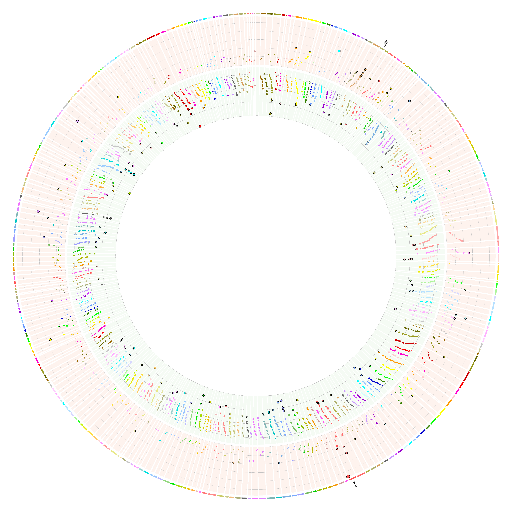
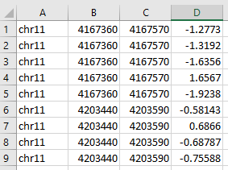
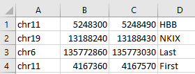

Manhanttan plot in circos 
=========================

Summary
^^^^^^^

Manhanttan plot is a way to visualize 1D values when you need to preserve the order (e.g., genomic positions). People also add colors (e.g., different chromosomes) or sizes to the plot, which makes it suitable for 2D or 3D datasets. However, when you have 100+ regions/loci and you want to visualize them in the same figure, linear manhanttan plot can't do that. In such case, you need circos. 

	

Usage
^^^^^

**Step 1**

.. highlight:: none

:: 

	hpcf_interactive -q standard -R "rusage[mem=4000]"

**Step 2**

.. code:: bash

	module purge

	module load python/2.7.12 circos

**Step 3**

To see the help message:

.. code:: bash

	circos_Manhattan -h 

To run an example:

.. code:: bash

	circos_Manhattan -f /home/yli11/HemTools/share/circos_Manhanttan/LFC.bed.sorted --genes /home/yli11/HemTools/share/circos_Manhanttan/gene.bed

To run your own data:

For that, you need two input files; they are all tsv files.

1. numerical values tsv (-f)

	

2. gene definition tsv (--genes)

	

