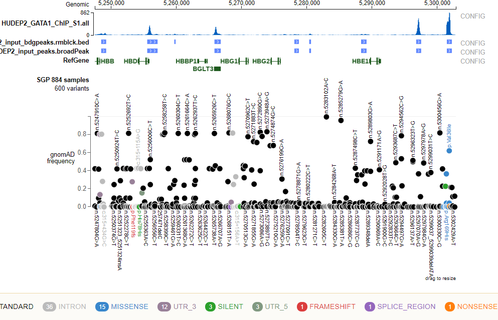

Upload your bw and bed files to protein paint
=============================================

Summary
^^^^^^^

An easy way to visualizing your data. This program will upload all ``.bw``, ``.bed``, and ``Peak`` files to protein paint. Note that protein paint genome browser is only accessible inside stjude network.

Usage
^^^^^

**Step 1**

.. code:: bash

	module purge

	module load python/2.7.13 htslib

**Step 2**

.. code:: bash

	create_tracks.py -h

	usage: create_tracks.py [-h] [-j JID] [-g GENOME] [--current_dir]

	optional arguments:
	  -h, --help            show this help message and exit
	  -j JID, --jid JID     a folder name, used to upload tracks (default:
	                        create_tracks_yli11_2019-06-28)
	  -g GENOME, --genome GENOME
	                        genome version: hg19, hg38, mm9, mm10. (default: hg19)
	  --current_dir         Upload .bed .narrowPeak .broadPeak and .bw files
	                        (default: False)

.. code:: bash

	create_tracks.py --current_dir -g hg19

