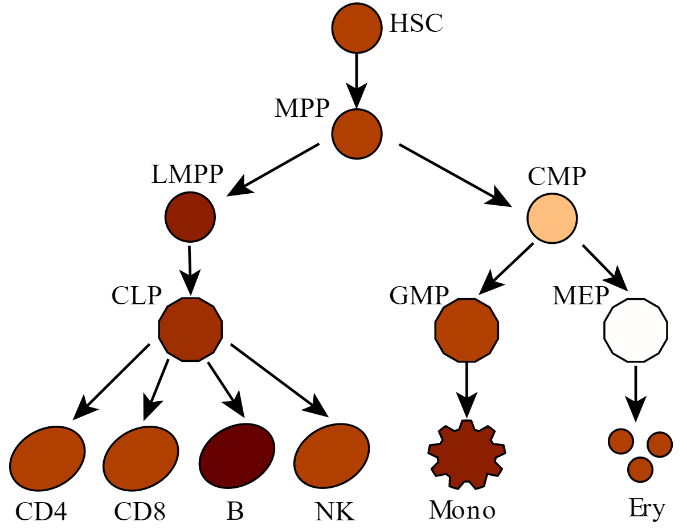

Plot hematopoiesis intensity, blood lineage
============================

::

	usage: plot_blood_lineage.py [-h] -f INPUT [--min MIN]
	                             [--custom_color_scale CUSTOM_COLOR_SCALE]
	                             [--svg_template SVG_TEMPLATE] [-o OUTPUT]

	optional arguments:
	  -h, --help            show this help message and exit
	  -f INPUT, --input INPUT
	                        2 column tsv, no header, the values for each cell type
	                        (default: None)
	  --min MIN             set min value, otherwise infered from data (default:
	                        None)
	  --custom_color_scale CUSTOM_COLOR_SCALE
	                        You can define your own color scheme (linear from
	                        lowest to highest) using hex color, separated by comma
	                        (default: #ffffff,#ff8000,#660000)
	  --svg_template SVG_TEMPLATE
	  -o OUTPUT, --output OUTPUT
	                        output file name (default:
	                        yli11_2020-01-17_929f6724faa3)

Summary
^^^^^^^

Plot a value intensity colored hematopoiesis figure. 

Input
^^^^^

A 2-col tsv file where you only need to modify the second column with your own value.

There are 13 cell types in this figure, you have to give values for all of them. The first column is the keyword.

::

	HSC	4
	MPP	4
	LMPP	5
	CLP	4.5
	GMP	4
	MEP	-2
	CMP	0
	CD4	4
	CD8	4
	B	6
	NK	4
	Mono	5
	Ery	4

Usage
^^^^^

.. code:: bash

	hpcf_interactive

	module load python/2.7.13 

	plot_blood_lineage.py -f input.tsv -o myPlot

Example
^^^^

.. code:: bash

	hpcf_interactive

	module load python/2.7.13 

	plot_blood_lineage.py -f ~/HemTools/share/misc/values.tsv

SVG to PDF
^^^^^^^^^^

Some SVG files will lose the color info when importing to AI. So you can convert them to PDF files first. See code below:

.. code:: bash

	hpcf_interactive

	module load conda3

	source activate /home/yli11/.conda/envs/pandoc

	rsvg-convert -f pdf -o output_plot.pdf input.svg

Replace ``input.svg`` with the actual SVG file name.

Output
^^^^^

A SVG figure and a colorbar pdf. They will be emailed to you as well.

