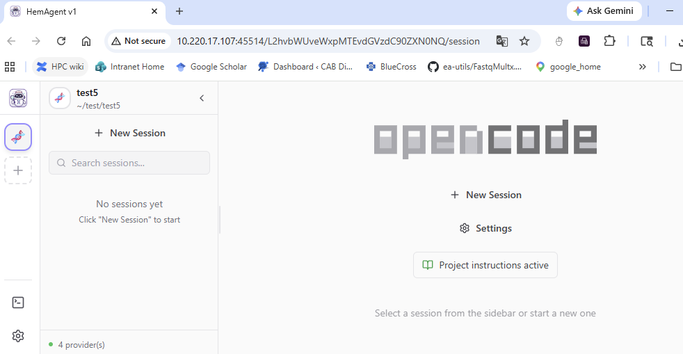

HemAgent Usage
===============================

.. toctree::
   :maxdepth: 1
   :glob:

   *

Summary
^^^^^^^^^

Use the latest AI-powered bioinformatics data analysis tools. After submitting the ``HemAgent`` job, you will receive an email to the link to use the HemAgent web portal.

The default working dir is the HPC location where you submit the job. Click ``+ New Session``, under the "opencode" logo, to open the AI session in this dir. 

If you need to go to another directory, clock ``+`` in the left sidebar to open a new project. You can have multiple session in one project, each project is sticked to its working dir. 

Usage
^^^^^^^^^

Before start
----------

.. note:: If you haven't logged in a compute node, do this first.

::

   hpcf_interactive

.. note:: If you haven't installed HemTools, do this next.

::

   PATH=/hpcf/lsf/lsf_prod/10.1/linux3.10-glibc2.17-x86_64/etc:/hpcf/lsf/lsf_prod/10.1/linux3.10-glibc2.17-x86_64/bin:/usr/lpp/mmfs/bin:/usr/lpp/mmfs/lib:/usr/local/bin:/usr/bin:/usr/local/sbin:/usr/sbin:/opt/ibutils/bin:/sbin:/cm/local/apps/environment-modules/3.2.10/bin:/opt/puppetlabs/bin
   export PATH=$PATH:"/home/yli11/HemTools/bin"

Run HemAgent
---------

::

   # cd to your working dir

   module load python/2.7.13

   run_lsf.py -p HemAgent

