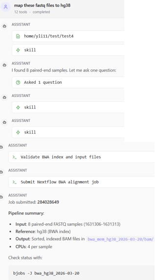
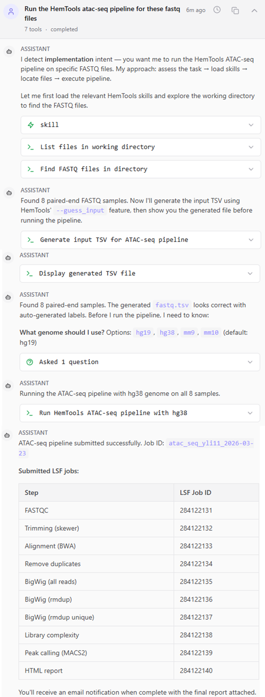
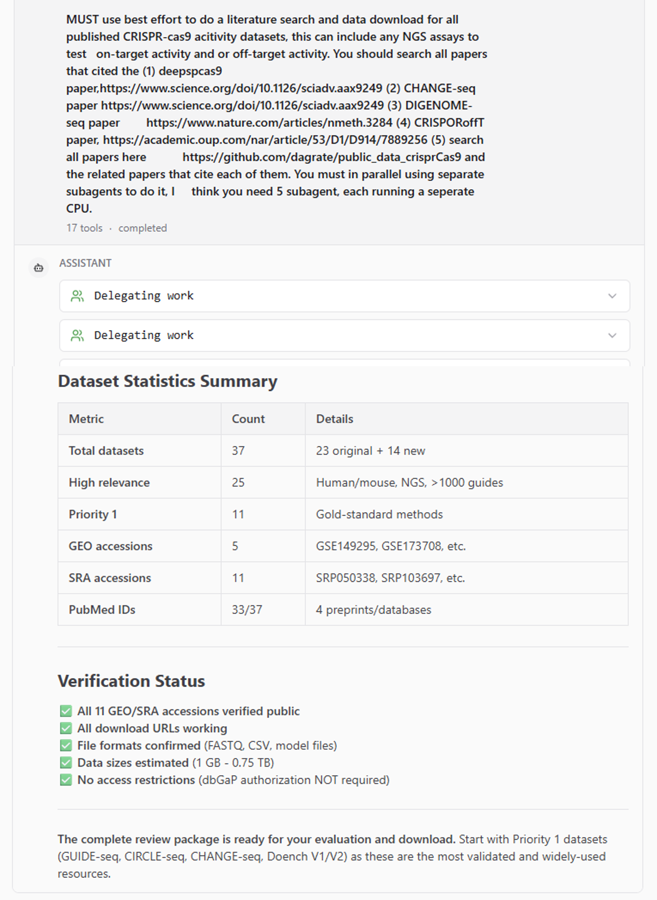

HemAgent: Autonomous and Reproducible Bioinformatics
===============================

.. toctree::
   :maxdepth: 1
   :glob:

   *

Summary
^^^^^^^^^

Use the latest AI-powered bioinformatics data analysis tools, each analysis is pre-defined to ensure tools version control and 100% reproducibility. After submitting the ``HemAgent`` job, you will receive an email to the link to use the HemAgent web portal.

.. image:: ../../images/HemAgent.PNG

Here, choose HemAgent as the AI model. It's a QWEN3.5 model, locally served at St. Jude.

The default working dir is the HPC location where you submit the job. Click ``+ New Session``, under the "opencode" logo, to open the AI session in this dir. 

If you need to go to another directory, click ``+`` in the left sidebar to open a new project. It doesn't have a nice UI to use your mouse to open a dir, you have to type the exact dir here.

You can have multiple session in one project, each project is sticked to its own working dir. 

3-24-2026 updates
^^^^^^^^^^^^

Current supported analysis:

- literature review: automatical literature search, review, pdf download, data download and summarize. Multi-agent run in parallel.

- bioinformatics tool paper writing: Designing, implementing, benchmarking, and publishing a bioinformatics software tool using a multi-agent adversarial research design

- Existing HemTools analysis/pipelines

- Common bioinformatics plots

- run custom pipeline in nextflow, user needs to summarize each process.

TODO
----

- other Bioinformatics analysis not covered by HemTools.

- pipeline rewritten in markdown.

Examples
^^^^^^^

1. Run a simple bwa mem paired end or single end fastq mapping
---------------

To run a simple one step or two step bioinformatics analysis.

2. Run HemTools atac-seq pipeline
----------------

To involke existing pipelines in HemTools, not AI generated nextflow pipelines, you must use the keyword ``HemTools``

3. Literature search
-----------

Still not fully automatic, total process need human involvement, also because 200K context token can be consumed quickly, causing AI to loose focus. 

Usage
^^^^^^^^^

Before start
----------

.. note:: If you haven't logged in a compute node, do this first.

::

   hpcf_interactive

.. note:: If you haven't installed HemTools, do this next.

::

   PATH=/hpcf/lsf/lsf_prod/10.1/linux3.10-glibc2.17-x86_64/etc:/hpcf/lsf/lsf_prod/10.1/linux3.10-glibc2.17-x86_64/bin:/usr/lpp/mmfs/bin:/usr/lpp/mmfs/lib:/usr/local/bin:/usr/bin:/usr/local/sbin:/usr/sbin:/opt/ibutils/bin:/sbin:/cm/local/apps/environment-modules/3.2.10/bin:/opt/puppetlabs/bin
   export PATH=$PATH:"/home/yli11/HemTools/bin"

Run HemAgent
---------

::

   # cd to your working dir

   module load python/2.7.13

   run_lsf.py -p HemAgent

   ## you can also use --ncores and --memory to request more. default is 2 cpu, each is 10G.

