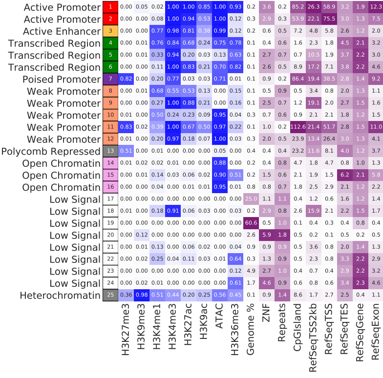

Chromatin State Discovery
=========================

::

	usage: chromHMM.py [-h] [-j JID] [--pipeline_type PIPELINE_TYPE]
	                   [-se SE_FASTQ_LIST] [-tf TF_FASTQ_LIST]
	                   [-his HIS_FASTQ_LIST] [-d_tf DESIGN_MATRIX_TF]
	                   [-d_his DESIGN_MATRIX_HIS] [-d1 DESIGN_MATRIX_1]
	                   [-d2 DESIGN_MATRIX_2] [--LearnModel_addon LEARNMODEL_ADDON]
	                   [-pe PE_FASTQ_LIST] [-c CELL_LINE] [--from_binBam]
	                   [-m MEMORY] [-bin CHROMHMM_JAR]
	                   [--known_association KNOWN_ASSOCIATION]
	                   [--chromatin_state_info CHROMATIN_STATE_INFO]
	                   [-n NUMBER_STATES] [--d1_bin_bam_addon D1_BIN_BAM_ADDON]
	                   [--d2_bin_bam_addon D2_BIN_BAM_ADDON]
	                   [--adjust_TF_pvalue ADJUST_TF_PVALUE]
	                   [--adjust_histone_pvalue ADJUST_HISTONE_PVALUE] [-g GENOME]
	                   [-i INDEX_FILE] [-s CHROM_SIZE]

	perform chromatin state discovery using chromHMM v1.18, bin size is fixed to
	be 200bp.

	optional arguments:
	  -h, --help            show this help message and exit
	  -j JID, --jid JID     enter a job ID, which is used to make a new directory.
	                        Every output will be moved into this folder. (default:
	                        chromHMM_yli11_2019-10-13)
	  --pipeline_type PIPELINE_TYPE
	                        Not for end-user. (default: chromHMM)

	Input Files:
	  -se SE_FASTQ_LIST, --SE_fastq_list SE_FASTQ_LIST
	                        A tsv file containing 2 columns, R1.fastq.gz & UID
	                        (default: None)
	  -tf TF_FASTQ_LIST, --TF_fastq_list TF_FASTQ_LIST
	                        A tsv file containing 2 columns, R1.fastq.gz & UID
	                        (default: None)
	  -his HIS_FASTQ_LIST, --His_fastq_list HIS_FASTQ_LIST
	                        A tsv file containing 2 columns, R1.fastq.gz & UID
	                        (default: None)
	  -d_tf DESIGN_MATRIX_TF, --design_matrix_TF DESIGN_MATRIX_TF
	                        Similar to peakcall.tsv, this is a tsv file containing
	                        3 columns: treatment_UID & control_UID & label. Label
	                        has to be meaningful labels, such as H3K4me3. Case
	                        insensitive. (default: None)
	  -d_his DESIGN_MATRIX_HIS, --design_matrix_His DESIGN_MATRIX_HIS
	                        Similar to peakcall.tsv, this is a tsv file containing
	                        3 columns: treatment_UID & control_UID & label. Label
	                        has to be meaningful labels, such as H3K4me3. Case
	                        insensitive. (default: None)
	  -d1 DESIGN_MATRIX_1, --design_matrix_1 DESIGN_MATRIX_1
	                        Similar to peakcall.tsv, this is a tsv file containing
	                        3 columns: treatment_UID & control_UID & label. Label
	                        has to be meaningful labels, such as H3K4me3. Case
	                        insensitive. (default: None)
	  -d2 DESIGN_MATRIX_2, --design_matrix_2 DESIGN_MATRIX_2
	                        A tsv file contatinig 2 columns: UID & label.
	                        (default: None)
	  --LearnModel_addon LEARNMODEL_ADDON
	                        chromHMM learmodel additional parameters e.g. -u coord
	                        dir (default: )
	  -pe PE_FASTQ_LIST, --PE_fastq_list PE_FASTQ_LIST
	                        A tsv file containing 3 columns, R1.fastq.gz &
	                        R2.fastq.gz & UID (default: None)
	  -c CELL_LINE, --cell_line CELL_LINE
	                        input cell line, just a name, not important (default:
	                        myCellLine)
	  --from_binBam         Resume analysis from chromHMM binBam step (default:
	                        False)
	  -m MEMORY, --memory MEMORY
	                        memory requested (MB), if you have 16+ samples, for
	                        example, 8 markers and 2 replicates per marker, use
	                        200G, which is -m 200000 (default: 200000)
	  -bin CHROMHMM_JAR, --chromHMM_jar CHROMHMM_JAR
	                        chromHMM bin location (default: /home/yli11/Programs/j
	                        ar_tools/ChromHMM-1.18/ChromHMM.jar)
	  --known_association KNOWN_ASSOCIATION
	                        chromHMM bin location (default: /home/yli11/HemTools/s
	                        hare/misc/chromHMM_known_associations.tsv)
	  --chromatin_state_info CHROMATIN_STATE_INFO
	                        chromHMM bin location (default: /home/yli11/HemTools/s
	                        hare/misc/chromatin_state_info.tsv)
	  -n NUMBER_STATES, --number_states NUMBER_STATES
	                        Number of chromHMM states to learn. Remember, chromHMM
	                        uses binarized signals. If you have N markers, then
	                        possibly you could explain up to 2^N states. In
	                        practice, you should run this program several times,
	                        each with different number of states. (default: 10)
	  --d1_bin_bam_addon D1_BIN_BAM_ADDON
	                        This is an addon parameter for binarized bam with
	                        design_matrix_1 as input (default: )
	  --d2_bin_bam_addon D2_BIN_BAM_ADDON
	                        This is an addon parameter for binarized bam with
	                        design_matrix_2 as input (default: )
	  --adjust_TF_pvalue ADJUST_TF_PVALUE
	                        Most TFs, except for CTCF, tend to have much lower
	                        number of 1s (default: 0.0005)
	  --adjust_histone_pvalue ADJUST_HISTONE_PVALUE
	                        Some histone marks can have much higher number of 1s
	                        after binarizeBam, increase the p-value cutoff can
	                        descrease the number of 1s (default: 1e-05)

	Genome Info:
	  -g GENOME, --genome GENOME
	                        genome version: hg19, hg38, mm9, mm10. By default,
	                        specifying a genome version will automatically update
	                        index file, black list, chrom size and
	                        effectiveGenomeSize, unless a user explicitly sets
	                        those options. (default: hg19)
	  -i INDEX_FILE, --index_file INDEX_FILE
	                        BWA index file (default: /home/yli11/Data/Human/hg19/i
	                        ndex/bwa_16a_index/hg19.fa)
	  -s CHROM_SIZE, --chrom_size CHROM_SIZE
	                        chrome size (default: /home/yli11/Data/Human/hg19/anno
	                        tations/hg19.chrom.sizes)

Summary
^^^^^^^

Perform chromatin state discovery given a list of fastq files. Single-end fastq is given using ``-se`` option. Paired-end fastq is given using ``-pe`` option. These input files are similar to ``fastq.tsv``, as used in other HemTools programs. One can use either one or both input types. Design matrix is given as ``-d1`` or ``-d2`` options. ``-d1`` input format is similar to ``peakcall.tsv``, where the first two columns are UIDs (treatment vs control), and the third column is a label. This label has to be a meanfully label, such as H3K4me3 (Case insensitive). These labels are used to compare to known chromHMM annotations (see the second figure below). Still, chromatin state annotations are subjective, there's no ground rules, this comparison is just to help you define the learned model.

.. note:: In theory, you can input any fastq data, such as RNA-seq, Hi-C, or TF CHIP-seq data. However, I haven't seen papers using RNA-seq or Hi-C for chromatin state discovery. There are few papers using Pol-II, CTCF, or NANOG. You can definitely try everything.

Flowchart
^^^^^^^^^

.. image:: ../../images/chromHMM.png
	:align: center

Chromatin states known associations
^^^^^^^^^^^^^^^^^^^^^^^^^^^^^^^^^^^

.. image:: ../../images/chromatin_states_known_associations.png
	:align: center

Example output
^^^^^^^^^^^^^^

These chromatin state definitions were obtained by comparing with known associations. For exploratory usage, this is OK. For publication purpose, you will probably need to redefine some states.

Input
^^^^^

See ``Summary`` above for how these inputs are used.

**-se: similar to fastq.tsv for single-end data**

2 columns: file_location (with path if not in the current dir), UID.

See an example below. This file is named as se.list.

::

	/path_to_file/1577764_ChIP_T_input_rep2_R1.fastq.gz	input_rep2
	/path_to_file/1577763_ChIP_T_input_rep1_R1.fastq.gz	input_rep1
	/path_to_file/1577762_ChIP_T_H3K36me3_rep2_R1.fastq.gz	H3K36me3_rep2
	/path_to_file/1577761_ChIP_T_H3K36me3_rep1_R1.fastq.gz	H3K36me3_rep1
	/path_to_file/1577760_ChIP_T_H3K27ac_rep2_R1.fastq.gz	H3K27ac_rep2
	/path_to_file/1577759_ChIP_T_H3K27ac_rep1_R1.fastq.gz	H3K27ac_rep1
	/path_to_file/1577758_ChIP_T_H3K27me3_rep2_R1.fastq.gz	H3K27me3_rep2
	/path_to_file/1577757_ChIP_T_H3K27me3_rep1_R1.fastq.gz	H3K27me3_rep1
	/path_to_file/1577756_ChIP_T_H3K9ac_rep2_R1.fastq.gz	H3K9ac_rep2
	/path_to_file/1577755_ChIP_T_H3K9ac_rep1_R1.fastq.gz	H3K9ac_rep1
	/path_to_file/1577754_ChIP_T_H3K9me3_rep2_R1.fastq.gz	H3K9me3_rep2
	/path_to_file/1577753_ChIP_T_H3K9me3_rep1_R1.fastq.gz	H3K9me3_rep1
	/path_to_file/1577752_ChIP_T_H3K4me3_rep2_R1.fastq.gz	H3K4me3_rep2
	/path_to_file/1577751_ChIP_T_H3K4me3_rep1_R1.fastq.gz	H3K4me3_rep1
	/path_to_file/1577750_ChIP_T_H3K4me1_rep2_R1.fastq.gz	H3K4me1_rep2
	/path_to_file/1577749_ChIP_T_H3K4me1_rep1_R1.fastq.gz	H3K4me1_rep1

**-pe: similar to fastq.tsv for paired-end data**

3 columns: file_location for R1.fastq.gz, file_location for R2.fastq.gz, UID.

See an example below. This file is named as pe.list.

::

	/path_to_file/1448387_T_R1_ATAC_R1.fastq.gz	/path_to_file/1448387_T_R1_ATAC_R2.fastq.gz	R1_ATAC
	/path_to_file/1448388_T_R2_ATAC_R1.fastq.gz	/path_to_file/1448388_T_R2_ATAC_R2.fastq.gz	R2_ATAC

**-d1: similar to peakcall.tsv for chip-seq data**

For ChIP-seq data, usually you have an input control. For that, you want to use ``-d1``. 

Here, you want to compare everything to control, which could be input chip or IgG.

3 columns: UID, UID, label. 

See an example below. This file is named as d1.tsv.

::

	H3K36me3_rep2	input_rep2	H3K36me3
	H3K36me3_rep1	input_rep1	H3K36me3
	H3K27ac_rep2	input_rep2	H3K27ac
	H3K27ac_rep1	input_rep1	H3K27ac
	H3K27me3_rep2	input_rep2	H3K27me3
	H3K27me3_rep1	input_rep1	H3K27me3
	H3K9ac_rep2	input_rep2	H3K9ac
	H3K9ac_rep1	input_rep1	H3K9ac
	H3K9me3_rep2	input_rep2	H3K9me3
	H3K9me3_rep1	input_rep1	H3K9me3

**-d2: give your input files a label**

For ATAC-seq data, you don't have control. Then, use ``-d2``.

Here, you want to state the label for your input files.

2 columns: UID, label. 

See an example below. This file is named as d2.tsv.

::

	R1_ATAC	ATAC
	R2_ATAC	ATAC

Usage
^^^^^

Go to your data directory and type the following.

**Step 0: Load python version 2.7.13.**

.. code:: bash

    module load python/2.7.13

**Step 1: Prepare input parameters**

.. code:: bash

	chromHMM.py -pe PE_list -d1 design_matrix_1 -d2 design_matrix_2 -n 4 

.. tip:: If files in ``-d1`` are paired-end data, use ``--d1_bin_bam_addon " -paired"``. Similarly, if ``-d2`` is paired-end data, use ``--d2_bin_bam_addon " -paired"``. See example below. This program can't handle mix input in the same design matrix.

.. code:: bash

    chromHMM.py -pe PE_list -d1 design_matrix_1 -d2 design_matrix_2 -n 4 --d1_bin_bam_addon " -paired" --d2_bin_bam_addon " -paired"

.. code:: bash

    chromHMM.py -pe PE_list -d1 design_matrix_1 -d2 design_matrix_2 -n 25 

For the specific example shown in the `Input`_ section, my command is:

::

	[yli11@hpc01 chromHMM_pipeline]$ chromHMM.py -se se.list -pe pe.list -d1 d1.tsv -d2 d2.tsv -g hg38 --d2_bin_bam_addon " -paired" -m 200000
	2019-07-15 17:35:12,714 - INFO - main - The job id is: chromHMM_yli11_2019-07-15
	2019-07-15 17:35:12,714 - INFO - main - checking input files...
	2019-07-15 17:35:12,715 - INFO - main - parsing se.list
	2019-07-15 17:35:12,727 - INFO - main - parsing pe.list
	2019-07-15 17:35:12,736 - INFO - main - All input files are found. Submitting jobs...
	2019-07-15 17:35:12,742 - INFO - to_design_matrix - parsing d1.tsv
	2019-07-15 17:35:12,758 - INFO - to_design_matrix - parsing d2.tsv
	2019-07-15 17:35:12,843 - INFO - submit_pipeline_jobs - BWA_PE has been submitted; JobID: 83644249
	2019-07-15 17:35:12,916 - INFO - submit_pipeline_jobs - BWA_SE has been submitted; JobID: 83644250
	2019-07-15 17:35:13,160 - INFO - submit_pipeline_jobs - bin_bam has been submitted; JobID: 83644251
	2019-07-15 17:35:13,666 - INFO - submit_pipeline_jobs - learn_model has been submitted; JobID: 83644252
	2019-07-15 17:35:13,812 - INFO - submit_pipeline_jobs - infer_CS has been submitted; JobID: 83644253
	2019-07-15 17:35:13,876 - INFO - submit_pipeline_jobs - email has been submitted; JobID: 83644254

Output
^^^^^^

Once the job is finished, you will receive a notification email with the learned chromatin states attached (i.e., ``chromHMM_heatmap.pdf``). 

``learned_states`` contains the chromHMM chromatin state discovery results, look at ``webpage_{{number_states}}.html`` for detailed description. ``_segments.bed`` contains the genome segments.

``chromHMM_heatmap.pdf`` is the infered chromatin states, by comparing to the known associations (using euclidean distance). Note that row orders are sorted by chromatin state labels, which is not the same as the ``_segments.bed`` file.

Fine tuning chromHMM states
^^^^^^^^^^^^^^

chromHMM itself is a dark art. ``Fine tuning`` is more like a personal taste. As long as the annotation is expected in some degree and you can link the results to some biological findings, then you don't really need to worry too much about tuning the parameters. (Because more likely that, different parameters converged to the same or almost similar results.)

In this section, I have to mention one parameter to affect the binarizaiton  significantly (chromHMM.jar binBam). Although I didn't find it affect the actually learned states too much, I think tuning this parameter did increase the signal to noise ratio a little bit. This parameter is ``-p``

::

	poissonthreshold – This option specifies the tail probability of the poisson distribution that the binarization threshold should correspond to. The default value of this parameter is 0.0001.

I call it the binarization p-value. Basically, increase the p-value cutoff (default is 0.0001, change it to 1e-5) will decrease the number of 1s and vice versa. 

In one example I have worked on, H3K4me1 occurs frequently in most of the learned states (looking at the emission probability), then we can increase the cutoff. Some TF chip-seq will have less occurrence then histone chip-seq, then we can lower the significance.

.. code:: bash

	chromHMM.py -se default_histone_fastq.tsv -d1 default_histone_design.tsv -g mm9 -d_tf special_TF_design.tsv -tf special_TF_fastq.tsv -j p0000005_n8 -n 8 --design_matrix_His special_histone_design.tsv --His_fastq_list special_histone_fastq.tsv --adjust_histone_pvalue 0.0000005 --LearnModel_addon  -u /path/chromHMM_input --adjust_TF_pvalue 0.005.

In this above command:

``-se`` and ``-d1`` are the fastq files applied to the default p-value, 0.0001.

``-tf`` , ``-d_tf`` and ``--adjust_TF_pvalue`` are the ones applied to user-defined p-value.

``--His_fastq_list``, ``--design_matrix_His`` and ``--adjust_histone_pvalue`` are the ones applied to user-defined p-value.

``-u`` gives the path to annotation bed files. Note that these bed files have to be stored in a folder named with the genome assembly. For example, suppose my current working dir is ``/path/cwd``. Then I need to create ``/path/cwd/mm9/``, and inside ``mm9`` I can put some sorted 3-column chip-seq bed files or other kind of bed files. Then I have to use ``-u /path/cwd`` not ``/path/cwd/mm9``.

Post Processing
^^^^^^^^^^^^^^^

This section is provided to solve the following problems:

(1) Automatic chromHMM annotation may not be accurate. For example, you may not have H3K27me3 (a poised promoter state marker) but still get poised promoter states in your chromHMM_heatmap.pdf. In this case, you want to manually define the chromatin states

.. note:: Look at the computer generated chromHMM_heatmap.pdf, think about the best chromatin states before starting this analysis.

.. code:: bash

	hpcf_interactive

	cd {{jid}}/learned_model_{{N}}  

	cp reordered_row_annotation.txt new_names.txt

	## edit new_names.txt 

	module load conda3

	source activate /home/yli11/.conda/envs/py2

	plot_chromHMM_emission_enrichment_heatmap.py -e emissions_{{N}}.txt -a myCellLine_{{N}}_overlap.txt -c new_names.txt -o some_name.pdf

An example of new_names.txt is shown below:

::

	label	r	g	b	chromHMM_col_order
	Active Promoter 1	255	0	0	8
	Active Promoter 2	255	195	77	6
	Weak Promoter	112	48	160	7
	Active Enhancer	255	255	0	5
	Weak Enhancer	0	128	0	4
	Insulator	189	183	107	3
	Heterochromatin	128	128	128	1
	Heterochromatin	128	128	128	2

Note that the row order and RGB colors are the same as the result heatmap.pdf. 

(2) Create ppr chromHMM tracks for visualization.

Here we need a segmentation bed file from chromHMM.jar and an annotation file defined by user.

The row order in annotation.txt should be the same as the ones in chromHMM_segments.txt. And chromHMM uses E1, E2 for the state names. You can check out reordered_row_annotation.txt for the original chromHMM state names.

::

	Heterochromatin	Het	128	128	128
	Heterochromatin	Het	128	128	128
	Insulator	Ins	189	183	107
	Weak Enhancer	WeakE	255	195	77
	Active Enhancer	ActiveE	255	255	0
	Active Promoter 2	ActiveP2	255	0	0
	Weak Promoter	WeakP	112	48	160
	Active Promoter 1	ActiveP1	255	0	0

.. code:: bash

	hpcf_interactive 

	dos2unix row_annotation.txt

	module load htslib python/2.7.13

	chromHMM_ppr_track.py -bed myCellLine_8_segments.bed -ann row_annotation.txt -o ppr_tracks.bed

The output ``*.sorted.gz*`` are ready to be uploaded to ppr. 

Custom enrichment
^^^^^^^^^^^^^

``Input_25_segments.bed`` is the learned states from chromHMM, you can get it from this pipeline.

``other_bed`` is a folder containing all the bed files that you want to check for segment enrichments.

``myOut`` is the output name.

::

	module load java

	chrHMM=/home/yli11/Programs/jar_tools/ChromHMM-1.18/ChromHMM.jar

	java -jar $chrHMM OverlapEnrichment Input_25_segments.bed other_bed myOut

Comments
^^^^^^^^

.. disqus::
    :disqus_identifier: NGS_pipelines

