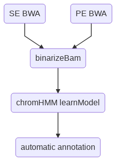
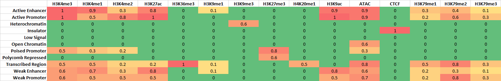

Chromatin State Discovery
=========================

::

	usage: chromHMM.py [-h] [-j JID] [--pipeline_type PIPELINE_TYPE]
	                   [-se SE_FASTQ_LIST] [-d1 DESIGN_MATRIX_1]
	                   [-d2 DESIGN_MATRIX_2] [-pe PE_FASTQ_LIST] [-c CELL_LINE]
	                   [-m MEMORY] [-bin CHROMHMM_JAR] [-n NUMBER_STATES]
	                   [--d1_bin_bam_addon D1_BIN_BAM_ADDON]
	                   [--d2_bin_bam_addon D2_BIN_BAM_ADDON] [-g GENOME]
	                   [-i INDEX_FILE] [-s CHROM_SIZE]

	perform chromatin state discovery using chromHMM v1.18, bin size is fixed to
	be 200bp.

	optional arguments:
	  -h, --help            show this help message and exit
	  -j JID, --jid JID     enter a job ID, which is used to make a new directory.
	                        Every output will be moved into this folder. (default:
	                        chromHMM_yli11_2019-07-15)
	  --pipeline_type PIPELINE_TYPE
	                        Not for end-user. (default: chromHMM)

	Input Files:
	  -se SE_FASTQ_LIST, --SE_fastq_list SE_FASTQ_LIST
	                        A tsv file containing 2 columns, R1.fastq.gz & UID
	                        (default: None)
	  -d1 DESIGN_MATRIX_1, --design_matrix_1 DESIGN_MATRIX_1
	                        Similar to peakcall.tsv, this is a tsv file containing
	                        3 columns: treatment_UID & control_UID & label. Label
	                        has to be meaningful labels, such as H3K4me3. Case
	                        insensitive. (default: None)
	  -d2 DESIGN_MATRIX_2, --design_matrix_2 DESIGN_MATRIX_2
	                        A tsv file contatinig 2 columns: UID & label.
	                        (default: None)
	  -pe PE_FASTQ_LIST, --PE_fastq_list PE_FASTQ_LIST
	                        A tsv file containing 3 columns, R1.fastq.gz &
	                        R2.fastq.gz & UID (default: None)
	  -c CELL_LINE, --cell_line CELL_LINE
	                        input cell line, just a name, not important (default:
	                        myCellLine)
	  -m MEMORY, --memory MEMORY
	                        memory requested (MB), if you have 16+ samples, for
	                        example, 8 markers and 2 replicates per marker, use
	                        200G, which is -m 200000 (default: 10000)
	  -bin CHROMHMM_JAR, --chromHMM_jar CHROMHMM_JAR
	                        chromHMM bin location (default: /home/yli11/Programs/j
	                        ar_tools/ChromHMM-1.18/ChromHMM.jar)
	  -n NUMBER_STATES, --number_states NUMBER_STATES
	                        Number of chromHMM states to learn. Remember, chromHMM
	                        uses binarized signals. If you have N markers, then
	                        possibly you could explain up to 2^N states. In
	                        practice, you should run this program several times,
	                        each with different number of states. (default: 10)
	  --d1_bin_bam_addon D1_BIN_BAM_ADDON
	                        This is an addon parameter for binarized bam with
	                        design_matrix_1 as input (default: )
	  --d2_bin_bam_addon D2_BIN_BAM_ADDON
	                        This is an addon parameter for binarized bam with
	                        design_matrix_2 as input (default: )

	Genome Info:
	  -g GENOME, --genome GENOME
	                        genome version: hg19, hg38, mm9, mm10. By default,
	                        specifying a genome version will automatically update
	                        index file, black list, chrom size and
	                        effectiveGenomeSize, unless a user explicitly sets
	                        those options. (default: hg19)
	  -i INDEX_FILE, --index_file INDEX_FILE
	                        BWA index file (default: /home/yli11/Data/Human/hg19/i
	                        ndex/bwa_16a_index/hg19.fa)
	  -s CHROM_SIZE, --chrom_size CHROM_SIZE
	                        chrome size (default: /home/yli11/Data/Human/hg19/anno
	                        tations/hg19.chrom.sizes)

Summary
^^^^^^^

Perform chromatin state discovery given a list of fastq files. Single-end fastq is given using ``-se`` option. Paired-end fastq is given using ``-pe`` option. These input files are similar to ``fastq.tsv``, as used in other HemTools programs. One can use either one or both input types. Design matrix is given as ``-d1`` or ``-d2`` options. ``-d1`` input format is similar to ``peakcall.tsv``, where the first two columns are UIDs (treatment vs control), and the third column is a label. This label has to be a meanfully label, such as H3K4me3 (Case insensitive). These labels are used to compare to known chromHMM annotations (see the second figure below). Still, chromatin state annotations are subjective, there's no ground rules, this comparison is just to help you define the learned model.

.. note:: In theory, you can input any fastq data, such as RNA-seq, Hi-C, or TF CHIP-seq data. However, I haven't seen papers using RNA-seq or Hi-C for chromatin state discovery. There are few papers using Pol-II, CTCF, or NANOG. You can definitely try everything.

Flowchart
^^^^^^^^^

Chromatin states known associations
^^^^^^^^^^^^^^^^^^^^^^^^^^^^^^^^^^^

Example output
^^^^^^^^^^^^^^

Input
^^^^^

See ``Summary`` above for how these inputs are used.

**-se: similar to fastq.tsv for single-end data**

2 columns: file_location (with path if not in the current dir), UID.

**-pe: similar to fastq.tsv for paired-end data**

3 columns: file_location for R1.fastq.gz, file_location for R2.fastq.gz, UID.

**-d1: similar to peakcall.tsv for chip-seq data**

For ChIP-seq data, usually you have an input control. For that, you want to use ``-d1``. 

Here, you want to compare everything to control, which could be input chip or IgG.

3 columns: UID, UID, label. 

**-d2: give your input files a label**

For ATAC-seq data, you don't have control. Then, use ``-d2``.

Here, you want to state the label for your input files.

2 columns: UID, label. 

Usage
^^^^^

Go to your data directory and type the following.

**Step 0: Load python version 2.7.13.**

.. code:: bash

    module load python/2.7.13

**Step 1: Prepare input parameters**

.. code:: bash

	chromHMM.py -pe PE_list -d1 design_matrix_1 -d2 design_matrix_2 -n 4 

.. tip:: If files in ``-d1`` are paired-end data, use ``--d1_bin_bam_addon " -paired"``. Similarly, if ``-d2`` is paired-end data, use ``--d2_bin_bam_addon " -paired"``. See example below. This program can't handle mix input in the same design matrix.

.. code:: bash

    chromHMM.py -pe PE_list -d1 design_matrix_1 -d2 design_matrix_2 -n 4 --d1_bin_bam_addon " -paired" --d2_bin_bam_addon " -paired"

.. note:: If you have 16+ samples, for example, 8 markers and 2 replicates per marker, please use 200G memory, which is ``-m 200000`` (default: 10000).

.. code:: bash

    chromHMM.py -pe PE_list -d1 design_matrix_1 -d2 design_matrix_2 -n 25 -m 200000

Output
^^^^^^

Once the job is finished, you will receive a notification email with the learned chromatin states attached. 

``learned_states`` contains the chromHMM chromatin state discovery results, look at ``webpage_{{number_states}}.html`` for detailed description. ``_segments.bed`` contains the genome segments.

``chromHMM_heatmap.pdf`` is the infered chromatin states, by comparing to the known associations (using euclidean distance). Note that row orders are sorted by chromatin state labels, which is not the same as the ``_segments.bed`` file.

Comments
^^^^^^^^

.. disqus::
    :disqus_identifier: NGS_pipelines

