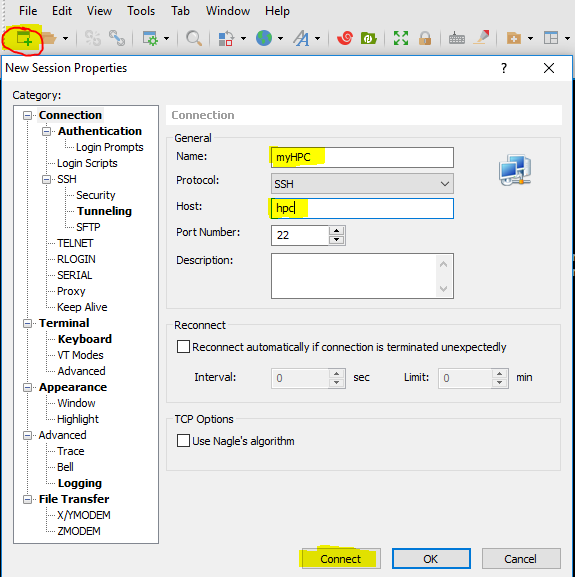
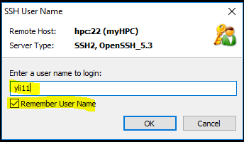
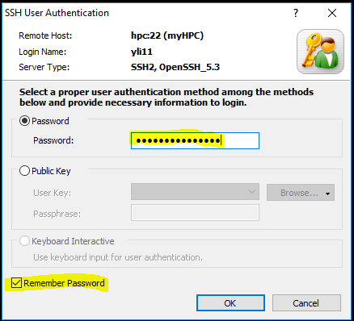

SSH to HPC without password
===========================

Make sure you are connected to ``$ecureNet``

For non-Windows users
^^^^^^^^^^^^^^^^^^^^^

Open a terminal and do the following 3 steps.

**Step 1. Create public/private RSA keys.**

.. code:: bash

	ssh-keygen -t rsa -N "" -F ~/.ssh/id_rsa

**Step 2. Create a folder on HPC. (Enter your HPC password).**

.. code:: bash

	ssh hpc mkdir -p .ssh

**Step 3. Let HPC knows that it is you. (Enter your password for the last time).**

.. code:: bash

	cat ~/.ssh/id_rsa.pub | ssh hpc 'cat >> .ssh/authorized_keys'

For Windows users
^^^^^^^^^^^^^^^^^

A good news for windows users is that logging-in and transferring files from HPC to your local computer is very simple.

**Step 1: Download and install Xshell and Xftp.**

https://www.netsarang.com/en/xshell/

https://www.netsarang.com/en/xftp/

**Step 2: Set up connection profile.**

Open Xshell, click the red circle button below to open a new connection.

Input user name. Check the remember username option.

Input password. Check the remember password option.

**Step 3: Transferring files.**

Click the Xftp logo. It will open a new window and you can start uploading and downloading files from HPC.

