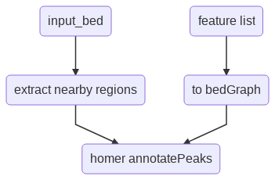

Feature extraction over a bed file
==================================

::

	usage: annotate_peaks.py [-h] [-j JID] [--pipeline_type PIPELINE_TYPE]
	                         [-w WINDOW_SIZE] [-s STEP_SIZE] [-n NUMBER_STEPS] -l
	                         FEATURE_LIST [-t FEATURE_TYPE] [--bed_list BED_LIST]
	                         [-g GENOME] -f INPUT

	annotate your bed files given a list of bed files, bedGraph files, or
	narrowPeak files. The input list can't contain a mix of types.

	optional arguments:
	  -h, --help            show this help message and exit
	  -j JID, --jid JID     enter a job ID, which is used to make a new directory.
	                        Every output will be moved into this folder. (default:
	                        annotate_peaks_yli11_2019-07-13)
	  --pipeline_type PIPELINE_TYPE
	                        Not for end-user. (default: annotate_peaks)
	  -w WINDOW_SIZE, --window_size WINDOW_SIZE
	                        feature window size, use the center of you input bed
	                        file, and create several windows both upstream and
	                        downstream, then your input file list will be used to
	                        overlap with each of these windows. (default: 200)
	  -s STEP_SIZE, --step_size STEP_SIZE
	                        How to create each window (where to set window start
	                        site). If step_size >= window_size, then it means no
	                        overlap between each window. (default: 100)
	  -n NUMBER_STEPS, --number_steps NUMBER_STEPS
	                        How many windows to create (i.e., how many steps you
	                        want to go). Note that number of bins = n-1. The
	                        actual bp to the center is n*s+w (default: 5)
	  -l FEATURE_LIST, --feature_list FEATURE_LIST
	                        a tsv file containing 2 columns, feature name &
	                        feature file (with path) (default: None)
	  -t FEATURE_TYPE, --feature_type FEATURE_TYPE
	                        can be bed, bedGraph, or narrowPeak. Case insensitive.
	                        Currently, only bedGraph or narrowPeak is implemented.
	                        (default: narrowPeak)
	  --bed_list BED_LIST   NOT FOR END-USER (default: None)
	  -g GENOME, --genome GENOME
	                        homer genome, hg18, hg19, mm9, mm10. Case sensitive!
	                        (default: hg19)
	  -f INPUT, --input INPUT
	                        a bed file with at least 4 columns, additional columns
	                        will be kept when output the result. The first 4
	                        columns are chr, start, end, unique name.
	                        (default: None)

.. note:: ``--feature_type bed`` option is not implemented.

Summary
^^^^^^^

Given a bed file, user wants to annotate this bed files with a list of bed files, bedGraph files, or narrowPeak files. In additional to regions in the user-input bed file, nearby region feature extraction will also be done by options ``-w``, ``-s``, and ``-n``. Basically, those parameters are used to define a sliding window.

.. note:: the input feature list should not contain a mix of file types.

Flowchart
^^^^^^^^^

Input
^^^^^

**A bed file to be annotated**

This bed file must contain at least 4 columns: chr, start, end, unique_name. Additional columns will be kept when output the result. 

**Feature list**

A tsv file, 2 columns: feature_name, feature_file (with path).

If feature_file is not in the current dir, you should provide relative or absolute path.

::

	H2_ATAC	/path_to_file/Hudep2_ATAC.narrowPeak
	H1_ATAC	/path_to_file/Hudep1_ATAC.narrowPeak
	myGrandpa	/path_to_file/myGrandpa_and_blue_color.narrowPeak

Usage
^^^^^

Go to your data directory and type the following.

**Step 0: Load python version 2.7.13.**

.. code:: bash

    module load python/2.7.13

**Step 1: Prepare input parameters**

.. code:: bash

    annotate_peaks.py -l feature.list -f gRNA.loci306.bed -g hg19

.. note:: By default, genome is hg19. Only hg18, hg19, mm9, mm10 is available for this option. Use ``-w``, ``-s``, and ``-n`` to control nearby windows.

Output
^^^^^^

Once the job is finished, you will receive a notification email. 

``*_homer.tsv`` files contain the features overlaped with your input regions and nearby regions.

Comments
^^^^^^^^

.. disqus::
    :disqus_identifier: NGS_pipelines

