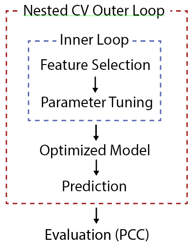
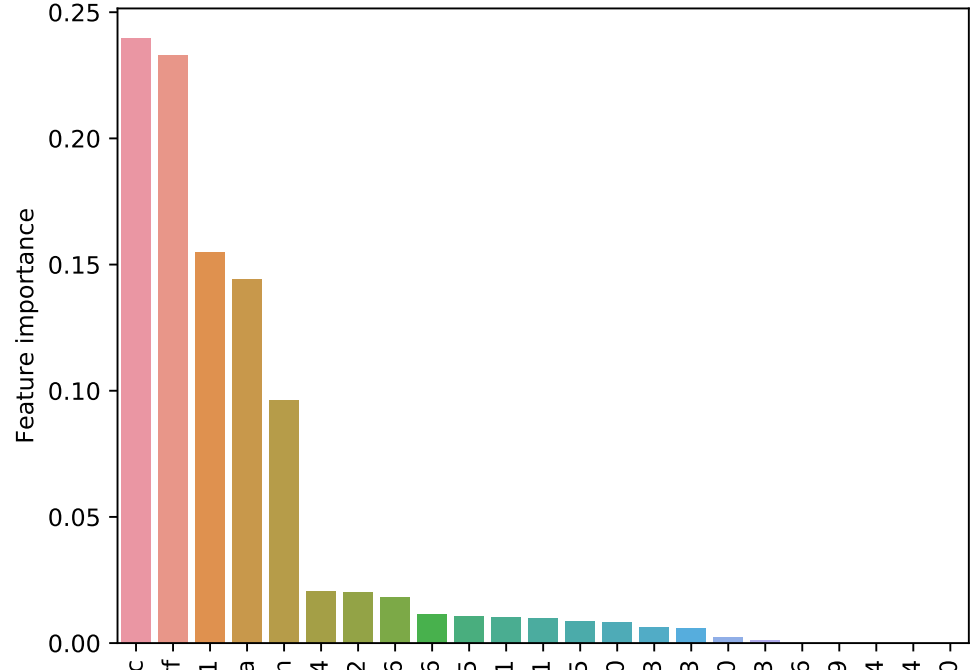
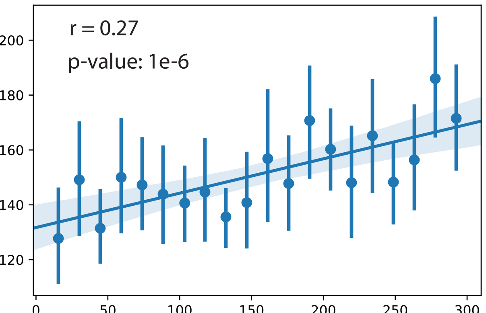

Regression model with nested CV evaluation
==========================================

::

	usage: regression_test.py [-h] -f INPUT [-s SEP] [--index] [--header] --target
							  TARGET [-o OUTPUT]

	optional arguments:
	  -h, --help			show this help message and exit
	  -f INPUT, --input INPUT
							input data frame (default: None)
	  -s SEP, --sep SEP	 separator (default: \t)
	  --index			   index is true (default: False)
	  --header			  header is true (default: False)
	  --target TARGET	   target column name, if no header, use column order,
							start from 0 (default: None)
	  -o OUTPUT, --output OUTPUT
							output file name prefix (default:
							regression_test_output)

Summary
^^^^^^^

This program trains a gradient boosting tree model and performs a feature selection and parameter selection on your input data and target label. This program is not intended to save a trained model in order to make predictions for further usage, but rather trying to evaluate how best we can do to predict the target value in a unbiased way (nested cross-validation).

The feature selection step select top 5, 10, 20 features.

The parameter selection step select ``max_depth``, ``loss``, and ``learning`` rate parameters.

The grid search step optimizes mean absolute error.

The output includes a feature importance bar plot and a correlation scatter plot to show the true and predicted values.

Flowchart
^^^^^^^^^

Input
^^^^^

**A dataframe**

**target label**

Usage
^^^^^

Go to your data directory and type the following.

**Step 0: Load python version 2.7.13.**

.. code:: bash

	hpcf_interactive

	module load python/2.7.13

**Step 1: Prepare input parameters**

.. code:: bash

	regression_test.py -f combined.data.csv -s , --index --header --target fdr

.. note:: ``-f`` and ``--target`` are required.

Output
^^^^^^

Comments
^^^^^^^^

.. disqus::
	:disqus_identifier: NGS_pipelines

