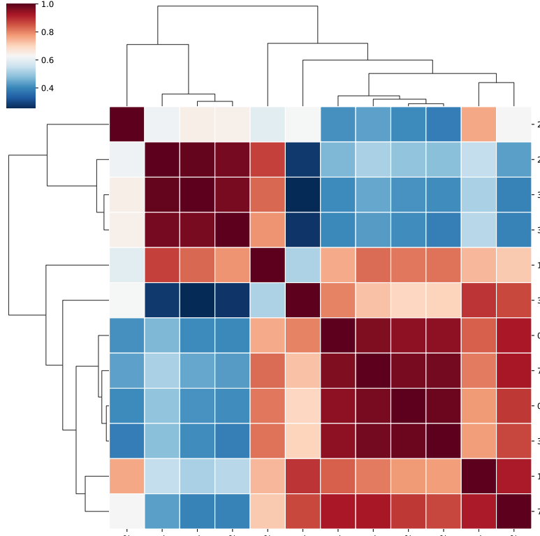
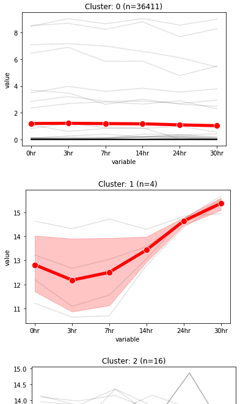

Time-series K-means clustering
==========================

Summary
^^^^^^^

Performing K-means cluster given an input table. 

Input
^^^^^

1. data table with each column representing a time point and each row representing a sample (e.g., a gene)
----------------------

Input data can be both csv or tsv. Please use ``-s ,`` for csv and ``-s "\t"`` for tsv. Please also use ``--index --header`` to tell the program that the input table has index and header.

2. time point list
-------------------

This is used for specifying replicates in each time plot, for example:

::

	(py2) [yli11@nodecn202 ts_test]$ head time.list 
	0hr	0hr_1
	0hr	0hr_2
	3hr	3hr_1
	3hr	3hr_2
	7hr	7hr_1
	7hr	7hr_2
	14hr	14hr_1

The first column is the time point, the second column is the column name used in the table above.

Usage
^^^^^

::

	module load conda3

	source activate /home/yli11/.conda/envs/py2/

	ts_kmeans.py -f input.csv -t time.list --index --header -s , --log2 -n 6 -o my_output_label

Output
^^^^^^

1. For QC purpose, look at sample correlation
--------------------------------

The output figure is ``output_label.corr.pdf``

2. Raw data with cluster assignment
---------------------------

The output table is ``output_label.clusters.csv``

The last column is the cluster assignment, starting from 0.

3. Visualization of data trend in each cluster
---------------------------

The output table is ``output_label.clusters.4.pdf``

Comments
^^^^^^^^

.. disqus::
    :disqus_identifier: NGS_pipelines

