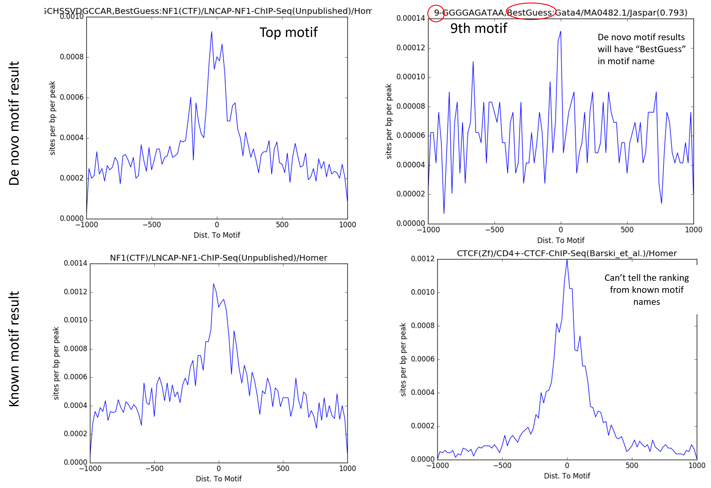

Homer motif discovery
==================

::

	usage: homer_motif_discovery.py [-h] [-j JID] -f PEAK_LIST
	                                [-s HOMER_REGION_SIZE] [-n NUMBER_MOTIF]
	                                [-m MISMATCH] [--homer_addon HOMER_ADDON]
	                                [-p FIMO_CUTOFF] [-g GENOME]
	                                [--genome_fasta GENOME_FASTA]

	optional arguments:
	  -h, --help            show this help message and exit
	  -j JID, --jid JID     enter a job ID, which is used to make a new directory.
	                        Every output will be moved into this folder. (default:
	                        homer_motif_discovery_yli11_2021-08-25)
	  -f PEAK_LIST, --peak_list PEAK_LIST
	                        a list of peak files (default: None)
	  -s HOMER_REGION_SIZE, --homer_region_size HOMER_REGION_SIZE
	  -n NUMBER_MOTIF, --number_motif NUMBER_MOTIF
	  -m MISMATCH, --mismatch MISMATCH
	  --homer_addon HOMER_ADDON
	                        you can add -norevopp to search only one strand
	                        (default: -mask)
	  -p FIMO_CUTOFF, --fimo_cutoff FIMO_CUTOFF

	Genome Info:
	  -g GENOME, --genome GENOME
	                        genome version: hg19, mm10, mm9, hg38 (default: hg19)
	  --genome_fasta GENOME_FASTA
	                        genome version: hs, mm (default:
	                        /home/yli11/Data/Human/hg19/fasta/hg19.fa)

Usage
^^^^^

Remember to login to a compute node and ``module load python/2.7.13``

I usually search motifs with multiple parameter combinations, for example:

::

	homer_motif_discovery.py -f input.list -g mm9 -s 200 -m 2 -n 50

	homer_motif_discovery.py -f input.list -g mm9 -s 500 -m 2 -n 50

	homer_motif_discovery.py -f input.list -g mm9 -s given -m 2 -n 50

	homer_motif_discovery.py -f input.list -g mm9 -s 1000 -m 2 -n 50

You can reduce ``-n 50`` to ``-n 10`` when you use homer on the same input the second time, because you have an idea of what the motifs would look like. In this case, I usually increase the number of mismatches to 3.

::

	homer_motif_discovery.py -f input.list -g mm9 -s 200 -m 3 -n 10

	homer_motif_discovery.py -f input.list -g mm9 -s 500 -m 3 -n 10

	homer_motif_discovery.py -f input.list -g mm9 -s given -m 3 -n 10

	homer_motif_discovery.py -f input.list -g mm9 -s 1000 -m 3 -n 10

Sometimes I only want to search on one strand, for NFIX motif, because it is a palindromic motif:

::

	homer_motif_discovery.py -f input.list -g mm9 -s 200 --homer_addon " -norevopp" -m 2

	homer_motif_discovery.py -f input.list -g mm9 -s 500 --homer_addon " -norevopp" -m 2

	homer_motif_discovery.py -f input.list -g mm9 -s given --homer_addon " -norevopp" -m 2

	homer_motif_discovery.py -f input.list -g mm9 -s 200 --homer_addon " -norevopp" -m 3

	homer_motif_discovery.py -f input.list -g mm9 -s 500 --homer_addon " -norevopp" -m 3

	homer_motif_discovery.py -f input.list -g mm9 -s given --homer_addon " -norevopp" -m 3

Output
^^^^

Motif enrichment (Main results)
---------------

Please look for the two html files in the jobID folder, e.g., homerResults.html , knownResults.html

Motif occurrences
------------------

To find out which peak contains the motif, go to ``knownResults`` for known motifs and ``homerResults`` for de novo motifs and look for tsv file.

Each motif is represented as one column in the tsv file. We provide all motif occurrences and top 10 motif occurrences. Usually, we just need top10 motifs, the file will be ``top10.known_motif_occ.tsv`` and ``top10.denovo_motif_occ.tsv``

Distribution of motif position relative to peak summit
-----------------------------

Individual motif position density plot is stored in ``homer_all_motifs`` folder.

