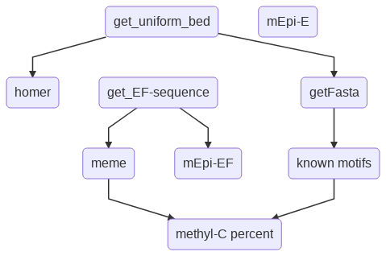

Methylated Motif Discovery
==========================

Summary
^^^^^^^

Given a bed file, identify motifs (homer, meme) and methyl-motifs (mEpigram, meme). 

**Input**

The first 3 columns should always be chr, start, end, e.g., narrowPeak file from MACS2. If you have additional columns, they will be simply ignored.

Currently, this program only works for hg19 with hudep1 or hudep2 cell lines.

Flowchart
^^^^^^^^^

Motif discovery pipeline usually contains 3 main steps: (1) motif discovery (2) motif scanning (3) motif evaluation. You may wonder that, during motif discovery step, one should already have the motif locations. However, this is almost never happended, mainly because the motif discovery process only tries to find the motif significant pattern, not really worrying about the significance of individual motif occurrence.

Different motif scanning program will give you slightly different motif mapping table, just like short reads mappers. You just want to setup a standard so that everyone uses the same motif scanning algorithm. 

Here, in this pipeline, motif scanning will be done using FIMO except for mEpigram.

In the last step, top motifs will be shown using ppr genome browser. 

motif similarity between regular motifs and methyl-motifs.

Usage
^^^^^

Prototype
^^^^^^^^^

Currently, there is no methyl-motif discovery and analysis pipeline. This pipeline is a prototype for that.

1. homer motif - homer motif report (DONE)

2. fimo known motif scanning (DONE)

3. mEpigram typeE motif report and motif locations  (DONE)

4. mEpigram typeEF motif report and motif lcoations (DONE)

5. meme typeEF motif report and motif locations (DONE)

6. percentage of overlap between known motif and methyl-motifs (i.e., similarity)

peak locations, then bedtools intersect

6a. percentage of known motif sites containing methyl-C. (DONE)

E positions in terms of peak, then use bedtools intersect with known motif fimo output

6b. percentage of motif sites containing methyl-C (DONE)

E positions in terms of peak, then use bedtools intersect with methyl motif fimo output

7. LIFT motif peak mapping locations to genome mapping coordinates

8. ppr visualization of top correlated motifs.

Note that the number of occurrences in the mEpigram report may not be the same in the motif mapping file. 

