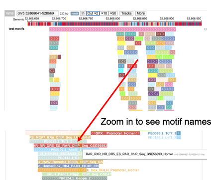

Find dense motif clusters
========================

::

	usage: motif_cluster.py [-h] [-j JID] -f INPUT_BED [-m MOTIF]
	                        [--motif_cluster_score MOTIF_CLUSTER_SCORE]
	                        [-o OUTPUT] [--input_list INPUT_LIST]
	                        [--motif_matching_score MOTIF_MATCHING_SCORE]
	                        [-g GENOME] [--genome_fasta GENOME_FASTA]

	optional arguments:
	  -h, --help            show this help message and exit
	  -j JID, --jid JID     enter a job ID, which is used to make a new directory.
	                        Every output will be moved into this folder. (default:
	                        motif_cluster_yli11_2020-09-16)
	  -f INPUT_BED, --input_bed INPUT_BED
	                        3 column bed file, additional columns are OK, but will
	                        be ignored (default: None)
	  -m MOTIF, --motif MOTIF
	                        motif database homer format (default: /home/yli11/Data
	                        /Motif_database/homer/combined.homer.motif)
	  --motif_cluster_score MOTIF_CLUSTER_SCORE
	                        motif_cluster_score (default: 5)
	  -o OUTPUT, --output OUTPUT
	  --input_list INPUT_LIST
	                        not for end user (default: None)
	  --motif_matching_score MOTIF_MATCHING_SCORE
	                        motif_matching_score (default: 6)

	Genome Info:
	  -g GENOME, --genome GENOME
	                        genome version: hg19, mm10, mm9, hg38 (default: hg19)
	  --genome_fasta GENOME_FASTA
	                        genome version: hs, mm (default:
	                        /home/yli11/Data/Human/hg19/fasta/hg19.fa)

Summary
^^^^^^^

This pipeline uses ``cluster bluster`` to find dense motif clusters.

ref: https://github.com/weng-lab/cluster-buster

Input
^^^^^

bed file

Usage
^^^^^

.. code:: bash

	hpcf_interactive

	module load python/2.7.13

	motif_cluster.py -f input.bed -g mm9 -o output.bed

Output
^^^^^^

The output is a bed file where the first 3 columns are the coordinates.

Motif cluster name or motif name is in the 4th column. Motif clusters are named as ``chr5:52866664-52868616__cluster_1``, the individual motif in each cluster can be found in the lines below motif cluster.

5th column is motif cluster score or motif score.

6th column is the strand.

The bed file can also be visualized in protein paint.

Comments
^^^^^^^^

.. disqus::
    :disqus_identifier: NGS_pipelines

