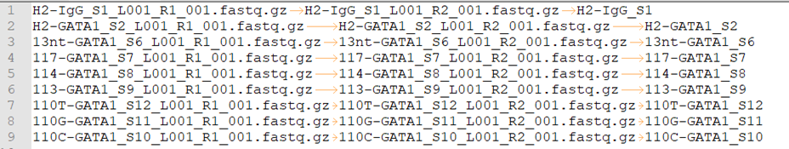
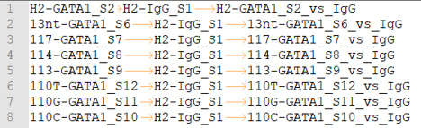

ARTR-seq data analysis pipeline
===================================

Summary
^^^^^^^

Pipeline adopted from https://github.com/mingming-cgz/ARTR-seq/ and  https://www.encodeproject.org/documents/739ca190-8d43-4a68-90ce-1a0ddfffc6fd/@@download/attachment/eCLIP_analysisSOP_v2.2.pdf

Pipeline has been tested using the ENCODE data from K562: blood_regulome/chenggrp/Projects/Siqi_data/CLIP/RBM9_Public/RBM9_K562

Input format
^^^^^^^^^^^^^^^^^^^

**fastq.tsv**

This is a tab-seperated-value format file. The 3 columns are: Read 1, Read 2, sample ID.

**peakcall.tsv**

This is also a tab-seperated-value format file. The 3 columns are: treatment sample ID, control/input sample ID, peakcall ID.

Usage
^^^^^

.. code:: bash

	hpcf_interactive

	module load python/2.7.13

	HemTools chip_seq_pair --guess_input	
	
	run_lsf.py -f fastq.tsv -d peakcall.tsv -p artr_seq -g hg38	

Output
^^^^^^

1. QC report
-----------------

Please check the QC in the html file.

2. called peaks
---------------

