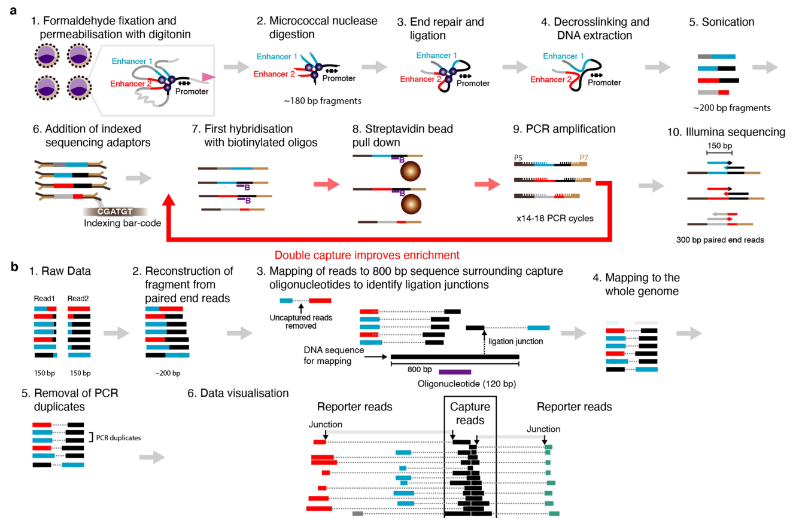

MicroC data analysis pipeline
===================================

::

	usage: MicroC.py [-h] [-j JID] [-f FASTQ_TSV] [-q QUEUE] [-m MEMORY]
	                 [--FLASH_min_overlap FLASH_MIN_OVERLAP]
	                 [--FLASH_max_overlap FLASH_MAX_OVERLAP] [--src SRC]
	                 [-g GENOME] [--bowtie2_index BOWTIE2_INDEX]
	                 [--genome_fasta GENOME_FASTA] [-s CHROM_SIZE] [--interactive]

	optional arguments:
	  -h, --help            show this help message and exit
	  -j JID, --jid JID     enter a job ID, which is used to make a new directory.
	                        Every output will be moved into this folder. (default:
	                        MicroC_yli11_2022-02-08)
	  -f FASTQ_TSV, --fastq_tsv FASTQ_TSV
	                        4 columns: R1, R2, label, bait.bed (default: None)
	  -q QUEUE, --queue QUEUE
	                        submit queue (default: standard)
	  -m MEMORY, --memory MEMORY
	                        request memory (default: 30000)
	  --FLASH_min_overlap FLASH_MIN_OVERLAP
	                        FLASH_min_overlap (default: 10)
	  --FLASH_max_overlap FLASH_MAX_OVERLAP
	                        FLASH_max_overlap (default: 100)
	  --src SRC             src of MicroC program (default: /home/yli11/Programs
	                        /Micro-Capture-C)
	  --interactive         run pipeline interatively (default: False)

	Genome Info:
	  -g GENOME, --genome GENOME
	                        genome version: hg19, hg38, mm9, mm10. By default,
	                        specifying a genome version will automatically update
	                        index file, black list, chrom size and
	                        effectiveGenomeSize, unless a user explicitly sets
	                        those options. (default: hg19)
	  --bowtie2_index BOWTIE2_INDEX
	                        fasta index (default:
	                        /home/yli11/Data/Human/hg19/index/bowtie2_index/hg19)
	  --genome_fasta GENOME_FASTA
	                        fasta (default:
	                        /home/yli11/Data/Human/hg19/fasta/hg19.fa)
	  -s CHROM_SIZE, --chrom_size CHROM_SIZE
	                        chrome size (default: /home/yli11/Data/Human/hg19/anno
	                        tations/hg19.chrom.sizes)

MicroC worflow
^^^^^^^^^^^

Summary
^^^^^^^

Pipeline adopted and customized from https://github.com/jojdavies/Micro-Capture-C

Only work for hg19 right now, by 2/8/2022.

Input
^^^^^

Example: ``Sequencing_runs/chenggrp_253074_HiC-1_MCC/analysis``

1. Target bait bed file

Need 4 columns, chr, start, end, name (R or L)

::

	==> HBG1_bait.bed <==
	chr11	5272143	5272263	R
	chr11	5270668	5270788	L

	==> HBG2_bait.bed <==
	chr11	5277094	5277214	R
	chr11	5275592	5275712	L

.. note:: The 4th column in the bait.bed file has to be either R or L exactly, not other strings.

2. fastq.tsv

Need 4 columns, R1, R2, label, bait bed file name

Use ``--guess_input`` to automatically generate the first 3 columns. Here I manually edited the 3rd column.

::

	8_S15_L002_R1_001.fastq.gz	8_S15_L002_R2_001.fastq.gz	H2_15_HBG2	HBG2_bait.bed
	7_S14_L002_R1_001.fastq.gz	7_S14_L002_R2_001.fastq.gz	H2_15_HBG1	HBG1_bait.bed
	6_S13_L002_R1_001.fastq.gz	6_S13_L002_R2_001.fastq.gz	H2_10_HBG2	HBG2_bait.bed
	5_S12_L002_R1_001.fastq.gz	5_S12_L002_R2_001.fastq.gz	H2_10_HBG1	HBG1_bait.bed
	4_S11_L002_R1_001.fastq.gz	4_S11_L002_R2_001.fastq.gz	H1_15_HBG2	HBG2_bait.bed
	3_S10_L002_R1_001.fastq.gz	3_S10_L002_R2_001.fastq.gz	H1_15_HBG1	HBG1_bait.bed
	2_S9_L002_R1_001.fastq.gz	2_S9_L002_R2_001.fastq.gz	H1_10_HBG2	HBG2_bait.bed
	1_S8_L002_R1_001.fastq.gz	1_S8_L002_R2_001.fastq.gz	H1_10_HBG1	HBG1_bait.bed

Usage
^^^^^

.. code:: bash

	hpcf_interactive

	module load python/2.7.13

	run_lsf.py --guess_input # to generate fastq.tsv

	# Please manually add the 4th column to fastq.tsv before running this
	MicroC.py -f fastq.tsv -g hg19

QC
^^^^^

These reports are attached in the email notification.

multiqc_report.html
-------------

``General statistics``, in this section, we may look at Length, M Seqs, and %Combined; average read length, total read count, and percentage of combined reads.

``FastQC``, in this section, we may look at ``Sequence Quality Histograms``. 

MicroC_summary.html
-----------------

In the summary table, we can look at capture efficiency and read duplication rate (for Left and Right oligo).

Output
^^^^^^^

In the jobID folder, result is organized for each sample (``*_read_split`` folder). In each folder, you can find bw files:

::

	L_H1_10_HBG1_ALL_FP.bw
	L_H1_10_HBG1_UP_FP.bw
	R_H1_10_HBG1_DO_FP_plusone.bw
	L_H1_10_HBG1_ALL_FP_plusone.bw
	L_H1_10_HBG1_UP_FP_plusone.bw
	R_H1_10_HBG1.read_pileup.bw
	L_H1_10_HBG1_de_norm_rep.bw
	R_H1_10_HBG1_ALL_FP.bw
	R_H1_10_HBG1_UP_FP.bw
	L_H1_10_HBG1_DO_FP.bw
	R_H1_10_HBG1_ALL_FP_plusone.bw
	R_H1_10_HBG1_UP_FP_plusone.bw
	L_H1_10_HBG1_DO_FP_plusone.bw
	R_H1_10_HBG1_de_norm_rep.bw
	L_H1_10_HBG1.read_pileup.bw
	R_H1_10_HBG1_DO_FP.bw

