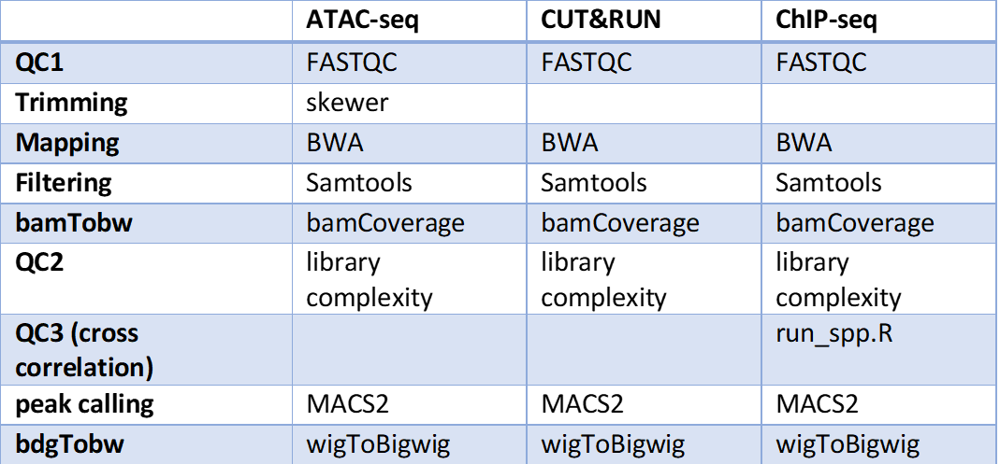

A collection of NGS_pipelines
=============================

.. contents:: 
    :local:
.. toctree::
   :maxdepth: 1

   atac_seq
   cut_run
   chip_seq_single
   chip_seq_pair
   crispr_seq

Typical Usage
^^^^^^^^^^^^^

Go to your data directory and type the following.

Step 0: Load python version 2.7.13.

.. code:: bash

    $ module load python/2.7.13

Step 1: Prepare input files, generate fastq.tsv and peakcall.tsv. 

.. tip:: peakcall.tsv is not generated for atac_seq subcmd, since no control is needed for atac_seq. `--guess_input` option is not available for crispr_seq subcmd.

.. code:: bash

    $ HemTools [subcmd] --guess_input

	Input fastq files preparation complete! ALL GOOD!
	Please check if you like the computer-generated labels in : fastq.tsv
	Input peakcall file preparation complete! File name: peakcall.tsv

Step 2: Check the computer-generated input list (manually), make sure they are correct.

.. code:: bash

    $ less fastq.tsv

    $ less peakcall.tsv

.. tip:: a random string will be added to the generated files (e.g., fastq.94c049cbff1f.tsv) if they exist before running step 1.

Step 3: Submit your job.

.. code:: bash

    $ HemTools [subcmd] -f fastq.tsv -d peakcall.tsv

You can always see all available sub-commands by:

.. code:: bash

    $ HemTools -h

Report bug
^^^^^^^^^^   

Once the job is finished, you will be notified by email with some attachments.  If no attachment can be found, it might be caused by an error. In such case, please go to the result directory (where the log_files folder is located) and type: 

.. code:: bash

    $ HemTools report_bug

